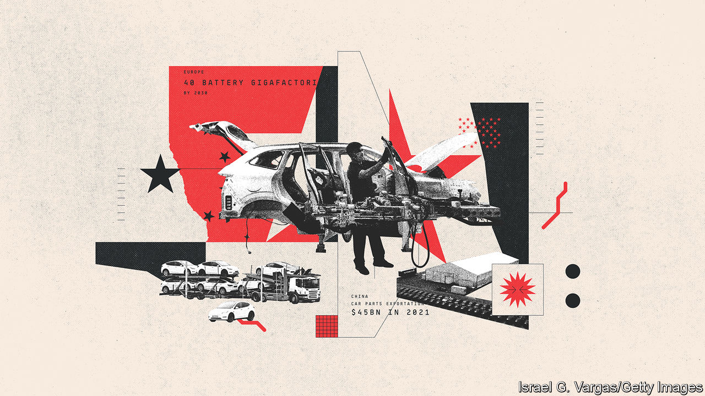

###### Geopolitics

# How geopolitical tensions could disrupt the global car industry 

##### The unhelpful fallout from Sino-American squabbles 

 

> Apr 14th 2023 

THE WORLD’S carmakers are nowadays perforce learning from Chinese car firms and their customers what the future might look like. Similarly, Chinese carmakers are trying to understand what they need to do to conquer the West. Just as big firms have engineering and design centres in China, so do Chinese firms in America and Europe. But even as foreign carmakers begin to struggle in China, Chinese hopes of selling millions of cars abroad may fall foul of a deteriorating political landscape. A souring of relations between America and China means rising geopolitical tensions, new trade barriers, a subsidy race, shifting supply chains and tighter restrictions on access to Western technology and data-sharing. These could even add up to the deglobalisation of what is in many ways the archetypal global industry.

The dwindling market share of foreign firms in China owes much to the perception that the software in their electric vehicles is not as advanced as in their Chinese competitors. Sales of VW’s ID series of EVs in China have disappointed. Slowing EV sales as government subsidies were cut prompted Tesla to slash prices, triggering a price war at the start of 2023 that hit less coveted EVs from foreign carmakers. Growing nationalist sentiment among Chinese buyers and greater efforts by the government to encourage domestic firms such as BYD will make China an even harder place to do business in future.

At the same time carmakers are reconfiguring supply chains to make them less exposed to geopolitical concerns, with reliance on China a growing issue. The country is one of the world’s biggest exporters of car parts, to a value of over $45bn in 2021, a quarter of which went to America, says a study by Sheffield Hallam University. In 2020, 12 Chinese car-parts firms were in the world’s top 100 by revenues. Pandemic-induced snarl-ups sent shipping prices soaring and hit the supply of car parts. China’s zero-covid policy meant widespread lockdowns that caused further delays. However forming new relationships with suppliers from India, north Africa or Mexico is a lengthy business. Firms usually change suppliers only when they make new models. Yet the process of shifting supply chains away from China is clearly under way. 

Restrictions on access to the West’s technology may also have an effect. America’s efforts to bar Chinese firms from advanced technology include a ban by the Commerce Department on exporting certain semiconductors to China. And the CHIPS act passed last year offers new subsidies for manufacturing semiconductors at home. China’s car firms may lead the world in EVs and automotive software but they rely almost entirely on chips imported from America, Europe and Taiwan. To plug the gap carmakers such as BYD and Geely are making their own chips, and startups like Nio, Li Auto and Xpeng may also do so. The Chinese government plans to spend billions on a domestic chip industry.

Efforts to pull up the drawbridge will hamper China’s exports. So might worries about the security of data gathered from users of Chinese-made cars. America already imposes hefty tariffs on Chinese cars: 27.5%, against 10% levied by the EU. That may not hold back the import of Chinese cars for ever, as cheaper models could still be competitive. But the effects of America’s Inflation Reduction Act, passed last year, which offers big subsidies to American-made EVs with batteries that use raw materials sourced in America or from close allies, will do more to bring production home. 

The results are already evident. Tesla is scaling back European investment to focus on North America, and will build a new gigafactory in Mexico. Ford chose Michigan for a new battery factory. GM will invest in a lithium mine in Nevada. VW is thinking of relocating a battery factory from Europe, reckoning it could be worth $10bn in subsidies over its lifespan. Few carmakers seem able to resist the American lure. Europe is intent on responding to America’s lavish handouts. But even without big inducements the industry will become more regional. Manufacturing batteries, which are bulky and make up a big proportion of a car’s value, is better done close to where cars are made and sold. The EU’s car firms have their own plans to weaken China’s grip on battery-making. New incentives to make batteries locally could mean that Europe sees 40 battery gigafactories by 2030. Caught between America and the EU, Britain is looking on nervously.

Were China’s sabre-rattling over Taiwan to turn into full-scale war, this slow regionalisation would speed up rapidly. Russia’s attack on Ukraine shows how fast a country with a small car industry has been affected. Western car firms with manufacturing plants were forced to suspend operations or to pull out entirely. Renault had to sell its operations in Russia, including a 68% stake in AvtoVAZ, Russia’s biggest carmaker. VW suspended manufacturing after the invasion and has had its assets frozen by a Russian court. Toyota closed its Russian factory. Ironically Chinese car firms then grabbed a bigger share of the Russian market.

Rising tensions with China would affect many industries besides cars. And even if the broad influence of China on both carmaking and the experience of driving persists, tastes will still differ between regions. Chinese tech, the American love of large pickups and Europe’s taste for small cars all show a world that is not entirely uniform. Yet a more regionalised, more protected and hence less efficient car industry would not be a better one.■

