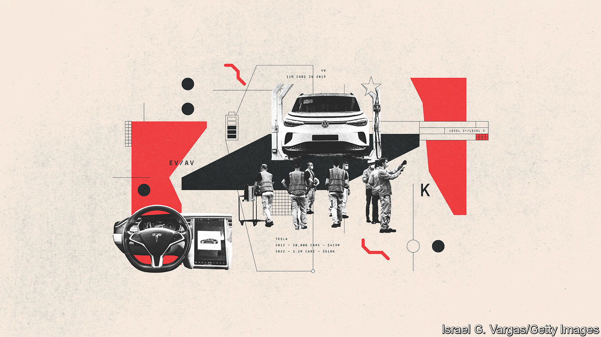
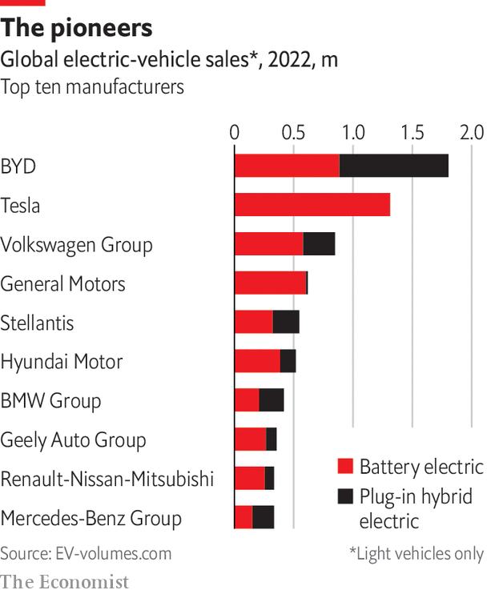

###### Barriers to entry

# It is getting easier for new entrants to make cars 

##### Electrification is lowering the industry’s daunting barriers to entry 

 

> Apr 14th 2023 

Wolfsburg, the company town that Volkswagen calls home, is drab. Most executives choose to live in the surrounding countryside or in Berlin, an hour away by train. Its function is to serve a carmaking empire that churned out nearly 11m cars in 2019 (pre-pandemic) and has vied with Toyota and the Renault-Nissan-Mitsubishi alliance to be the world’s biggest carmaker. It seems inconceivable that such a mighty firm, epitomised by Wolfsburg’s vast assembly halls, dedicated power station and towering offices adorned with giant company logos, could be under threat.

VW bosses want to reinvent the firm so as to make the most of established carmakers’ strengths, such as powerful brands, mass-manufacturing prowess and money, while learning from Tesla and the Chinese how to change their business. VW is symbolic of what Henrik Fisker, boss of an American EV startup, calls “a giant machine [incumbents] have to keep alive”. Philippe Houchois of Jefferies, an investment bank, says size matters to spread the industry’s high fixed costs and to generate the cashflows to pay for the EV transition. But, he adds, it is “hard to unlearn the past”. 

The industry has refined itself since Henry Ford’s River Rouge factory, where raw materials acquired from mines or rubber plantations owned by the company went in one end, and a shiny new car came out the other. By outsourcing as much as they can to suppliers, firms have concentrated on design and marketing, managing complex supply chains, manufacturing to exacting tolerances and integrating the mechanical tech acquired from “tier 1” suppliers, such as Bosch, Continental, Delphi and Denso. Outsourcing has reduced costs but left tech advances to others. 

Mr Musk’s innovation was to bring River Rouge up to date, borrowing the “full stack” business model from the tech industry. Vertical integration now ensures innovativeness and agility while keeping more profits. Car buyers and investors like what they see. In 2012 Tesla made around 3,100 cars and had revenues of $413m; by 2022 those numbers were 1.4m cars and $81bn. An initial public offering in 2010 valued Tesla at $1.7bn. The belief that it might come to dominate the car industry propelled its market capitalisation up to $1.2trn in November 2021. A tech sell-off and concerns about Tesla’s performance then dragged it back down to $650bn, but that is still more than the next five car companies combined.

Tesla’s rise was not struggle-free. It acquired a factory in 2010 in Fremont, California, for just $42m from GM and Toyota. But the “production hell” that Mr Musk described in 2018 nearly tipped his firm into bankruptcy. Since then it has built five new battery or car plants and has plans for another in Mexico. Mr Musk has restated his belief that Tesla will be making 20m cars by 2030. Most analysts reckon 5m is nearer the mark, yet that would still be a huge achievement. Adam Jonas of Morgan Stanley, a bank, suggests that the “innovations brought to market by Tesla [will] become the industry standard”.

One reason is that vertical integration is back, not least to ensure supplies of raw materials. Arno Antlitz, VW’s chief financial officer, says “battery supply is a constraint on transformation”. VW has the most ambitious electrification plans of any established carmaker: it wants half its sales in North America and China and 80% in Europe to be electric by 2030. But battery-making is dominated by China, Japan and South Korea. Six of the top ten firms are Chinese, supplying 60% of the world’s batteries. China also has a firm grip on raw materials, such as lithium, graphite and nickel, and also on processing capacity. 

 


Breaking China’s domination has meant bypassing established supply chains. Tesla was the first to sign an “offtake” agreement directly with a mining company. But other carmakers have followed suit. Ford has signed deals with BHP, a mining giant, for nickel and Rio Tinto, another industry titan, for lithium. GM has signed deals to get lithium from CTR in Australia and cobalt from Glencore, another miner. Toyota’s battery joint-venture with Panasonic will source lithium from Argentina. Tesla has commissioned a lithium refinery in Texas.

Another change is the move towards “gigafactories”. Most carmakers have joint ventures with established battery firms, such as GM’s with South Korea’s LG Chem or Mercedes-Benz’s with China’s CATL, the world’s biggest battery-maker. PowerCo, VW’s dedicated battery unit, plans investment of €20bn in five factories by 2030, adding to a partnership with Volvo in Northvolt, a Swedish startup run by Peter Carlsson, a former Tesla man. Kai Müller, boss of PowerCo, explains that VW has the financial clout to stay in control of its battery supply. Leaving it to a joint venture would mean putting up half the money but handing direction to a third party.

Other functions are moving in-house. Much of the software for new features and functions will be developed by carmakers. Tesla makes some of its own batteries, chips, motors and other bits of the powertrain. It even makes its own seats. China’s BYD, which began life as a tech firm producing batteries, makes almost everything for its new models bar glass and tyres.

Carmakers are also entering the charging business themselves. Tesla’s Supercharger network could become a big business, as the firm has opened it up to other cars, a move that Goldman Sachs reckons could be worth as much as $25bn a year. Juniper Research thinks that charging could rake in $300bn in revenues globally by 2027, up from $66bn in 2023. As part of the deal to resolve the “dieselgate” scandal that embroiled VW in 2015, the company put $2bn into Electrify America. GM has invested $750m in 40,000 charging points in North America. Mercedes-Benz, which has a stake in Ionity with BMW, Ford, Hyundai and VW, plans to spend $1bn on an American business that it intends to manage along with ChargePoint, which is one of the world’s biggest charging companies.

The carmaking giants will not manage vertical integration as easily as newcomers can. As Mr Hummel notes, it is too expensive to bring everything back in-house. Yet for new firms, scale, experience, brands and access to capital are no longer huge barriers to success, as the experience of China is showing.■

