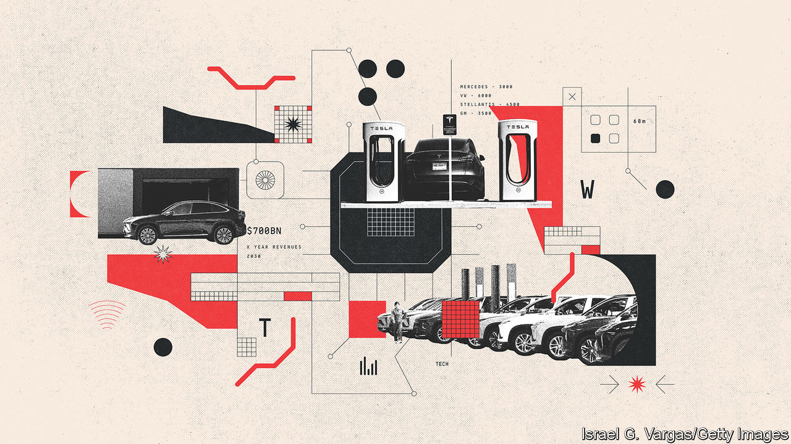

###### The software shuffle

# Software is now as important as hardware in cars 

##### It is easier for a tech firm to make cars than a carmaker to become a tech company 

 

> Apr 14th 2023 

A visit to Nio house in Berlin, which is modelled on a network of 100 similar establishments in China, offers evidence of a fundamental change. Here you can still acquire a car, but unlike a traditional dealership only a small fraction of the floorspace is taken up by vehicles. Nio sees itself as a lifestyle brand and tech firm. The “focus is on the user experience”, says Lihong Qin, its president. Using a Nio is about enjoying the journey and the community built around its brand. Its cars are packed with high-definition screens and state-of-the-art sound systems. In Berlin owners, potential owners or anyone else can drop by the coffee bars and meeting rooms, buy locally sourced branded goods, or even leave their children in a high-tech play area.

The usual way of differentiating car brands by mechanical excellence was personified by the ICE’s performance, design and  (a German word for slim regular gaps between bodywork panels that are hard for newcomers to reproduce). Nowadays buyers are no longer so bothered. McKinsey, a consultancy, reckons that only 8% are “petrolheads” who love driving for its own sake. Future drivers and passengers want to make the most of their trips. The features and functions that do this rely on software rather than hardware. Tu Le of Sino Auto Insights, a consultancy, puts it bluntly: “customers don’t care about panel gaps.” The software updates keeping Tesla’s technology fresh matter more. 

Dirk Hilgenberg, boss of Cariad, VW’s software division, says the car will be a “third living space” between home and work. Software controls performance, driving features and the experience of sitting in the vehicle. Safety features such as automatic braking, automatic lane-keeping and changing, adaptive cruise control and automatic parking are already available. Others will make things more fun and become increasingly useful as autonomous driving becomes common. These include huge improvements to such features as infotainment—the best navigation maps, sound systems and screens to watch films or play video games—and advanced voice controls, a particularly important feature in China. Michael Mauser, boss of Harman, a tech firm supplying carmakers, describes how smart devices have changed the expectations of consumers: spending $100,000 on a car comes with the same demand for personalisation as a $300 smartphone. 


The established car industry has been good at delivering cars on budget and on time but not at considering the business case of the car, says Johannes Deichmann of McKinsey. Increasing connectivity—by 2030 four cars in five will be internet-enabled, says UBS—will allow over-the-air updates to software. For carmakers that means new opportunities to sell things. For owners it means vehicles can be continuously updated and improved when they buy new features and functions. Legacy carmakers will have the hardest job replicating the advantages of startups, for which software is the most important element, and Chinese firms, whose customers demand and expect a seamless extension of their digital lifestyles in their cars. 

Software can be lucrative. UBS forecasts $700bn a year in revenues by 2030, but adds that this will compensate only for declining revenues elsewhere as negligible growth combines with higher costs and lower profits. Mastering software has become vital for carmakers just to stand still. But established firms have to rethink a business model dedicated to mechanical-engineering excellence. The industry operates on roughly seven- or eight-year model cycles, with research and development frozen before the start of production. This leisurely pace is far removed from software’s timescales, with small updates coming weekly or monthly and big overhauls perhaps every year, as they do for smartphones. 

Big carmakers have done a good job of claiming to be tech companies, but informed observers detect a resistance to change. Mr Li says that Nio and other Chinese firms starting from scratch develop software and hardware together. Clean-sheet designs can incorporate more centralised and efficient computing systems, whereas current ICE models integrate separate bits of technology developed by suppliers, making cars a mass of hundreds of electronic control units. At least the launch of all-new EVs allows established firms to redesign their computing architecture.

The dinosaur era

Firms that have long had a mechanical mindset struggle to set up the units needed to develop the software that now makes brands distinctive or to strike deals with tech firms that today matter as much as traditional suppliers. According to Daniel Roeska of Bernstein, a broker, the average European car executive is 55 and has worked in the industry for 22 years. He drily notes that this is “not the right mix of experiences and capabilities” for firms that need to be “more agile and innovative than ever before”. Gartner’s Pedro Pacheco is equally damning, suggesting that some firms don’t want to change their corporate culture and are “running with an iron ball around their ankle”.

Carmakers are appointing chief software officers, presenting strategy at “software days” and setting up software divisions. A new seven-storey building at the Mercedes plant in Sindelfingen, built at a cost of €200m, will house a third of the firm’s 3,000 software engineers. Cariad, the software unit created by VW in 2020, has a large site in Ingolstadt, not far away, for its 6,000 software employees. Stellantis aims to have 4,500 software engineers by 2024. GM had planned to hire 8,500 techies in 2022. But only Volvo and Ferrari have CEOs with a background in tech.

How much and what to keep in-house remains a big issue. VW says its once-stated ambition to develop 60% of its own software was a means to reinforce the importance of software rather than an actual target. Most car firms have settled on developing no more than 20-30% in-house. As UBS puts it, carmakers that want to do everything are “set up for expensive failure” but those relying “100% on an external software stack” are the “worst case…for brand equity”. Most carmakers realise that they should concentrate only on what they can do better. 

That means having a clear view of what is best kept in-house but also trying to stay in control of what is bought in. Ola Kallenius of Mercedes-Benz says the role of legacy car firms is to become the “architect of the house”. It is creating its own operating system and teaming up with the best contractors, such as Nvidia for chips, and deepening a partnership with Google to improve navigation systems. Mr Kallenius argues that car firms still have a vital role as integrators, as no tech firm can deliver off-the-shelf software for all four separate domains of driving and charging, comfort (such as lighting and massaging seats), infotainment and autonomy.

Carmakers need to strike deals with tech firms that are also eyeing their business as a potential source of new revenues. But do drivers want a proprietary system or rather something closer to what they are already familiar with from their phones? In 2022 Renault announced a deepening of its relationship with Google’s Android Automotive, which lets driver access phone features and apps, to speed up its digital transformation. Bernstein asks if carmakers should “forgo control and adopt a platform that consumers appear to readily accept?” Gill Pratt, Toyota’s chief scientist, similarly suggests that car software must be a seamless part of the smartphone ecosystem. 

Yet this runs the risk of ceding users’ experience to the tech firms. The latest version of Apple’s CarPlay, due in September, connects iPhones to a car’s infotainment screen, offering a more seamless experience for maps, driving information and connections to smartphone apps by taking over the screens in cars. But Apple will keep the data on drivers. Some think the slow reaction of the industry to software means the game is already up. Olaf Sakkers of RedBlue Capital, a mobility investment fund, says that Apple has already won the “in-car experience” and that legacy firms have “already lost but are acting like they haven’t”.

For Tesla and other newcomers this is hardly an issue. Innovating and rapidly turning out new software features is at the core of what they do. Michael Dunne of ZoZoGo, a consultancy, reckons Tesla’s software is five years ahead of the established firms. Most agree they are behind the Chinese when it comes to user experience. Mr Hilgenberg agrees that his firm has much to learn from the speed of decision-making and time to market of Chinese firms. Even Western startups cannot keep pace. John Makin of the automotive division of Luxoft, a software company, says Rivian and Western startups are quick but the Chinese are quicker still, rolling out updates in hours or days rather than weeks or months. 

Getting the software right by marrying the speed and agility of the tech industry to the old world of carmaking will be especially hard for legacy firms. Some at least have the right idea, but for many it will prove all-but impossible. And that could create a big opportunity for the new entrants that have mastered the tech skills now needed.■

