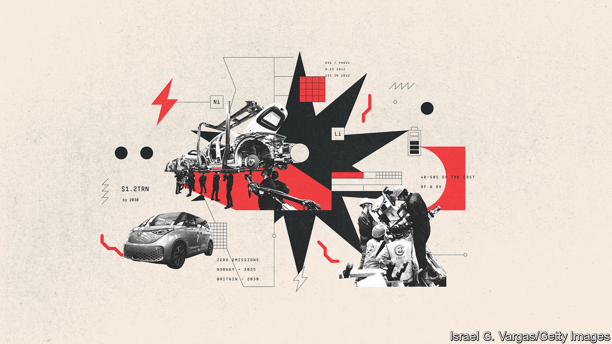
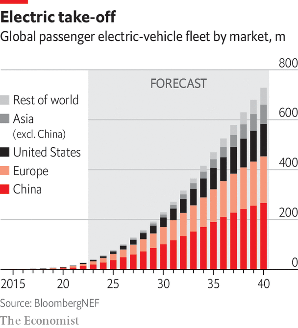

###### Electrification

# The future lies with electric vehicles 

##### The car industry is electrifying rapidly and irrevocably 

 

> Apr 14th 2023 

Carl Benz may have been the first person successfully to marry the horseless carriage with the ICE. But early dalliances with batteries predate him. As early as the 1830s Robert Anderson, a Scot, developed a rudimentary EV, but it was not a success. Even after the car industry really took off in the 1890s, as French and American firms joined the fray, electric power was still in the ascendancy. In America in 1900, almost twice as many electric- as petrol-driven vehicles were on the road. Then the Ford Model T, cheaply made by mass production, a growing oil industry and a wider availability of petrol sealed the fate of battery power. 

Despite half-hearted resurrections such as the EV1 from General Motors in 1996, it was not until Tesla’s arrival in 2003 that the battery-electric revolution began in earnest. This, in turn, hastened efforts to decarbonise road transport, propelling EVs and PHEVs from 0.2% of new-car sales a decade ago to 13% in 2022. The surge is set to continue. By 2025 EVs will account for nearly a quarter of sales, says Bloomberg nef, a data firm, and closer to 40% in Europe and China. Even conservative estimates reckon that by 2040 around three-quarters of new-car sales worldwide will be fully electric, as better batteries make even PHEVs redundant. 

 


Tough emissions regulations have done much to promote evs. A draft law approved by the European Union in February may mean a total ban on new ice cars by 2035 (though Germany has won an exception for cars using carbon-neutral synthetic fuels). Governments and cities are cracking down on carbon and other emissions that affect local air quality. China is demanding that 20% of cars must be nevs by 2025, with a full switch away from cars with only an ice by 2035. Even in America, the land of the petrolhead, Joe Biden unveiled on April 12 proposals for strict limits on vehicle emissions, the toughest of which would require around two-thirds of car sales to be battery-powered by 2032. The president is backing this up with huge handouts to domestic ev industries. The 2022 Inflation Reduction Act, a vast clean-energy package, subsidises sales of America-made evs with domestic-made batteries from raw materials supplied at home or from allies.

Carmakers are duly investing vast sums: around $1.2trn by 2030, according to Reuters, a news agency. America’s GM says it will go all-electric by 2035 and Ford wants its European arm to do the same by 2030. The goal of Stellantis (whose largest shareholder, Exor, part-owns ’s parent company), formed by a merger in 2021 of Fiat Chrysler and PSA Group, owner of Citroën and Peugeot, is for all new cars in Europe and half its American output to be EVs by 2030. Volkswagen says its namesake brand will be EV-only by 2033 in Europe and that Audi, an upmarket sibling, will go fully electric worldwide by the same year. 

The biggest deterrents to buying an electric car—price and range—are slowly being overcome. Tightening bottlenecks for raw materials, such as lithium and nickel, caused battery prices, which are still around 40-50% of the cost of a new EV, to rise slightly in 2022. But scale and new tech have pushed prices down by as much as 90% since 2008. Better batteries mean longer ranges, partly alleviating concerns about a slow rollout of public charging infrastructure. Generous subsidies and an ever-increasing choice of new models mean that Tesla and a handful of unattractive “compliance” cars are no longer the only choices. The total cost of owning an EV, including running costs, repairs and fuel, is already roughly equivalent to some ICE cars. By the end of this decade the sticker price of most EVs will be equal to that of ICE cars—and they will be cheaper to run.■

