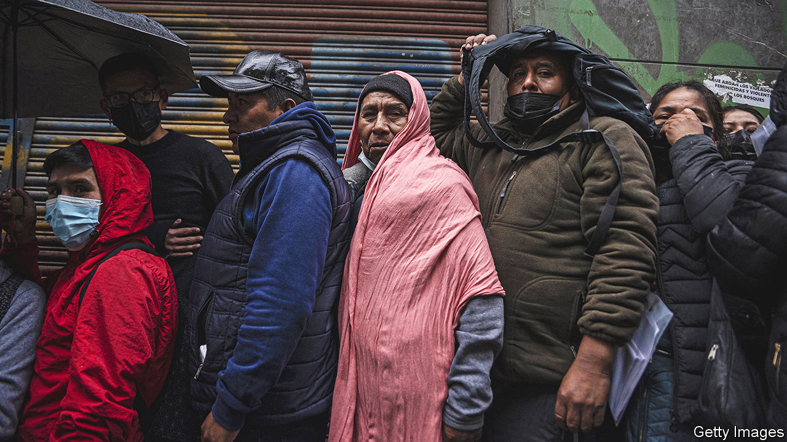
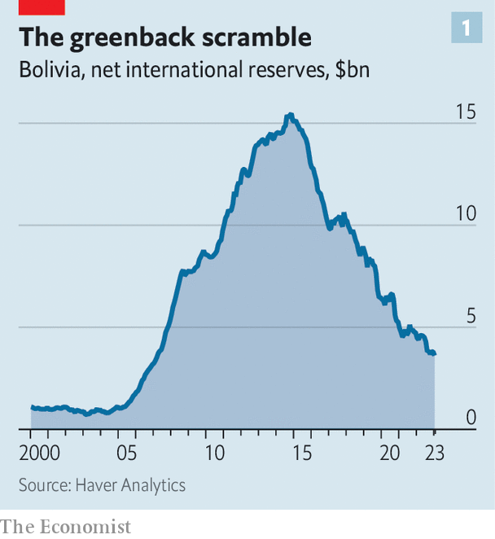
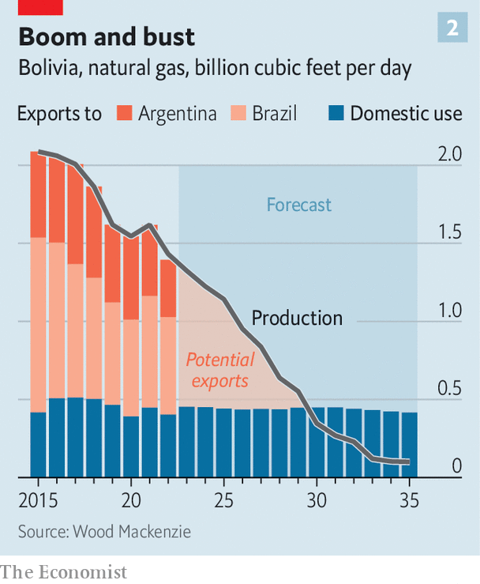
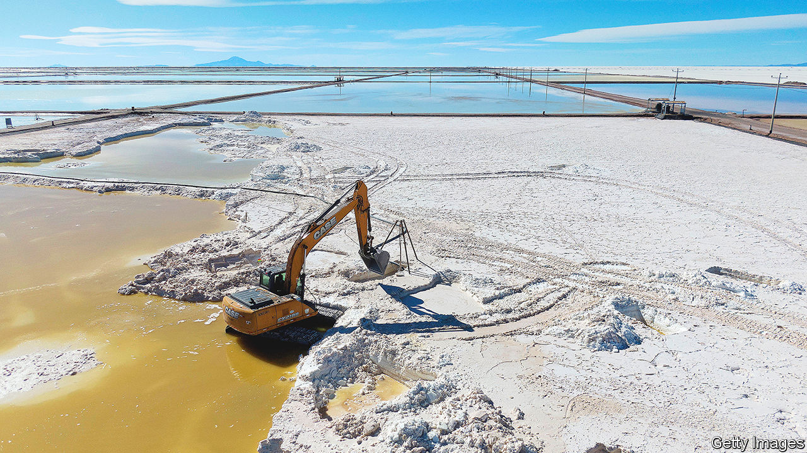

###### Out of gas and good ideas

# Bolivia is on the brink of an economic crisis 

##### After two decades of statist policies, the country’s economic model is bust 

 

> Apr 18th 2023 

“There is no shortage of dollars” announces a banner on the homepage of Bolivia’s central bank. “Our economy is strong, solvent and stable.” The need for the post suggests otherwise. For the past few weeks, Bolivians have desperately been trying to buy dollars. In February the central bank stopped publishing data on its foreign-currency reserves. In March it took the unusual step of selling greenbacks directly to the public after exchange houses started to run out. When the queue got too long the bank made Bolivians book appointments online. The next available one is in July. Investors are spooked. Government bonds maturing in 2028 have lost a third of their value since January. 

The dollar shortage is partly a result of tighter global financial markets. When the Federal Reserve started raising interest rates last year it became harder for Bolivia to take on foreign debt. Then came the war in Ukraine, and the annual cost of importing fuel doubled to more than $4bn (or 10% of GDP). The government began dipping into its reserves to prop up the currency, which has been pegged at 6.96 bolivianos to the US dollar since 2011, and to subsidise fuel. Yet although the country’s dollar shortage was exacerbated by short-term problems, it has been long in the making. Bolivia’s economic model is bust.

 


In the early 2000s Bolivia experienced robust growth on the back of natural-gas exports. Evo Morales, the leftist president elected in 2005, struck it lucky. Soon after he came to power, multilateral institutions wrote off debt for many of the world’s poorest countries. Gas prices doubled to record highs in 2006. This allowed Bolivia to accumulate the largest foreign reserves in its history: they rose from 12% of GDP in 2003 to 52% by 2012 (see chart 1). Real GDP per person has grown by half since 2005. According to the World Bank the proportion of people living on the equivalent of less than $2.15 a day (after adjusting for inflation) fell from 15% in 2005 to 2% by 2019. Annual inflation was 1.7% last year, the lowest in the region. 

Pundits praised Bolivia’s economic miracle. But it was not sustainable. The government spent much of the windfall from natural gas on fuel subsidies, inefficient state firms and propping up the exchange rate. Fuel prices have been frozen since 2005 at $0.54 a litre, compared with a world average today of $1.31. In 2006 Mr Morales nationalised the country’s . Private companies were forced to sign new contracts with the state firm, Yacimientos Petrolíferos Fiscales Bolivianos (YPFB), and hand over majority control. They also pay royalties amounting to 50% of gross production. The state takes a bigger share of revenue from oil and gas companies than in any other country in Latin America after Mexico, says Marcelo de Assis of Wood Mackenzie, a research firm. 

Such statist, populist policies have inhibited investment. In 1999, after the country’s energy sector was privatised, annual net inflows of foreign direct investment as a share of GDP hit a peak of 12%. Over the past five years it has averaged 0.1%. In 2014 the price of gas fell, and so did production. Annual investment in gas fields declined from over $1bn in 2015 to $300m last year. 

The government refused to adjust its policies when gas prices fell. Instead, it piled on debts and used its reserves to fund its expensive subsidies. Public debt has doubled since 2014 to a whopping 80% of GDP, above the regional and world average, and dangerously high for a lower middle-income country. A study by Fundación Milenio, a think-tank, found that the profits from YPFB hid combined losses from Bolivia’s 62 other state-owned enterprises that regularly exceeded 4% of GDP.

Bolivia has run persistent and large fiscal deficits for a decade. The deficit is 7% of GDP. The IMF expects growth to slow to 1.8% this year. In 2021 Bolivia had a current account surplus of 2% of GDP. But the IMF expects this to turn into a 2.5% deficit this year. It is unlikely that Bolivia’s reserves can make up the funding shortfall. These have fallen from $12bn in 2012 to less than $3.5bn. Only $370m of that is cash, too little to cover even three months of imports. Most of the rest is gold, which one faction of politicians in the government are unwilling to sell. The situation has probably deteriorated even further since the bank last released weekly data in February. 

Pumping problems

In February the government passed laws that encourage farmers and gold co-operatives to sell it dollars by offering them a better exchange rate. “People got scared and thought: why is the central bank trying to buy dollars and what will happen to the boliviano?” says a money-changer in La Paz, the capital. Six months ago he used to buy $3,000 a day and sell half of that. “Today we can’t even get $500.” Bolivians are taking out their savings, swapping them for dollars, and stashing them at home. In the week leading up to March 12th the central bank sold $24m to the public. Another money-changer says that when the dollars ran out customers started buying euros, Brazilian reais, Peruvian soles, or Chilean pesos. Now he is running out of those, too. 

Remarkably, the government denies there is a problem. On April 11th Luis Arce, the president and formerly Mr Morales’s finance minister, gave a rare interview in which he said there was no need to devalue the boliviano or to remove subsidies. Asked about the government’s rosy growth projections for this year, which are more than double those of the IMF, he replied, “We are going to disappoint the international organisations again….I am reassured when they say we are going to fall, because that means we are going to grow more.” A day earlier Mr Arce met with the private sector for the first time since coming to power in 2020. Rather than inspire hope, “the meeting suggests things are really bad,” says Gabriel Espinoza, a former central bank chief. 

 


Mr Arce has no easy way out of the crisis. Gas production has plummeted by a third since 2014. Around a third of this is sold domestically at below-market prices, while the remainder is shipped to Argentina and Brazil. But those exports will cease by 2030, according to a recent report by Wood Mackenzie. This is because production is set to decline further (see chart 2). 

In addition a pipeline, which stretches from the world’s second-biggest shale oil and gas field in Argentina’s far west to Buenos Aires, is set to start operating in June. That will reduce Argentina’s need to import the stuff from Bolivia. Although demand from Brazil will continue, Bolivia will have to focus on supplying the domestic market with ever-shrinking production. Private investment will not materialise soon. The law on YPFB having a majority share in any joint venture was included in a new constitution written in 2009.

 


Many within the government hope  will be the answer to the country’s problems. Bolivia has the world’s largest lithium brine resources. But unlike neighbouring Chile or Argentina, it has yet to pump any out of the ground at a commercial scale. In January a consortium of Chinese companies announced a $1bn deal to produce the stuff by 2025. Still, Beatriz Muriel of INESAD, a think-tank in La Paz, doubts lithium can replace gas as a source of revenue. She notes the terms of the Chinese deal have not been made public, and expects protests will erupt if locals do not feel fairly compensated. That would delay production even further.

The government wants to sell its gold reserves, which are worth $2.8bn. But infighting between followers of Mr Morales and Mr Arce, who have fallen out, means the law to sell reserves has not been passed since it was presented to Congress more than a year ago. 

Commodity chaos

Two other sources provide Bolivia some breathing room. First, its foreign debt obligations amount to a relatively small 30% of GDP and are mostly held on favourable terms with multilateral lenders. Much of these are not due for at least a decade. Mr Arce’s ministers are in talks with development banks to secure additional loans.

Second, the country’s gigantic informal economy provides a cushion against a meltdown, thinks Carlos Gustavo Machicado of the Catholic University of Bolivia. Over two-thirds of Bolivians work in the informal sector, one of the highest shares in the world. Sales from contraband are estimated to be worth the equivalent of almost a tenth of GDP. Since fuel in Bolivia is so cheap, much of it gets smuggled abroad and sold at higher prices. Ms Muriel estimates that as much as half of the $3bn Bolivia exported in gold last year was smuggled in from other countries, and exported from Bolivia, where export taxes are lower. This means that there are dollars in the economy, just not in government coffers.

“A balance of payments crisis is coming, like in 1982,” says Mr Machicado. That year Bolivia entered into a crisis that ended in hyperinflation. Today the signs of financial pressure are everywhere. On the streets of La Paz opportunists are selling dollars at much higher than the official rate. Unions will negotiate wage increases in May, and are demanding a 10% rise. Mr Espinoza reckons inflation will rise to 6% by the end of the year. That is low by regional standards, but high for the country. That could lead to unrest. In Santa Cruz, in the east, protests have erupted against the government since it came to power. Mr Arce may not be able to deny Bolivia’s problems for much longer. ■


