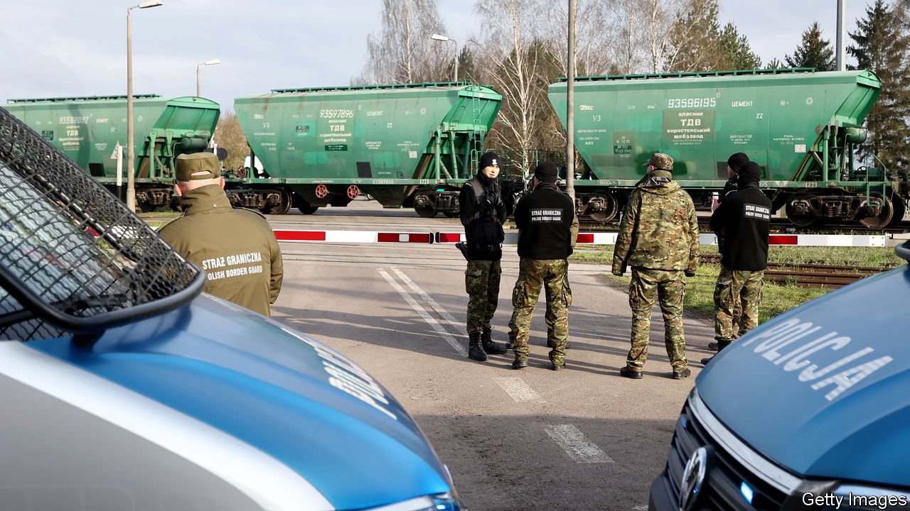

###### The Economist explains

# Why are eastern European countries banning Ukrainian produce? 

##### Farmers say that a duty-free influx is spoiling the market 

 

> Apr 17th 2023 

EASTERN EUROPEAN states have been among the  of Ukraine since Russia invaded last year. But efforts to help their neighbour continue to sell agricultural products have caused havoc in their own markets. Farmers have protested for weeks against unprecedented inflows of Ukrainian produce, which come in duty-free under an agreement with the European Union. On April 15th Poland’s government banned the import and transit of agricultural produce from Ukraine until June 30th. Hungary quickly followed suit. On April 17th Slovakia banned some farm imports, though not grain, and other countries are considering similar moves. Why are eastern European countries curbing Ukrainian imports, and thereby defying the EU?

To help Ukraine’s battered economy and avert a  caused by a blockade of Ukraine’s Black Sea ports, the EU lifted tariffs on a range of Ukrainian exports, including many agricultural products, and negotiated transit corridors through Bulgaria, Poland and Romania. The idea was to ship the produce to the Middle East and Africa. Under an agreement brokered by the UN, Russia now lets some produce through the Black Sea, but a larger amount leaves Ukraine via road, rail and river. Last year 27 times more Ukrainian grain passed through Poland than in 2021, according to government estimates. But a shortage of trains and lorries slowed shipments to overseas markets, and much of the produce ended up in local ones. Plummeting prices hurt the incomes of local farmers, sparking weeks of street protests.

In late March the governments of Bulgaria, Hungary, Poland, Romania and Slovakia sent a letter to the European Commission demanding that it curb the flow of grain from Ukraine. To no avail: on April 19th the ambassadors of EU countries will probably vote to extend duty-free imports until June 2024.

Poland’s agriculture minister, Robert Telus, said that its embargo on dozens of goods—including grains, milk, honey, fruits, vegetables and some meats—was necessary to “open the eyes of the EU”. Much of the motivation is political. Poland’s ruling Law and Justice (PiS) party, which depends on the rural vote, faces a difficult election this year. Mr Telus’s predecessor as agriculture minister resigned recently to placate farmers; the party said that the government would buy local grain to boost its price.

The embargoes put Hungary, Poland and Slovakia on a  with the EU. A commission spokeswoman said on April 16th that unilateral actions were “unacceptable”, since the bloc is in charge of its members’ trade policy. It did not, however, threaten any punishment. The rebellious eastern member states look unlikely to relent. Hungary’s agriculture minister, Sandor Farkas, threatened to extend the ban beyond June if the EU does not protect its farmers. Bulgaria could be next. On April 17th its agriculture minister, Yavor Gechev, said that the countries were “becoming warehouses” instead of corridors. He said that his country would also ban imports.

The EU’s disarray is undermining its claim to be acting as Ukraine’s steadfast ally. Ukraine’s agriculture minister, Mykola Solsky, has asked its neighbours to reconsider their bans. But farmers in those countries will only grow more alarmed as the summer harvest begins. ■

