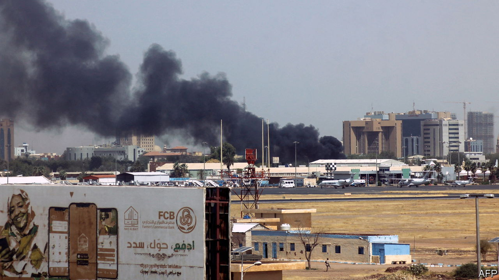
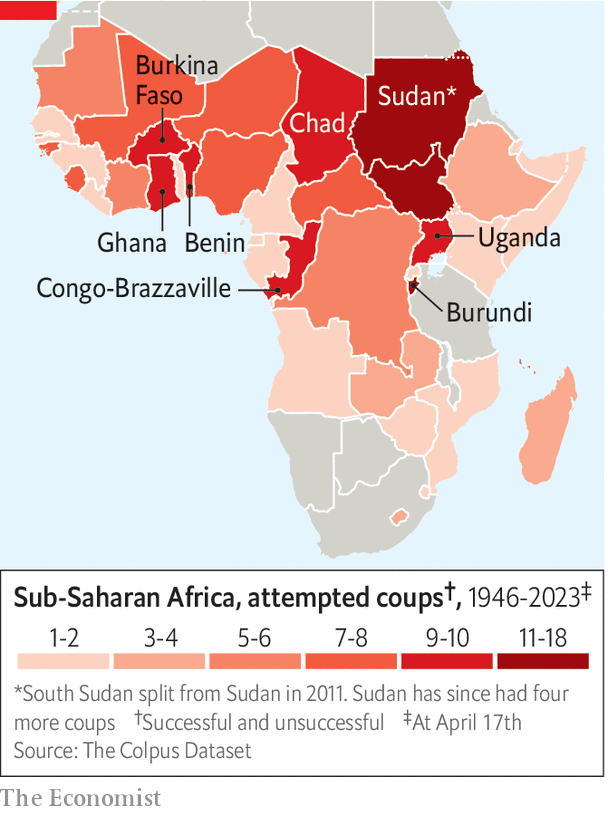

###### The Economist explains

# Why is Sudan on the brink of civil war, again? 

##### The country is especially prone to civil war and coups 

 

> Apr 18th 2023 

ON APRIL 15th Khartoum, Sudan’s capital, and much of the rest of the country were engulfed by . For months tensions had been building between the two most powerful figures in the military government: Abdel Fattah al-Burhan, Sudan’s de facto leader since a coup in 2019, and Muhammad Hamdan Dagalo (known as Hemedti), a warlord. He is the leader of the Rapid Support Forces (RSF), a paramilitary unit that grew out of the Janjaweed militias. America’s government among others has accused the Janjaweed of acts of genocide during a conflict in the western region of Darfur in the 2000s. In the  at least 180 civilians have been killed and a further 1,800 wounded. The Sudanese find themselves, once again, hostage to violent military officers intent on pursuing their own narrow interests.

 


Both sides claim that they are acting to forestall another coup. Since independence in 1956 Sudan has had six coups and ten failed attempts (see map). Instability has increased since General Omar al-Bashir, indicted by the International Criminal Court for genocide in 2009, was toppled by a popular revolution in April 2019. The army struck back almost immediately, killing scores of people. An uneasy alliance of generals and technocrats governed from August 2019 until October 2021, when yet another coup took place. Since early this year all sides have been trying to form a new transitional government that would hold elections, but the rivalry between General al-Burhan and Hemedti has stymied that.

Since independence Sudan has been governed, with only occasional breaks, by an autocratic Arab elite in Khartoum, bent on plundering the country’s considerable wealth, much of it in the form of oil and gold. Their rule, exercised through the army, has often been cloaked in the language of Islam; it is really a kleptocracy. The consequence is a country beset by wars and conflict between the centre and the immiserated peripheries, as well as between rival factions within the elite, such as the army and the RSF. The current fight is also for control of the country’s resources. The RSF runs gold mines, particularly in Darfur, which help to fund the tens of thousands of troops at Hemedti’s command. The plan for a new transitional government included the proposal to fold the RSF into the army, threatening Hemedti’s independent economic base.


Russia’s support for Hemedti in particular has encouraged the RSF to be more disruptive than it otherwise might have been. The warlord visited Russia in 2022 on the eve of its invasion of Ukraine. He is thought to be the Sudanese regime’s link to , a Russian mercenary outfit that, Western diplomats say, is involved in Sudan’s gold mines. (The government denies this.) Gold, which accounts for 40% of Sudan’s exports, is thought to be  out of the country via the UAE and then on to Russia.

Ordinary Sudanese are paying the price of decades of misrule. Inflation is more than 60%, almost a quarter of Sudanese can barely feed themselves and millions live in refugee camps. The elites, by contrast, seem to get by. Mr al-Bashir, for one, was caught with $130m worth of cash in sacks at home after he was ousted. It is little wonder that Sudan’s rulers are fighting over their share of the pie. ■


