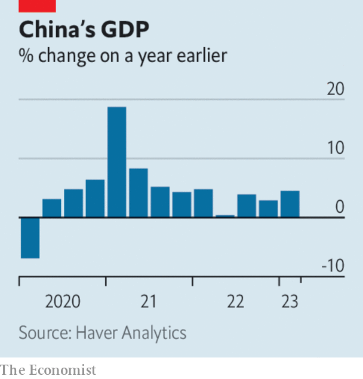

###### The world this week

# Business 

#####  

 

> Apr 20th 2023 

Elon Musk said he would launch a new platform called TruthGPT as a rival to ChatGPT and other generative-AI bots, somewhat contradicting his recent call for a moratorium on developing such technology. But Mr Musk reiterated his concerns about , even claiming it could cause the destruction of civilisation. It has emerged that Mr Musk has created a new company, X.AI, incorporated in Nevada. 

The X files

Mr Musk’s fascination with the letter X extends to , which has now changed its official company name to X Corp and moved its incorporation location from Delaware to Nevada. Mr Musk has a long-stated goal of creating X, “an everything app”. 

Sundar Pichai,  boss, warned that the world was not ready for the rapid changes that new AI will bring, saying it would “impact every product across every company” (though that isn’t stopping Google from racing ahead to integrate generative AI into its advertising, according to a report). Mr Pichai said the problem of would become much worse. In one recent example an image of Pope Francis in a white puffer coat went viral on social media before it was revealed to have been generated by AI. 

  with  over the broadcaster’s fake claims that Dominion’s machines helped “steal” the election in 2020 from Donald Trump. The $787.5m settlement is the biggest ever in a media defamation case. The deal was reached just ahead of a trial that would have called Rupert Murdoch, who controls Fox, as a witness. In pre-trial hearings the judge had dismissed Fox’s claim that it was merely reporting allegations, and said the jury’s task would be to determine if it had acted maliciously. 

Britain’s annual rate of  dipped in March to 10.1%, still stubbornly high and now twice America’s rate of 5%. Food prices rose the most in 45 years. Rishi Sunak, the prime minister, promises to cut inflation by half this year. 

 


 grew by 4.5% in the first quarter, year on year, beating the expectations of most economists. The government lifted its zero-covid restrictions in December, reopening the country to pent-up demand. The statistics bureau warned, however, that the recovery is not yet solid. 

The collapse of Silicon Valley Bank in March didn’t harm business at most of  in the first quarter. Net profit was up by around 50% at JPMorgan Chase, year on year, 32% at Wells Fargo, 15% at Bank of America and 7% at Citigroup. Profit plummeted by 18% at Goldman Sachs, however, because of poor revenue from fixed income, currencies and commodities trading. Profit was also down at Morgan Stanley, by 19%.

 can’t get a break. After collapsing in March, the bank faced claims this week from American senators that it had hampered an investigation into the “historical servicing of Nazi” accounts, which in some cases continued until 2020. The claims relate to an investigation by the Simon Wiesenthal Centre. Credit Suisse released the results of an independent inquiry that refutes the allegations. 

 biggest shareholder increased pressure on the bank to hive off its Asian business. Ping An, a giant Chinese insurer, which owns around 8% of HSBC, presented its plan in public for the first time, and said that HSBC was “exaggerating” the risks of the proposal. 

A $6.9bn charge related to up to 70,000 claims that its talcum powder causes cancer drove  to a small quarterly loss. The proposed settlement totals $8.9bn, making it one of the largest-ever liability payouts at an American company. 

 aggressive price cuts of its cars drove a 24% rise in revenue in the latest quarter, year on year. But the lower prices hit net profit, which fell, also by 24%. 

Film adaptation

 netted another 1.75m subscribers in the first quarter, taking its global users to 232.5m. That was a 4.9% increase, year on year, better than in the previous two quarters but a far cry from the 20%-plus it racked up during the pandemic. The streaming giant is delaying a crackdown on sharing passwords, after pilot schemes caused people to cancel their subscriptions. The company also said it would end its DVD-mailing service, which started off the business in 1997, in September. 

 opened its first stores in India, in Mumbai and Delhi. Tim Cook, Apple’s boss, attended the grand openings. He also met Narendra Modi, the prime minister; Apple is expanding manufacturing in the country. Costly iPhones are out of reach for most Indians and are a small share of the market. Still, Apple is tapping into steady growth in the premium-phone sector, as India’s middle class gets richer. 

