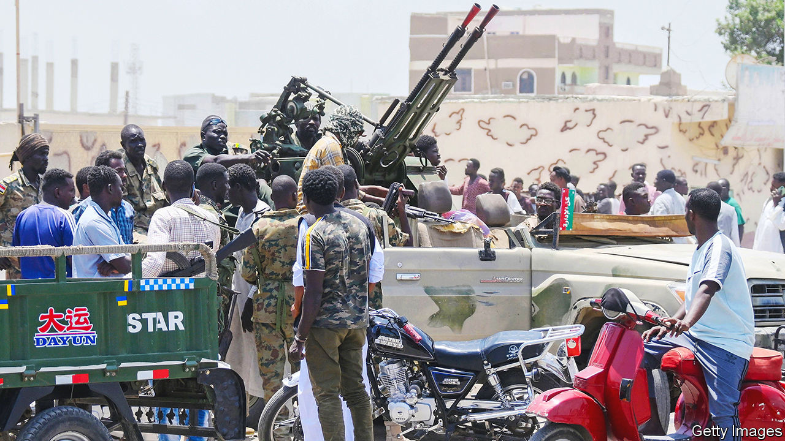
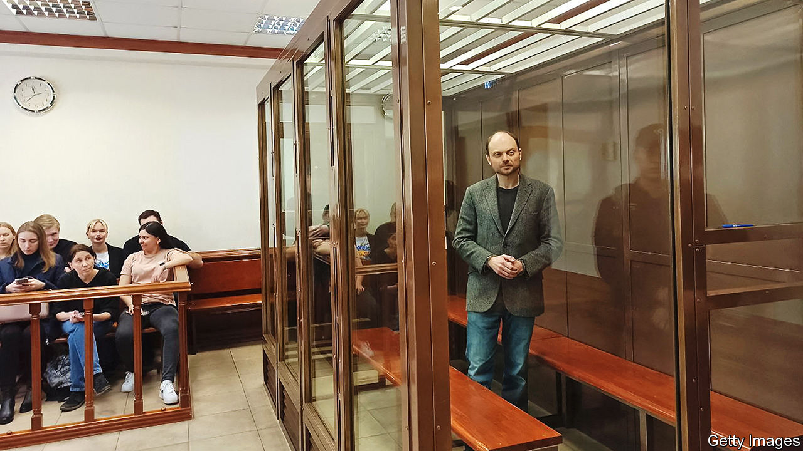

###### The world this week

# Politics 

#####  

 

> Apr 20th 2023 

War broke out in  between the national army, led by General Abdel Fattah al-Burhan, Sudan’s de facto leader, who seized power in a coup in 2021, and the Rapid Support Forces, a paramilitary commanded by Muhammad Hamdan Dagalo. Some 300 people, most of them civilians, were killed and at least 2,600 injured in the first few days of fighting, which has seen tanks and air strikes in Khartoum, the capital. Hospitals and aid agencies have been looted and diplomats attacked. 

 military government declared a general mobilisation (claiming the power to requisition people, goods and services and to impose a state of emergency) to fight jihadists who control around half the country. Western military sources worry that jihadists moving south may be able to encircle Ouagadougou, the capital, having already cut off road links in the north.

Rachid Ghannouchi, the long-serving leader of Ennahda,  main Islamist party, was arrested, according to the party. This marks a drastic step against the opposition by Kais Saied, the increasingly repressive president. 

In a sign that the two sides in  civil war may be getting closer to a peace deal, almost 900 people were released in a prisoner swap between the Houthis, a Shia rebel group that controls large parts of the country, and the Saudi-led coalition that has been fighting them since 2015. Meanwhile at least 80 people died in a crush as aid was being distributed in Sana’a, the capital. 

Sergei Lavrov,  foreign minister, visited  and . Luiz Inácio Lula da Silva, Brazil’s president, met Mr Lavrov, after stirring up trouble by suggesting that America was prolonging the fighting in Ukraine by sending weapons to Kiev. Lula clarified later that he condemned the invasion of Ukraine, but American officials remained unimpressed. Mr Lavrov is also visiting Cuba and Nicaragua. 

 Supreme Court annulled a contentious reform backed by Andrés Manuel López Obrador, the president, which would have put the National Guard, ostensibly a civilian police force, under the control of the armed forces. Mr López Obrador meanwhile accused the Pentagon of spying on Mexico, and promised to safeguard classified information about the army. 

 


A Russian court sentenced a prominent critic of the Putin regime to 25 years in prison for criticising the war in Ukraine, which the prosecution considered to be tantamount to treason. , who holds dual British-Russian citizenship, told the court he stood by “every word” and did not want to be acquitted. The judge took just minutes to rule on the case. 

A separate Russian court upheld the detention of , a journalist with the , on allegations of spying and refused to grant him bail. The American government again called for his release. 

Poland, Hungary and Slovakia banned some . The governments in all three countries are under pressure from farmers, who claim that cheaper Ukrainian surpluses undercut their bottom line. Officials in the EU said the bans were possibly illegal and counter-productive, undermining Europe’s support for Ukraine. One diplomat accused the Polish government of engaging in “gesture politics”. The government said it would allow Ukrainian grain to transit through Poland. 

Carry on, Emmanuel

Emmanuel Macron tried to regain control of the political agenda in  after months of sometimes violent protests against his pension reforms. He promised new measures to improve working conditions, among other things, by July 14th, Bastille Day. The French president said now was a time for “unity”. His comments came shortly after he signed the reform, which increases the state retirement age from 62 to 64, into law. 

The disarray within the  following the abrupt departure of Nicola Sturgeon as leader continued with the arrest of the party’s treasurer, who then stepped back from the role. The police are investigating claims that donations for a second independence referendum were misused. The scrutiny is an embarrassment for the SNP as it attempts a reset under its new leader, Humza Yousaf. He has said he only recently learnt that the party has been without auditors since October.

A 24-year-old man threw a smoke bomb at  prime minister, Kishida Fumio. The bomb-thrower was reportedly aggrieved at having been barred from running for an election. The incident rekindled fears of attacks on politicians, nine months after the assassination of Abe Shinzo, a former prime minister.

Separatist rebels in the  province of Papua attacked government troops searching for a pilot from New Zealand whom the rebels are holding hostage. Officials said one soldier was killed; the rebels claimed they shot dead nine troops. 

The UN’s annual population report listed India as having a bigger  than China for the first time. India’s population will reach 1.429bn by the middle of this year against China’s 1.426bn.

 Supreme Court heard arguments in the biggest test yet of the country’s ban on gay marriage. The court is focusing on secular laws that regulate marriage. The government wants to keep the ban, arguing that only the legislature can change the law. 

The FBI arrested two men accused of working as  and operating an “illegal overseas police station” in New York that liaised with China’s national police to intimidate Chinese dissidents in the United States. The authorities in New York also charged 34 police officers in China with harassing Chinese dissidents in America via social media. 

, Florida’s governor and putative Republican presidential contender, hurriedly signed a bill into law that bans abortion in the state after the sixth week of pregnancy. Mr DeSantis is veering further to the right to appeal to the supporters of Donald Trump he must win over in the primaries. 

Never on a Sunday

The Supreme Court heard arguments in a case brought by a  who says he should not be forced to work on the Sabbath. Gerald Groff worked for the postal service, which wanted him to deliver Amazon packages on Sundays. He claims he was discriminated against on religious grounds. A ruling in his favour may force companies to honour employees’ religious observances. 

