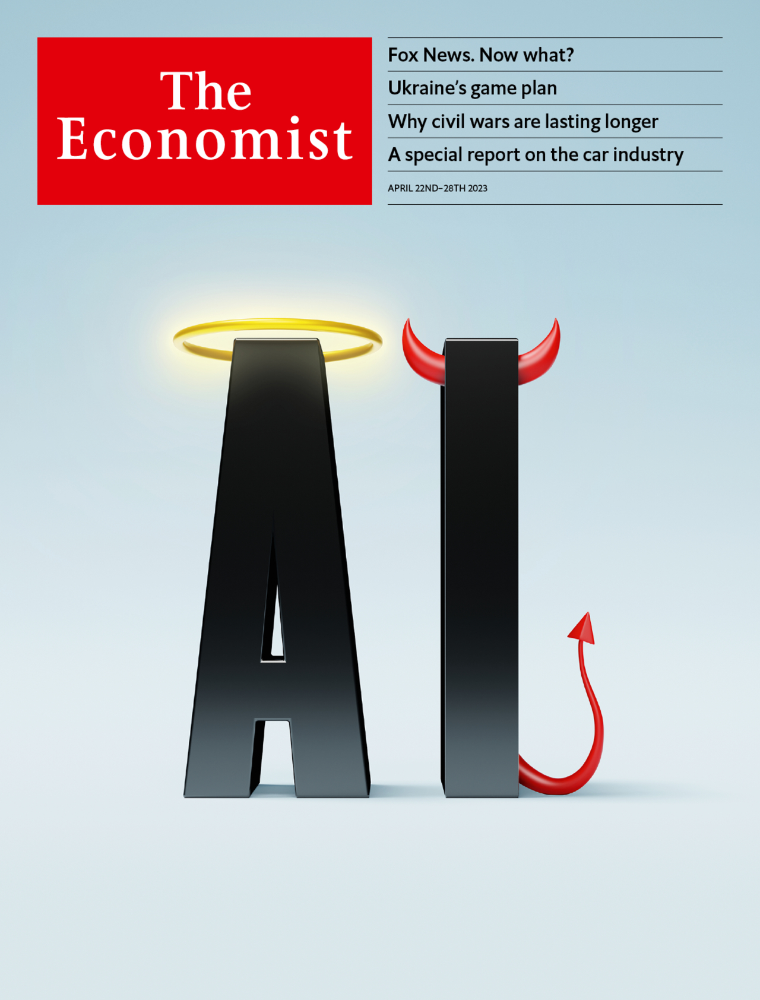

###### The world this week

# This week’s cover 

##### How we saw the world 

> Apr 20th 2023 

This week’s worldwide cover considers the rapid progress being made by artificial intelligence (AI). The technology is arousing a mixture of fear and excitement. The key to regulating it is to balance its promise with an assessment of its risks—and to be ready to adapt.

 


: 

: 

: 

: 

: 

: 

