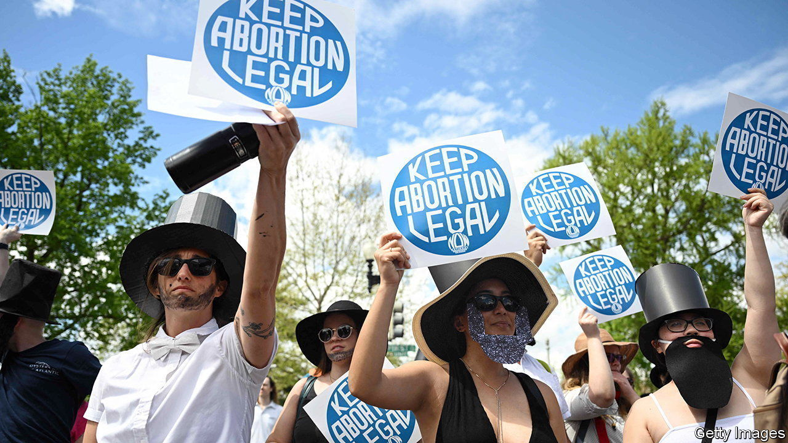
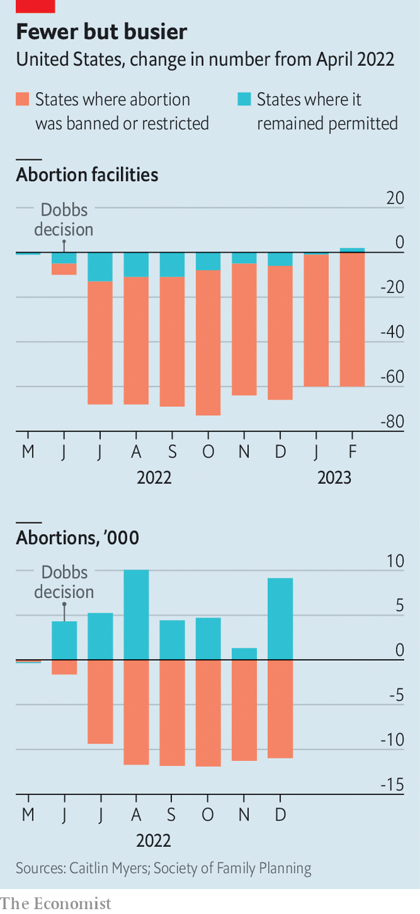
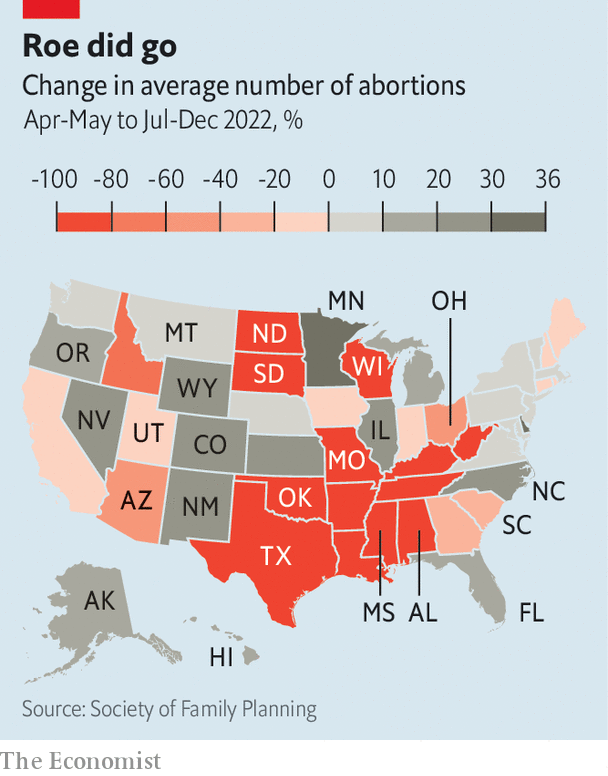

###### Rulings have consequences

# Abortions have become 6% rarer since the end of Roe v Wade 

##### That overall number disguises a huge variation between states 

 

> Apr 18th 2023 

After the Supreme Court issued its ruling in  last June, which reversed its decision in  and let states ban abortion, the biggest remaining question was what effect the change would have. On paper,  established a nationwide right to abortion. However, conservative states had already implemented rules before  that made abortions, though technically legal, very hard to obtain. Liberal states, in contrast, were unlikely to impose new restrictions. Were ’s protections worth as much in practice as in principle?

In the past, state-level data on the prevalence of abortion were patchy. But a report released by the Society of Family Planning (sfp), a non-profit group, quantifies the effect. From July to December 2022 there were 31,180 fewer abortions than pre- rates would suggest, a decline of 6%. That is despite a rise in abortions administered by virtual clinics, which prescribe abortifacient drugs like  (which the Supreme Court has temporarily protected).

 


In early 2022 sfp began compiling a database of every clinic, medical office and hospital known to perform abortions. It asked each one to calculate monthly abortion counts, and offered to pay expenses for data collection. Of the organisations contacted, 83% submitted numbers. sfp produced estimates for the remaining 17%.

The overall decline understates the effect  has had in much of the country. Across the 22 states where new restrictions took effect following the ruling, the number of abortions fell by 67,040 (63%). Even in states with tight pre- restrictions, the decision’s impact has been vast. After Texas implemented a law in 2021 that banned abortions once a fetal heartbeat could be detected, its abortion rate fell from 5,400 per month to 2,200. In April 2022 sfp recorded 2,700 abortions in the state. But between July and December 2022 it has logged fewer than 100. Abortion has also all but disappeared in seven other states, including four in the South.

In states with more permissive rules, in contrast, abortions rose by 35,860 (12%). This suggests that slightly more than half of women who would have had abortions in restrictive states before  travelled elsewhere to obtain them. The remaining 31,180 either carried their pregnancies to term or obtained abortions by methods that do not appear in sfp’s data.

 


The states with the greatest increases tend to share borders with places where abortion has declined or vanished. Now that Wisconsin bans the procedure even in cases of rape or incest, abortion rates in neighbouring Illinois and Minnesota have risen by 21% and 36%. Similarly, Florida and North Carolina have become havens for abortion in the South—though Florida, home to half of the region’s remaining abortion clinics, is about to reverse course. On April 13th it  of pregnancy.

Perhaps the most striking finding is that abortion has become rarer even where courts have temporarily protected it. In Indiana, a judge blocked a near-total ban just one week after the law went into effect. Even though the procedure remains legal for now, Indiana’s abortion rate plummeted: in December 2022 it was 40% below its pre- level. Similarly, in the three months after a court in Ohio issued an injunction pausing an abortion ban, abortion was 23% rarer than before .

Often, it is money that determines whether a woman can travel to obtain an abortion. In their dissent in , the Supreme Court’s liberal justices warned that letting states choose their own rules would be “cold comfort…for the poor woman who cannot get the money to fly to a distant state for a procedure”. The data appear to support their prediction: of the 13 states where abortions have fallen by at least 80%, seven are among the ten poorest.■


