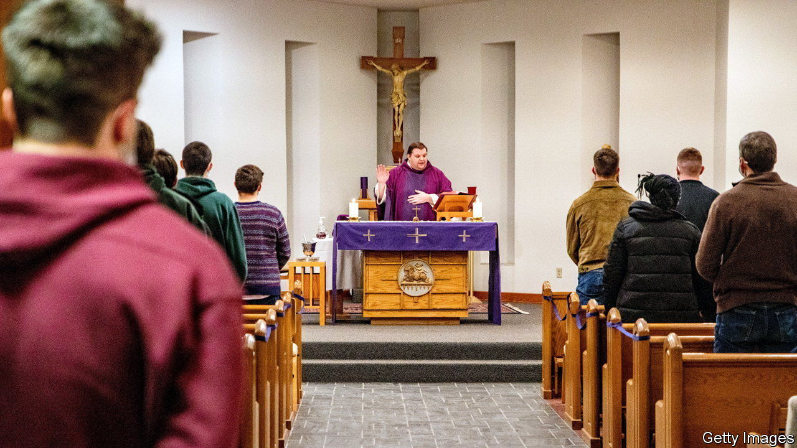
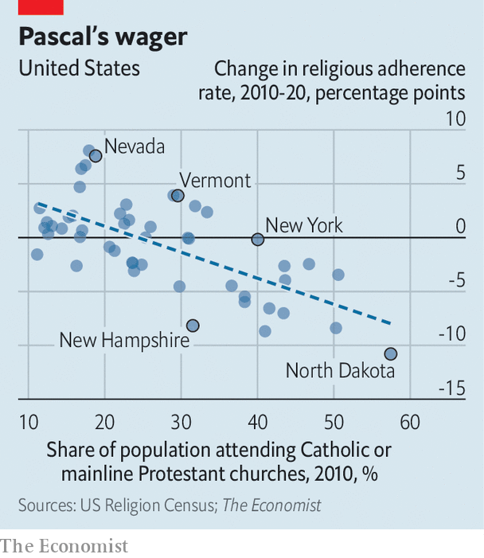

###### Counting Christians

# American religion is becoming less exceptional 

##### In 1972 90% of Americans called themselves Christians; now just 64% do 

 

> Apr 20th 2023 

WHAT IS a shepherd without a flock? Many of America’s pastors may soon have to answer. In 2014, 3,700 Protestant churches closed, by 2019 that figure was 4,500, according to Lifeway Research, a non-profit organisation that provides resources for ministry. Many parishes simply do not have enough congregants to pay the bills. In 1972, 90% of Americans called themselves Christians; now just 64% do. The waning of religiosity in America is not new, of course. But newly released data shed light on where religious adherence has dropped most, and among which Christian denominations. 

Every ten years the Association of Statisticians of American Religious Bodies (ASARB) attempts a tally of membership for every church in the country. It is a monumental feat of data-gathering, covering hundreds of religions and thousands of congregations. Figures for the 2020 census are now finally available. They issue a stark warning to the country’s “mainline” Christian denominations: membership of these old churches, such as the Methodists, Lutherans and Episcopalians, is shrinking at an alarming rate. Whereas the ranks of all religious Americans rose by 10.6m believers (7%) from 2010 to 2020 (when the overall population grew by 7.5%), the number of Episcopalians and Methodists dropped by 19% each, and the Lutherans plunged by 25%. Presbyterians, a Protestant group characterised by disdain for flashy ceremony, lost nearly 1m (40%) of their members over the same period—the largest drop of the major denominations.

 


Church-going fell by far less for evangelicals. The Southern Baptist Convention, the largest and most influential evangelical group, shrank by a mere 11% from 2010 to 2020 despite being roiled by various scandals straight from the Old Testament. Among the 50 largest religious sects in the country, evangelicals account for six of the ten fastest-growing. Not a single mainline Protestant church gained members. But some groups grew quickly: non-denominational Christian churches recruited 9m new members over the past decade, an increase in membership of 72%. Catholics claim they gained nearly 3m members (a 5% increase) despite closing over 1,100 churches. Geographically, the states with the highest shares of Catholics and mainline Protestants have seen the biggest drop in religious adherence (see chart).

What has gone so wrong for America’s oldest churches? One answer is age. According to data from the Pew Research Centre, a think-tank, a majority of mainline Christians are over 50 and one-third are older than 65. Only about one in ten are under the age of 30. For many churches, older congregants are simply dying too quickly to be replaced by new members. 

Another explanation is conversion. Pew finds that just over one-third of Americans between the ages of 30 and 39 who were brought up in Christian households no longer identify with that faith. But only 20% of young adults brought up outside the church have travelled in the opposite direction, making far more leavers than joiners. The problem has become even worse in recent years. According to Pew, in 1990 only one in ten Christian-raised adults between the ages of 30 and 34 became “switchers”. Rates have more than tripled since then. 

Pew reckons that if these trends continue, the non-religious could become the dominant group in American society as soon as 2055. One concern is what the shepherds will do next. A deeper one is what happens to a wandering flock.■


