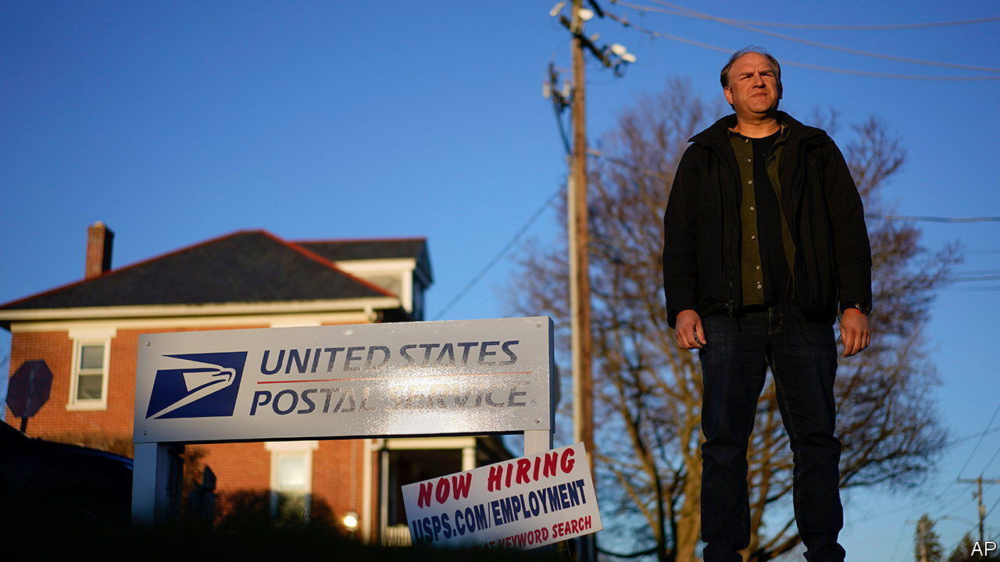

###### Postal piety

# America’s Supreme Court weighs religious accommodations in the workplace 

##### The justices grope for common ground in a religious-rights row 

 

> Apr 20th 2023 

When gerald groff took a job as a pinch-hitting mail carrier for the United States Postal Service in 2012, his strict observance of the Christian sabbath posed no problem. But after the USPS started doing business with Amazon a year later—delivering the internet giant’s packages every day of the week—those Sabbatarian commitments became an issue. Mr Groff’s rural-Pennsylvania bosses found ways to accommodate him for a time, but colleagues grew weary of taking his shifts and he was instructed to report on Sundays. Mr Groff refused, drawing letters of reprimand and suspensions. Eventually, in 2019, he quit.

Mr Groff lost twice in lower courts when he claimed USPS had violated the bar on religion-based discrimination in Title VII of the Civil Rights Act of 1964. On April 18th, when came to the Supreme Court, justices from right to left—and lawyers for both parties—found some common ground. All agreed the court was mistaken in 1977 when it wrote, in  that companies need not “bear more than a cost” when offering religious accommodations. This formulation, to everyone’s mind, failed to uphold Title VII’s promise that businesses must accommodate such religious requests unless they inflict an “undue hardship on the conduct of the employer’s business”.

Trying to save  from its universally disdained test, Justice Brett Kavanaugh pointed to a footnote in the decision clarifying that only a showing of “substantial” costs could relieve an employer of the duty to make room for an employee’s religious practice. Justice Neil Gorsuch built on this in colloquy with Elizabeth Prelogar, the solicitor-general, who defended the postal service. Both parties agree that whether a business must offer an accommodation is “context-dependent”, he said, and that civil-rights protections must be robust, not “trifling”. And, Justice Gorsuch suggested, there may not be much daylight between “significant difficulty or expense” (Mr Groff’s proposed standard) and “substantial cost” (’s). So why, Justice Gorsuch asked, shouldn’t the Supreme Court just clarify that, send the case back to the lower court and therefore “be done with it”?

Justice Elena Kagan threw some chilly water on this ostensible solution. All the “kumbaya-ing” in the abstract is lovely, she said, but the parties still disagree about whether Mr Groff had a right to take every Sunday off—and, more broadly, there is currently a big difference of opinion between the parties “as to which cases require an accommodation”. 

Ms Prelogar argued that Title VII does not require a company to provide an accommodation that would leave it persistently short-staffed or paying overtime week after week. Three of Mr Groff’s co-workers were bothered enough by having to fill in for him on Sundays that one quit, one transferred and one filed a grievance. This, Ms Prelogar said, counts as “an undue hardship under any reasonable standard”. Mr Groff’s lawyer, Aaron Streett, said this approach “would have the effect of eviscerating…any Sabbatarian observance” that “was at the very core” of what Congress was trying to protect when it passed Title VII.

Micah Schwartzman, a law professor at the University of Virginia, said before the oral argument that most observers had been expecting the court to overrule But the tenor of the hearing puts that prediction on shakier ground. The three more liberal justices—Ketanji Brown Jackson, Justice Kagan and Sonia Sotomayor—may have at least two conservatives on their side in hanging on to the nearly five-decade-old precedent.

Justices Gorsuch and Kavanaugh seem more keen to clarify than to abandon the precedent, and Donald Trump’s third appointee, Amy Coney Barrett, also pointed towards a more modest resolution. Justice Kagan said she could count on “like, a finger” how many times the court has overturned similar statutory precedents that Congress could fix by itself.

Justice Samuel Alito took a sharper position, telling Ms Prelogar he was “really struck” by her claim that the courts have been enforcing Title VII faithfully. Friend-of-the-court briefs from “Muslims, Hindus, Orthodox Jews [and] Seventh Day Adventists”, he said, claim that  has harmed their religious freedom. “Are they wrong?” Yes, Ms Prelogar said. The record shows a “substantial zone of protection for religious exercise” over decades of litigation in American courts.

With the exception of Justice Alito and perhaps Justice Clarence Thomas, who said little, the court seemed receptive to Ms Prelogar’s plea not to rock the boat by coming up with a new standard. “What’s clear to me, after all this discussion,” said Justice Sotomayor late in the hearing, is that although some “might want to provide absolute clarity, there is none we can give, is there?” Justice Kavanaugh sounded resigned, too; “I’m not sure”, he said, “we can give you a full manual about how it is going to play out.”■


