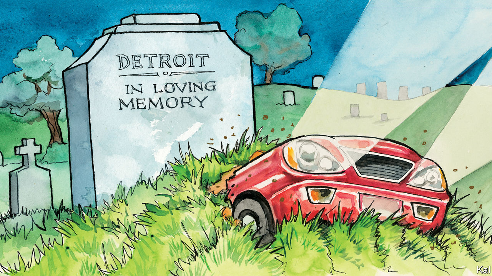

###### Lexington

# Detroit is working again 

##### Despite big problems, the city that sums up American success and failure is looking pretty positive 

 

> Apr 20th 2023 

The seal of Detroit, created after it burned to the ground in 1805, anticipated the way despair and determination would vie ever after for the city’s future. One woman weeps beside burning buildings while another next to her, smiling, is flanked by a grand, flame-free Detroit. “We hope for better things,” sighs one motto, in Latin. “It will arise from the ashes,” insists the other. 

The arising-from-the-ashes moment has been heralded at intervals for a long time. “There is little doubt that Detroit has turned the corner on some of its most obvious problems,” reported the  back in 1980. “Middle-class whites are moving back into the city, and a visitor senses a new vitality downtown.” Yet in the decades ahead lay the exodus of hundreds of thousands more residents, more declarations of renaissance and, in 2013, America’s biggest municipal bankruptcy.

That history is chastening. Let it be said that Detroit has not turned the corner on all its obvious problems, including a high crime rate and beleaguered schools. But determination has clearly gained the upper hand. Ford, General Motors and Stellantis (whose biggest shareholder, Exor, also part-owns ’s parent company) are making big bets on Detroit, as are Amazon, Google and the developer Stephen Ross. Under Mayor Mike Duggan, in his tenth year, the government has courted investment by offering itself not just as provider of tax incentives and expediter of permits but as real-estate agent and hr department. 

Stellantis built the first new auto-assembly plant in Detroit in more than 30 years—a $1.6bn investment, constructed as the pandemic raged—after the city traded 200 acres for a promise to give residents first crack at the jobs. Then the city screened candidates, testing them in maths and reasoning, as well as for drugs, offering tutoring to those who needed it. Of 30,000 Detroiters referred by the city, Stellantis has hired some 8,600, at the plant and elsewhere. “It didn’t do me any good to land a plant in Detroit and hire a bunch of suburbanites,” says Mr Duggan, a practical, old-school liberal in the mould of Joe Biden, to whom he is close. “My job was to get Detroiters to work.” 

By the beginning of the year, Detroit’s unemployment rate had dropped below 7% for the first time since 2000. Mr Duggan boasts that “at this point, anybody in this city who wants to work has a job available.” With tax receipts running well ahead of forecasts, the city is applying its federal covid-relief money—more than $800m—to improving its public spaces and its workforce. It is offering full-time jobs, with benefits, at tasks like cutting grass, but letting workers spend two out of five paid days in apprentice programmes for higher-skilled work.

No American city is more haunted than Detroit by America’s successes and failures—by American capitalism’s power to create and destroy, and by American democracy’s capacity to promise opportunity to all yet deny it by race. The city’s conflicting legacies burden it but also sustain it, giving it a grip on Americans’ imagination no other city can match. “I think across the country folks believe the people of Detroit didn’t deserve what happened,” Mr Duggan says. “There’s been no shortage of people willing to help.”

Henry Ford invented mass production in Detroit, and while working on a Ford assembly line Berry Gordy, playing the piano in his mind, began to create the Motown sound. Towards the middle of the last century, the city government was so rich it could shovel money to its Institute of Arts to buy paintings by Rembrandt. 

But then hundreds of thousands of auto jobs left, and hundreds of thousands of white people did, too. Detroit became so desolate by the 1990s that Camilo José Vergara, an artist, proposed in magazine turning the magnificent, boarded-up buildings downtown into a ruins park, an “American acropolis”. 

One of the most prominent ruins was Michigan Central railway station, a Beaux-Arts massif of marble and bronze designed by the architects behind New York’s Grand Central station. In the mid-1990s, when Lexington was a reporter in Detroit, the three-storey depot and its 18-storey office tower stood empty, stripped and smeared with graffiti. He would wander the vast space trying to imagine the city that once filled it with life. 

Late this year, after an investment of some $740m, Ford plans to reopen Michigan Central as the hub, with some 5,000 workers, of a 30-acre campus devoted to the future of transport. Farther downtown, buildings Mr Vergara envisioned in his park have been replaced or revived, many by Dan Gilbert, the co-founder of Rocket Mortgage, who is reported to have invested $2.5bn in Detroit. 

Don’t call it a comeback

Kofi Bonner, chief executive officer of Mr Gilbert’s development firm, Bedrock, argues that the sameness of glass-and-steel development in coastal cities has made Detroit more appealing. He rattles off a list of ambitious projects. “None of that was here eight years ago,” he says. “The intensity and density of investment that has occurred in a fairly short time frame has finally captured the attention of folks.” Mr Duggan sees the downtown as the selling point for Ford and the high-tech workers destined for Michigan Central, and it is true that millennials can be seen walking their somethingdoodles on pavements once vacant at night. 

To say it again: Detroit has lots of work to do, not just to enchant the young but to retain families, and to spread the wealth to outlying neighbourhoods. The city sprawls over 140 square miles, which made some sense in 1950 when it had 1.8m people, but less today at a third that many. Under Mr Duggan, Detroit has demolished or sold 40,000 vacant houses; it has about 12,000 to go.

Yet Mr Duggan also finds himself with high-class headaches no Detroit mayor has had for generations. As parts-makers move to be near the new assembly plants, he cannot come up with enough space for a battery factory. “Really,” he says, “at this point, I wish I had another three or four hundred acres.” ■


