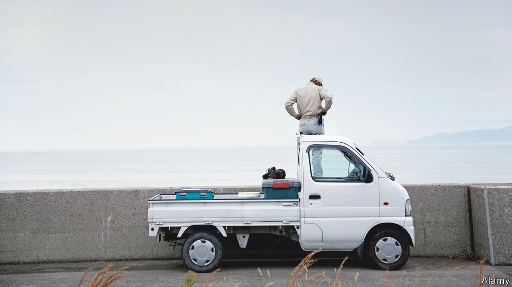

###### Tiny trucks

# Rural Americans are importing tiny Japanese pickup trucks 

##### Bigger isn’t always better 

 

> Apr 20th 2023 

A couple of years ago Jake Morgan, a  who lives just outside Raleigh, in North Carolina, realised he needed a new vehicle to get around his property. At first he was looking at “side-by-sides”—a sort of off-road utility vehicle. But watching a review on YouTube of one that costs around $30,000 made by John Deere, he saw a comment that said something like “Why don’t you just get a minitruck instead?” That is, a tiny four-wheel drive pickup truck, sometimes known as a “Kei” truck, mostly made in Japan to take advantage of laws there which tax smaller vehicles less.

Intrigued, Mr Morgan started researching. Within a few months, he drove to Newport, Virginia to pick up a 1997 Honda Acty, having spent a total of just $2,000 on importing it. He was delighted. Not only was it “dirt cheap”, but the Acty is less than five feet wide, and so can get into tight spaces a normal pickup cannot, like Mr Morgan’s barn. And unlike a side-by-side, it can also be driven legally on local roads. “They’re amazingly useful,” he says. Not long after importing his first, he sold it and bought another. The new one is even better—it has air-conditioning and a button which activates a dumper.

Kei trucks were never intended for sale in America. Most are right-hand drive, and they do not always have airbags or other safety features required in new cars. The bulk are imported under a rule that allows non-compliant vehicles that are older than 25 years to be brought into America, a carve-out intended originally for collectible vintage cars, although a few specialist dealers import newer ones too, for sale as off-road vehicles. They fill a niche American manufacturers are failing to.

Todd Gatto, one of the owners of hvny Imports, a firm in Goshen, New York, says that he has sold over 300 to local businesses in the past few years. “We bought five of them to start, and we sold them all within seven days,” he says. Buyers include farmers, but also building contractors, a deli and Legoland, the theme park. “A lot of commercial businesses see the use of these over an $85,000 F250,” he says (the F250 is an  sold by Ford). 

Unlike new vehicles with onboard computers and complicated proprietary parts, Kei trucks are easy to modify and repair. In northern Wisconsin and Minnesota, people fit them out with tracks to drive on ice in winter. Some owners are almost cultish. “MotoCheez”, a mechanic from Connecticut, says his YouTube channel’s popularity soared after he started featuring his Kei truck.

As the demand grows, some worry that the loopholes that allow their import and use might be closed. Dealers increasingly report trouble getting the vehicles registered for road use, particularly in north-eastern states. Safety concerns are part of the reason. Mr Morgan admits his would be a “death trap” on a busy highway. But some fans suspect an auto-industry stitch-up to keep out cheap Japanese competition. If so, it would not be the first time.


