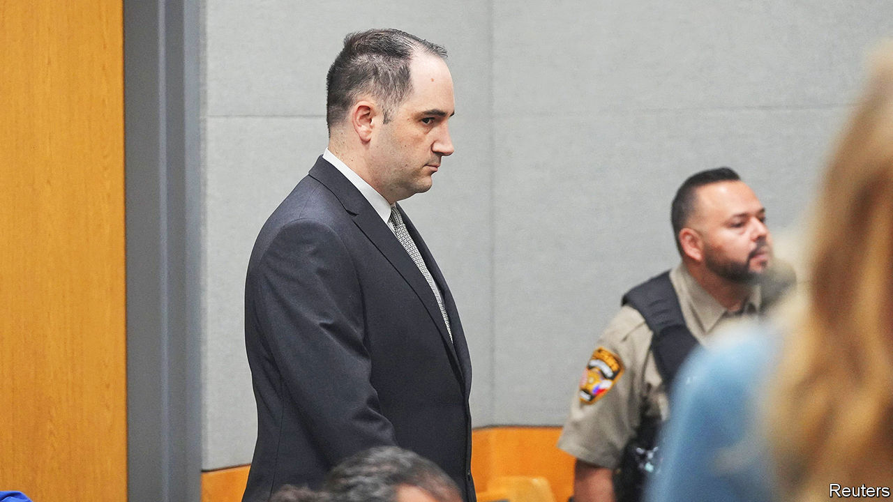

###### Of arms and harms

# The Daniel Perry case shows the contradictions of gun enthusiasts in Texas 

##### It cannot be the case both that all should be armed, and that anyone who is armed poses a mortal threat 

 

> Apr 20th 2023 

IN 2020 Daniel Perry (pictured), who was working as an Uber driver in downtown Austin, drove towards a group of “Black Lives Matter” protesters with a revolver in his car. One of the protesters, Garrett Foster, who himself was legally carrying an AK-47 (a detail which in any other country would suggest a war was under way), approached. Mr Perry shot him five times, killing him. Mr Perry argued that he shot Foster in self-defence, because Foster aimed his gun at him.

A jury disagreed with Mr Perry’s self-defence claim, convicting him of murder on April 7th. The next day Texas’s governor, Greg Abbott, announced his desire to pardon Mr Perry. The move is highly unusual. Mr Perry has not been sentenced and is awaiting a recommendation for a pardon from the state’s Board of Pardon and Paroles, whose members Mr Abbott appointed. Both Mr Perry and Foster are white. Foster was an Air Force veteran; Mr Perry was an active-duty soldier. The biggest difference seems to have been their affiliation to different political tribes.

What transpires is worth watching because of what it reveals about Texas and America writ large. First, it shows the strong influence certain media can exert over politicians. Mr Abbott supported pardoning Mr Perry within a day of Tucker Carlson, an influential commentator on Fox News, bemoaning the “legal atrocity” of Mr Perry’s conviction and calling out Mr Abbott for believing that “there is no right of self-defence in Texas.”

Mr Abbott does not want to seem insufficiently conservative to the Republican base or legislators in Texas, as he pushes his legislative priorities at the Capitol in Austin, says Mark Jones, a professor at Rice University. Coming to Mr Perry’s defence also raises Mr Abbott’s national profile among Republican voters as he eyes higher office, with Mr Perry’s case tying together several of their favourite issues, such as gun rights and distrust of “woke” protesters and progressive district attorneys. (José Garza, the DA for Travis County, which includes Austin, was supported by an outfit funded by George Soros.)

Second, the Perry case points to a growing “pattern of politicising self-defence”, says Eric Ruben of Southern Methodist University’s Dedman School of Law in Dallas. In recent years politicians have been more willing to wade into contentious cases. Donald Trump offered positive character assessments of Kyle Rittenhouse, a man who shot three people, killing two (he was acquitted of all charges), and Mark McCloskey, who, alongside his wife Patricia, brandished guns at Black Lives Matter protesters from their front porch. (The McCloskeys pleaded guilty to misdemeanours but were pardoned by Missouri’s governor.) Some pundits and politicians on the right are saying Mr Perry should never have been prosecuted. The notion that self-defence should “immunise” someone from prosecution is “radical” and a departure from legal norms, says Mr Ruben. 

The evidence, let alone the jury’s unanimous verdict convicting Mr Perry of murder, make this a bizarre case for the right to uphold as a clear instance of “self-defence” anyway. Mr Perry sent a message to a friend saying that he might “have to kill some protesters on his way to work”, and when his friend suggested he should use ammunition wisely, so as not to run out, he replied that he would “only shoot the ones in the front and push the pedal to the metal”. In his early debriefing with the police, after reporting that he had shot Foster, he said he “believed” Foster was going to aim his gun at him, not that he already had. 

Mr Perry would have lacked potential grounds for a defence, and pundits a platform for outrage, were it not for Texas’s “stand your ground” law. Under common law, people have the duty to retreat if possible when threatened, and force is meant to be proportionate to the threat. But since the mid-2000s, starting in Florida, states have been passing laws that give people the right to use deadly force if they feel threatened, even outside their home. Today around 30 states have “stand your ground” laws in place. Mr Perry’s murder trial is only one example calling attention to shootings in the name of self-defence; a 16-year-old boy, Ralph Yarl, who recently rang the doorbell of the wrong house in Missouri and was shot twice, is another. 

The convergence of broad “stand your ground” laws and more permissive gun laws is a toxic combination, says Kami Chavis, a professor at William and Mary Law School. Messrs Perry and Foster were both armed when they encountered each other, thanks to Texas’s lax gun laws. But there is an inconsistency in the logic of Mr Perry’s supporters, who say that he justifiably felt threatened and needed to act in self-defence because his victim was carrying an assault rifle. That fear would have had no basis if the open carrying of assault rifles was banned. Gun-rights activists “have to be intellectually consistent in their application of these principles,” says Ms Chavis. “Just because you’re armed doesn’t mean you’re a threat.” ■


