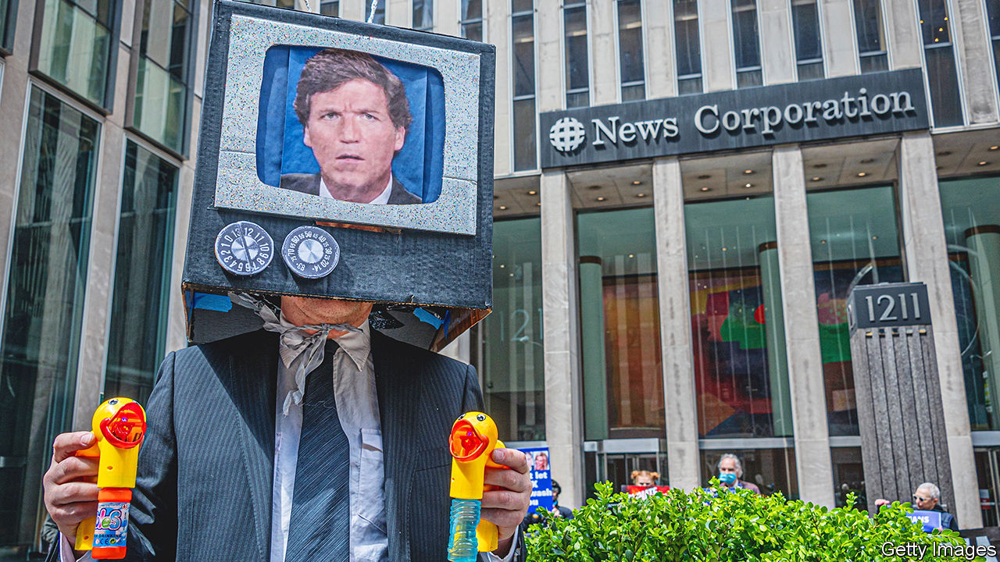
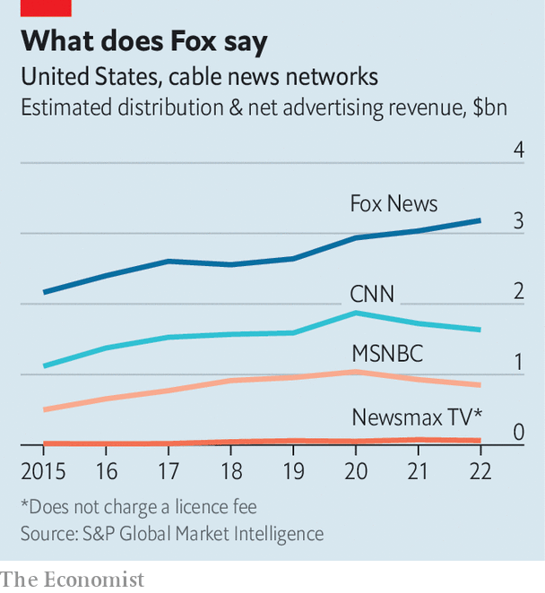

###### Audience capture

# The Dominion lawsuit showed the limits of Fox’s influence over its audience 

##### But notwithstanding a big settlement, the impact was negligible on America’s most popular cable network 

 

> Apr 17th 2023 


RESPECT THE audience; make money. That was how  explained his success on conservative talk radio in the early 1990s. Educated types derided his listeners—religious, working-class people—but he affirmed them and made things devilishly fun. The charge that he delivered “marching orders” to “mind-numbed robots” had it all wrong, said Limbaugh, who died in 2021. Rather he listened to his listeners, and voiced their convictions. It was wonderful for ratings. “This is a business!”, he once exclaimed.

Some 30 years on the same principle drives , the cable-news network that brought Limbaugh’s right-wing, populist sensibility to TV and, on April 18th, settled a mammoth  over its coverage of the 2020 election. Dominion Voting Systems, a voting-technology firm, had sued for defamation, accusing the network of knowingly spreading a lie that Dominion’s machines somehow threw the election to Joe Biden. Not since the phone-hacking scandal at the , a now-defunct British tabloid, had an outlet in Rupert Murdoch’s media empire landed in such a legal mess.

Fox will pay Dominion $787.5m, about half of what Dominion had first sought in damages. That figure dwarfs what is thought to be the second-largest defamation settlement involving a news outlet, the $177m paid by ABC News in 2017 to a meat producer whose products it reported were unsafe. The deal was struck moments before a trial was due to start in Delaware. That Dominion’s lawsuit had proceeded so far was itself remarkable. Defamation cases are notoriously hard to win in America—defendants must be shown to have knowingly published a lie (the legal standard is “actual malice”)—deterring would-be plaintiffs from bringing them.

But what really made  extraordinary were its revelations ahead of the trial. The lawsuit laid bare—through the release of emails, texts and depositions of Fox staff and management—the extent to which America’s most popular cable network’s coverage is shaped by a desire to tell its audience what it wants to hear and also by what its competitors are up to. And the case shed light on Fox’s fractious relationship with the politician loved by many of its viewers, Donald Trump. 

Fox’s trouble started on election night. To Mr Trump’s dismay it was the first outlet to call Arizona, a swing state, for Mr Biden (correctly). Later several Fox reporters challenged Mr Trump’s claims that there had been widespread voter fraud. Such acts of journalism infuriated the outgoing president, who urged his supporters to switch to Newsmax and One America News, two upstart, fringe networks. That day the share price of Fox News’s parent company, Fox Corporation, shed 6%. Many of his voters duly changed the channel. About two weeks after the election Newsmax’s prime-time audience had tripled, to 412,000. Fox’s fell by 37% to 3.5m. 

Fox got on a “war footing”, in the words of one executive. Suzanne Scott, the network’s boss, vowed to “plant flags letting the viewers know we hear them and respect them”. A journalist who had corrected election-fraud lies was chastised. So was another whose reporting higher-ups deemed “smug”. “I can’t keep defending these reporters who don’t understand our viewers,” wrote Ms Scott. The editor in charge of the Arizona decision was fired at the suggestion of Mr Murdoch, chair of Fox Corporation, who called the dismissal “a big message with Trump people”. 

Meanwhile Mr Trump’s lawyers, Sidney Powell and Rudy Giuliani, sat for chummy, credulous interviews. They said that Dominion was owned by a Venezuelan company founded to rig elections for Hugo Chávez, and that the firm paid officials to alter votes. Both claims were made up. Privately people at the network called Ms Powell and Mr Giuliani kooks, full of “crazy stuff”. But the audience ate it up. “Any day with Rudy and Sidney is guaranteed gold!”, wrote a producer to colleagues. 

Court filings showed how quickly the network moved to appease Trumpy viewers and fend off outlets like Newsmax, whose ratings then fell back. (Their threat has thoroughly subsided: big cable distributors no longer carry One America News, and Newsmax was briefly dropped by DirectTV, a satellite provider, in January.) The filings also showed the extent of disdain that both Mr Murdoch and Tucker Carlson, the network’s star host, had for Mr Trump. “I hate him passionately,” Mr Carlson wrote to a colleague a few days before the Capitol riot. “What he’s good at is destroying things. He’s the undisputed world champion of that. He could easily destroy us if we play it wrong.” A couple of months earlier, Mr Murdoch wrote that Mr Trump was “increasingly mad”.

Having followed the audience, as Limbaugh advised, Fox then attempted to lead it. For at least three months the network did not grant Mr Trump an interview, and tried hard instead to boost Florida’s governor, Ron DeSantis. Aides to Mr DeSantis have fed story ideas and talking points to Fox, according to records obtained by the . Mr DeSantis appeared on the network nearly once a day for months after the election of 2020. It is the kind of collaborative relationship Mr Murdoch seeks with conservative politicians and so unlike that with Mr Trump, who openly criticises the network on social media. 

But the audience would not be led. During hearings of the January 6th Committee, the FBI’s raid on Mar-a-Lago, or Mr Trump’s indictment by Manhattan prosecutors, Fox rallied to Mr Trump’s defence. “They can’t move until their audience moves,” says Nicole Hemmer, a historian of conservative media at Vanderbilt University. Mr Murdoch appears to agree. “[Leading] our viewers…is not as easy as it might seem,” he wrote after the Capitol riot. Mr Carlson recently gave an hour-long cuddle of an interview to Mr Trump.

 


All of which is fascinating for students of Fox and its influence on the American right. But what of the lawsuit’s damage? The network can pay the settlement, which is about a quarter of what analysts estimate that Fox News earned in revenue last year. Otherwise the impact is negligible, says A.J. Bauer of the University of Alabama. Viewers will not have heard much about the lawsuit on Fox, since the network barely covered it; those who caught wind of it elsewhere were primed to take Fox’s side. “I don’t see any reason why the lawsuit changes the way that Fox does business because the way it does business makes it money,” says Mr Bauer. Though the network acknowledged the court’s rulings finding certain claims about Dominion to be false, it will not have to air any retractions or corrections. A doublespeakish statement from Fox said the settlement reflected its “commitment to the highest journalistic standards”.

More legal trouble awaits Fox over its coverage of the 2020 election. Smartmatic, another voting-technology firm, is suing the company for $2.7bn. “Dominion’s litigation exposed some of the misconduct and damage caused by Fox’s disinformation campaign,” said Smartmatic after news of Dominion’s settlement. It promised to “expose the rest”. ■


