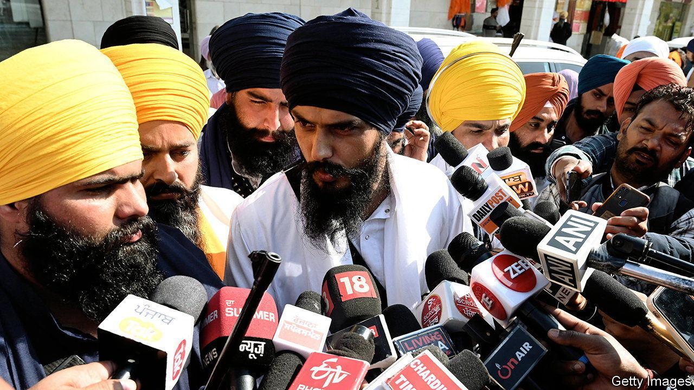

###### Sikh splittism

# Amritpal Singh, self-declared leader of Sikh separatism, is arrested in India 

##### Has the movement for a Sikh homeland of Khalistan been rekindled? 

 

> Apr 27th 2023 

AS THE POLICE tell it, it was an intrepid capture. Tipped off that Amritpal Singh, a radical Sikh preacher and separatist whom they had been pursuing for weeks, was hiding in a village in the north Indian state of Punjab, they sealed it off and, early on April 23rd, arrested the fugitive. The version Mr Singh’s supporters tell is less dramatic: the charismatic Sikh called the cops on himself and addressed a final gathering in the village gurdwara before surrendering.

His arrest ended a month-long manhunt that had Indians glued to their phones as the media reported sightings of Mr Singh across north India. He has been charged with attempted murder, among other things, over an attack on a police station in February. His capture will lower the profile of a man whose sudden notoriety raised fears of a resurgence of the militant Sikh separatism that once threatened to tear India apart.

With his long beard and flowing white garments, the 30-year-old Mr Singh models himself on Jarnail Singh Bhindranwale, a Sikh militant leader who was killed by the Indian army in 1984, setting off a decade-long insurgency in which thousands were killed. Before Mr Singh returned home to Punjab last year, he had worked in Dubai for a decade, sporting short hair and T-shirts. He first garnered popularity on social media, supporting protests which forced the central government of Narendra Modi to rescind new farm laws in November 2021. It was only last summer that Mr Singh donned his new attire and anointed himself leader of Waris Punjab De, an outfit which demands an independent Sikh nation of Khalistan. His followers, mostly young men, were inherited from the organisation’s founder, an actor who died in a car accident early last year. 

Mr Singh’s arrest has not prompted significant protests, suggesting there is less support for him than there is interest. Yet his agenda, which mingles demands for action on social problems in Punjab, such as a drug epidemic, with Sikh separatism, could yet strike a chord in the Sikh-majority state. The disintegration of its mainstream parties, chiefly the Congress party and the Akali Dal, whose longtime leader, Parkash Singh Badal, died this week at 95, has produced a political vacuum in Punjab which its current governing party, Aam Aadmi, has struggled to fill.

The authorities show signs of understanding that political risk. After they angered the public with internet shutdowns during their search for Mr Singh, the police took care over his arrest, firing no shots and respecting the sanctity of the gurdwara where he was hiding. The government should show similar judiciousness in tackling the causes of dissatisfaction among young Punjabis that Mr Singh has identified.■

