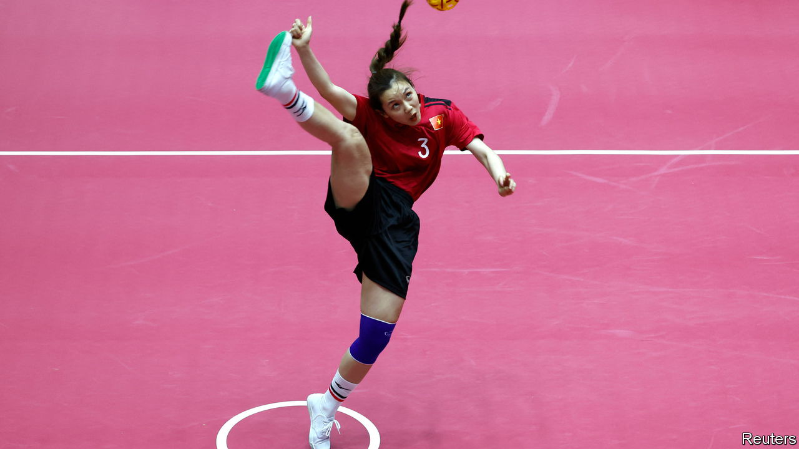

###### My ball, my rules

# Cambodia is about to host arguably the world’s biggest sporting event 

##### The South-East Asian Games will include obstacle racing and jet skiing 

 

> Apr 27th 2023 

The South-East Asian (SEA) Games that begin in Cambodia on May 5th will be contested by just 11 countries. But with 581 medals at stake—nearly twice the number won at the last Olympics—they can claim to be the world’s biggest sporting event. Athletes will compete on the track, in the pool and in less traditional ways—including obstacle racing, jet-skiing and dance. 

The inclusion of such obscure sports (loosely defined) is a SEA Games tradition. Hosts of the event, first held in 1959, have considerable discretion over its roster. Some of their selections reflect a desire to develop a sport. For instance, at the insistence of Cambodia’s fledgling cricket body, that sport, which is hardly played in the region, will feature for just the second time in the upcoming games. But the inclusion of an obscure sport is more often explained by the host’s hunger for medals.

Cambodia is no sporting powerhouse. At the last SEA Games it won 63 medals (ahead only of Brunei, Laos and East Timor). It has little chance of competing with its bigger, richer neighbours in most mainstream sports. The easiest way to boost its medal count is to hold events for which there is little or no competition. The coming games will also showcase , a Cambodian version of chess, and , a local martial art.

The tactic usually works. Hosts of the SEA Games tend to win far more medals than they would abroad. When the Philippines hosted the games in 2019, it was crowned overall champion with 387 medals—thanks in part to the inclusion of baseball and other Filipino pastimes. At the next rendition, in Vietnam, they were dropped and the Philippines won 226. 

Such manipulation hurts the broader sporting ambitions of the region. The SEA Games are held biennially to help athletes prepare for the Olympics and Asian Games. But when resources are directed towards offbeat events, mainstream sports suffer. South-East Asian countries only won 13 medals between them at the last Olympics.

Tinkering with the line-up also hinders the other stated goal of the games: regional unity. Thailand is incensed that the kick-boxing event has been given a Cambodian name—“instead of its preferred  Thai kick-boxers are therefore boycotting the games and a regional rivalry has been aggravated.

Still, winning lots of medals plays well to the home crowd, which makes for good politics, especially for authoritarian regimes such as Cambodia’s. Its strongman, Hun Sen, has spent lavishly on his country’s first Games. (China has helped too, by financing a new stadium.) Last month Mr Hun Sen announced that tickets for the games would be free. After decades of war and strife, Cambodia will have an opportunity to show off its recent progress. With a general election due in July, its prime minister might also think this a good moment to engender patriotic fervour. Not that Mr Hun Sen really needs it. He has ensured that the main opposition has been eliminated by the courts. In politics as in sport, some people will do anything to win. ■

