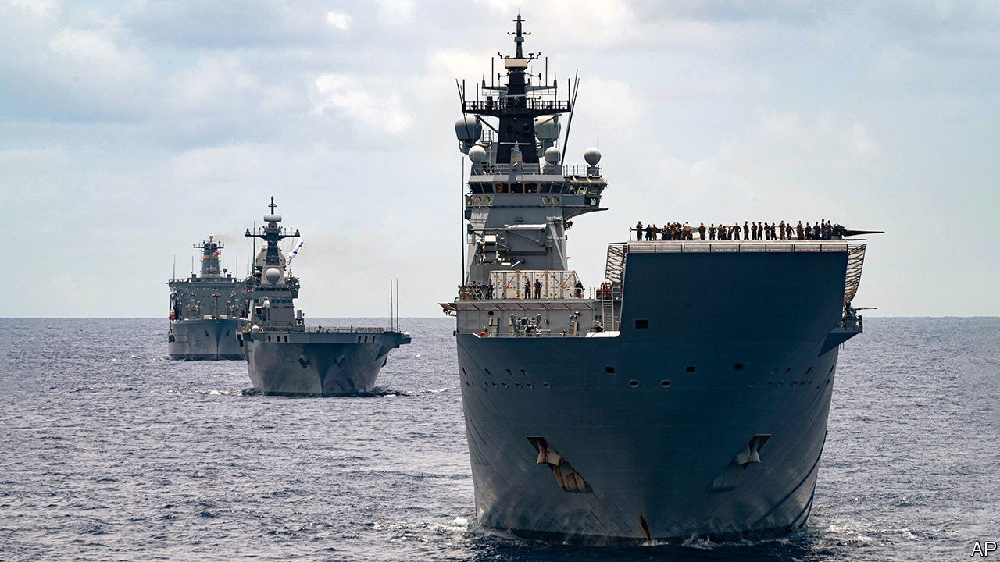

###### Protection by projection

# Fearing China, Australia rethinks its defence strategy 

##### It wants to deter Chinese threats by projecting power deeper into Asia 

 

> Apr 25th 2023 

THE BERLIN Wall still stood the last time Australia took a hard, independent look at the state of its defence. It was then “one of the most secure countries in the world…distant from the main centres of global military confrontation”, a defence review concluded in 1986. A new review, commissioned by the centre-left government of Anthony Albanese, the prime minister, and released in declassified form on April 24th, starkly concludes that Australia’s “strategic circumstances are now radically different.” The risks of military escalation and major conflict in the Indo-Pacific region are rising. Concerns about China demand a radical makeover of .

The review sees China’s military build-up as “the largest and most ambitious of any country since the end of the second world war”. It considers that it is “occurring without transparency or reassurance” about . The budding superpower’s assertion of sovereignty over the South China Sea threatens a rules-based order on which Australia, a country of 26m that is heavily reliant on global trade, depends. The ability of America, Australia’s ally, to guarantee regional security is being challenged.

With the strategic picture darkening, Australia’s defences are “no longer fit for purpose”, said the country’s defence minister, Richard Marles, endorsing the conclusions of the review, which was overseen by a former defence chief, Sir Angus Houston, and by Australia’s high commissioner to Britain, Stephen Smith. They fear less an invasion than the damage Australia could suffer from afar. It has lost the advantage of remoteness. Its north is within range of Chinese missiles. The shipping lanes in the Indian and Pacific Oceans which sustain its economy are vulnerable to blockades. (Australia knows all about coercion, having suffered Chinese trade bans in recent years that are only now being lifted.)

To defend itself as well as to preserve peace in its Indo-Pacific region, Australia must be able to project power farther from its shores, strategic planners argue. Or as one defence insider puts it, “if we get to the point where we have an amphibious landing group approaching Darwin, we’re already buggered.” Long-distance power projection represents the most logical form of deterrence, argues Bec Shrimpton of the Australian Strategic Policy Institute, a think-tank in Canberra, Australia’s capital.

The main Australian power projection will be , the wave-making trilateral pact under which America and Britain will supply Australia with nuclear-propelled submarines. But it must also develop longer-range strike capabilities, with munitions built in Australia, Mr Marles said. This would involve upgrading its northern ports and bases, which stretch from the Cocos Islands in the Indian Ocean to the north-eastern city of Townsville. Beyond that, the review insists, defending Australia requires a “whole-of-government” effort. That would include more resources for the foreign ministry. Australian regional statecraft can thereby help keep the Indo-Pacific stable and open.

Yet a country that has already pledged to spend up to A$368bn ($245bn) on nuclear-powered submarines in the coming decades faces hard choices. Much of the report, which the government has accepted in its entirety, is confidential. But projects worth A$8bn will be scrapped or postponed. An order for infantry-fighting vehicles will be cut sharply, and plans for a new regiment of mobile howitzers have been dropped. In return, the army will get longer-range strike capabilities. Australia must prioritise programmes with the greatest deterrent effect, stresses the same defence insider.

The government blames its conservative predecessor for some of the impending cuts. It promised lots of defence goodies without saying how it would pay for them. But there is bipartisan support for the strategic shift. Most of its critics are outside Parliament. Some say AUKUS and the new defence posture are too provocative towards China; others that they will prove wildly expensive. Even supporters of the strategy worry about Australia’s capacity to realise its ambitions. The public sector has a ropy procurement record. The defence establishment is understaffed and faces looming skills shortages.

Confronting such problems is part of the challenge the review outlines, however. It advocates not just a whole-of-government but a “whole-of-nation” approach. Education and training will need a significant reboot merely to carry out the nuclear-submarine and related programmes. Politicians will need to lead a wide-ranging conversation on some of the other consequences of the strategy shift. Fully three-quarters of Australians think it somewhat or very likely that China, their biggest trading partner, will pose a military threat to them in the next 20 years, according to polling from the Lowy Institute, a think-tank in Sydney. So there is a clear agreement on the security risk. Australians now need to agree on how much cost and change they will accept to mitigate it. ■

