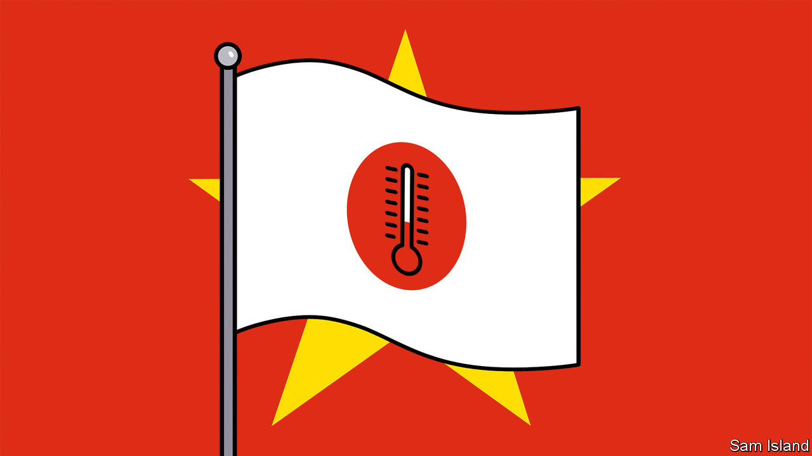

###### Banyan

# On China, Japan’s PM wants diplomacy, not war 

##### A chat with Kishida Fumio, who urges smart engagement 

 

> Apr 22nd 2023 

JAPANESE OFFICIALS used to fret that America took the threat from China too coolly. Even after Chinese and Japanese ships clashed over the Senkaku/Diaoyu Islands a decade ago, American leaders pursued engagement. “We warned the US,” a former Japanese ambassador once grumbled to Banyan. But these days the mercury in America has risen sharply—its politicians compete to see who can sound most . This is now giving Japan the opposite worry.

In an interview with  and other global media on April 20th, Kishida Fumio, Japan’s prime minister, was asked what his country was doing militarily to contain China’s hegemonic ambitions. He was reluctant to wade in. Instead of naming the many measures that Japan is taking to , he said: “What must be prioritised is proactive diplomacy.”

So it continued. Speaking ahead of the G7 summit that Japan will host in his home town of Hiroshima next month, Mr Kishida, glancing often at briefing papers, took pains not to make Japan’s  even worse. “Japan will assert what needs to be asserted and urge responsible action while maintaining a firm dialogue on various issues and co-operating on common challenges,” he added. He repeated his wish to build a “constructive and stable” relationship with China. He used much the same formulation in a speech he gave in January in Washington.

There are indeed many indications that Japan thinks the American-Chinese rivalry has got too hot. Japanese leaders now consistently call for better communication with China. Sino-Japanese diplomacy has quietly resumed since the first summit between Mr Kishida and Xi Jinping, China’s leader, in Indonesia in November. In late February officials from the two countries’ foreign and defence ministries met. At the end of March, their armed forces established a defence hotline. Hayashi Yoshimasa, Japan’s foreign minister, went to Beijing on April 2nd, the first such visit in three years.

Japanese parliamentarians are also showing restraint. The Diet has nothing resembling the belligerent China Select Committee in America’s House of Representatives. Japan’s parliament has a longstanding Japan-China Parliamentary Friendship Association—which this week named Nikai Toshihiro as its head. An ageing kingmaker, he is best known for his close ties to Beijing. 

This does not mean Japan is any less wary of China. Mr Kishida repeated calls for “peace and security in the Taiwan Strait” and signalled Japan’s unwillingness to tolerate “changes to the status quo through force”—code for opposition to Chinese aggression against Taiwan. Japan’s plans to double defence spending over the next five years are all about making China believe it cannot be pushed around. No one in Tokyo needs convincing that China poses a threat.

On the contrary, the proximity of that threat makes Japan treat it very seriously. In America, talk of war over Taiwan is an abstraction half a world away; in Japan, it makes people wonder where the nearest bomb shelter might be. That is why Japan, unlike the hotheads on Capitol Hill, is taking such pains to control the temperature. “It is very important for the international community that the US-China relationship remains stable,” stressed Mr Kishida.

There are signs that the message is getting through. Partly at Japan’s urging, the communiqué issued by a gathering of G7 foreign ministers on April 18th, in the Japanese province of Nagano, includes a call to countries to engage “candidly” and “work together” with China—the diplomatic equivalent of an extended hand. Katherine Tai, the United States Trade Representative, reassured an audience in Tokyo on April 20th that America does not intend to decouple from China. The same day Janet Yellen, the treasury secretary, said that America seeks “constructive and fair” ties with China. 

Yet moderating the temperature will only get harder. America’s election season is coming and Tokyo has become a stop on the circuit. (Ron DeSantis, Florida’s ambitious Republican governor and rival to Donald Trump, visited on April 24th.) And China is hardly taking the proffered hand; a Japanese pharmaceutical-company employee was arrested on espionage charges in Beijing last month. China’s willingness to speak with Japan is mostly about trying to drive a wedge between America and its allies. Even so, Mr Kishida’s stab at Indo-Pacific temperature control may be his most important geopolitical contribution.■


