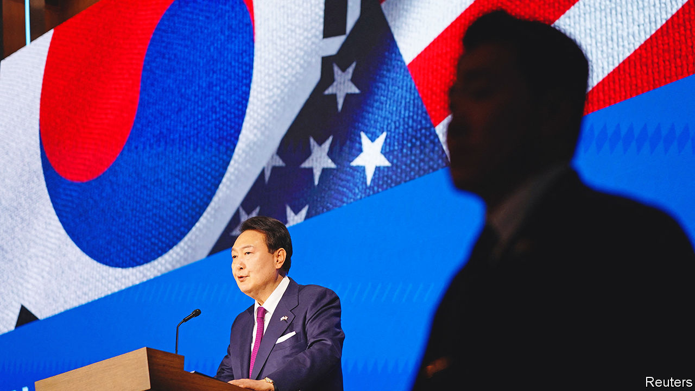

###### Asian geopolitics

# South Korea has America in its face and China breathing down its neck 

##### Yoon Suk-yeol can expect an awkward conversation in the Oval Office on April 26th 

 

> Apr 24th 2023 

Yoon Suk-yeol entered office last May with an ambitious vision for his country’s place in the world. He promised to make South Korea an assertive champion of freedom and human rights “not just for ourselves but also for others”. He spoke of it as a “global pivotal state”, pushing liberal values in developing and developed countries alike. Such rhetoric was unusual in a country that traditionally considers itself a shrimp trapped between whales.

It was music to American ears. President Joe Biden has sought to  (the two leviathans in question) by bigging up its Asian allies. He, too, appeals to their liberal values, including by rallying Japan, South Korea and the rest to join a “battle between democracy and autocracy”. Yet almost a year into Mr Yoon’s term there is no great change in South Korea’s diffident international posture, even as America’s demands on its allies have increased. Mr Yoon, who is in Washington this week for the first state visit by a South Korean leader in over a decade, has hesitated to back America’s arming of Ukraine. And he has largely spurned its trade and technology campaign against China. Mr Biden, who held talks with Mr Yoon on April 26th, applauded South Korea’s willingness to take on “greater global responsibilities”. But he expects more.

Mr Yoon’s visit marks the 70th anniversary of the alliance the two countries sealed, with a mutual defence treaty, after the Korean war. Preventing a re-run of that conflict, in which more than 140,000 South Korean and almost 37,000 American troops died, remains the pre-eminent bilateral concern. America’s 28,500 troops on the peninsula (notwithstanding Donald Trump’s threats to withdraw them) are a testament to it. Yet the two countries’ ties have thickened over the decades. South Korea sent troops to American wars in Vietnam, Afghanistan and Iraq. Commercial ties between the two countries were boosted by a free-trade deal signed a decade ago. Each has a lively community of the other’s citizens—and is a fan of its pop culture. 

Mr Yoon has at least provided a modest additional boost to the relationship. He has overseen expanded joint military exercises with America and launched a rapprochement with its closest East Asian ally, Japan. He signed up to America’s Indo-Pacific Economic Framework before it was published. His administration even defended America after leaked documents revealed that it had been spying on the South Korean government. Kim Tae-hyo, the deputy national-security adviser, at first claimed that the documents were forged. He subsequently acknowledged the snooping, but insisted it had been conducted without “malicious intent”.

Yet Mr Yoon’s reluctance to show the global leadership that he promised is more striking. South Korea, Asia’s second-biggest arms exporter after China, has refused requests from America and NATO to supply Ukraine with lethal weapons. It has also been far more loth than some other American allies to distance itself from China.

Japan, following America’s lead, says it is in “competition” with China and plans to double defence spending over five years to deter Chinese aggression. South Korea calls China a “key partner for achieving prosperity and peace”. It aims to increase defence spending by an annual average of 7% over the next five years, but mostly to counter North Korea. Unlike Japan and the Netherlands, it has not imposed curbs on semiconductor technology sales to China.

This hedging is understandable. China is South Korea’s largest trade partner by far. It does more business with China than with its second- and third-biggest partners, America and Japan, combined. Supply chains for some of South Korea’s most important industries, such as semiconductors, are largely China-based. In 2021 nearly 40% of South Korea’s semiconductor exports went to China.

South Korean firms also find some of America’s recent efforts to isolate China, including legislation intended to push electric-vehicle and semiconductor companies away from China and towards America, profoundly irksome. Mr Yoon will complain to Mr Biden about the protectionist nature of such measures and the superpower’s failure to consult its Asian allies adequately before introducing them.

China’s role in stabilising North Korea, including by supplying it with food, is another reason why South Korea is reluctant to annoy it. Japan, though deeply concerned about Kim Jong Un’s missiles, does not face the same day-to-day security threat from his regime. “There is no North Japan,” notes Victor Cha of the Centre for Strategic and International Studies, an American think-tank.

And China has a history of intimidating South Korea to keep it in line. After the South Koreans announced plans to install an American missile-defence system in 2016-17, Chinese state media launched a boycott of South Korean goods and services. Yet if such action has cowed South Korea, it has also exacerbated the country’s preference for the West over China on most issues. Since the boycott, pro-China voices have been quelled in South Korean policymaking. According to a poll by the Pew Research Centre last year, 89% of South Koreans have a favourable view of America, while only 19% feel the same way about China. Mr Yoon’s talk of making the country more geopolitically active was partly a response to such sentiment. 

The South Korean leader may yet turn more of his talk into action. America’s leaked wiretapping showed his administration was discussing supplying lethal weapons to Ukraine. On April 19th Mr Yoon told Reuters, a news agency, that South Korea’s continued refusal would be hard to maintain in the event of a “large-scale [Russian] attack on civilians, massacre or serious violation of the laws of war”. Turning to the Taiwan Strait, Mr Yoon said in the same interview that South Korea would oppose any “change to the status quo by force”. Those comments earned stiff rebukes from Russia and China respectively. 

South Korea worries about America’s reliability as an ally. Mr Trump, or a similarly unilateralist Republican, could soon be back in the White House. Mr Kim’s nuclear-missile programme has reduced the effectiveness of America’s nuclear deterrent to the extent that some South Korean policymakers want to acquire their own. A new agreement to enhance consultation on America’s nuclear deterrent seems unlikely to change that. Yet the South Koreans at least consider America open to discussing such concerns, unlike China. The Americans “do not accept all our requests”, says Park Cheol-hee of the Korean National Diplomatic Academy, but they “try to find a way to find a better solution”.

Ultimately, the two countries’ mutual concern over North Korea represents a powerful adhesive. South Korea knows it is deeply reliant on America’s security guarantee. It is also increasingly minded to follow America’s lead on other matters, including China; but cautiously. South Korea is not a global pivotal state. It is not even in a pivotal state when it comes to reassessing its high-risk dependence on China. Yet it is inching in that direction. ■

