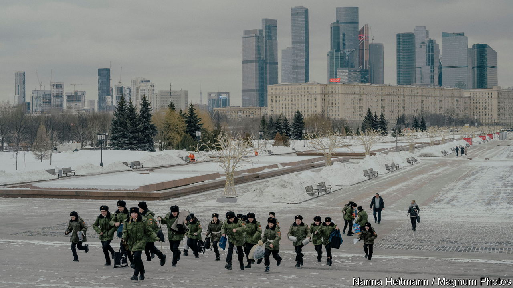
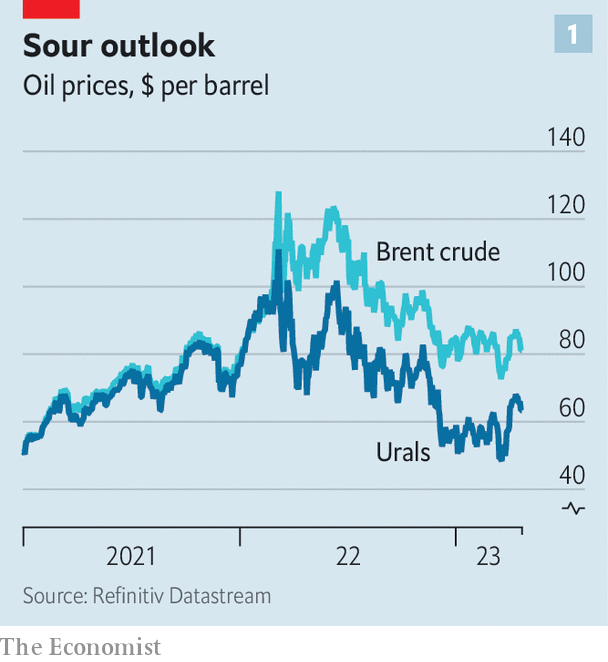
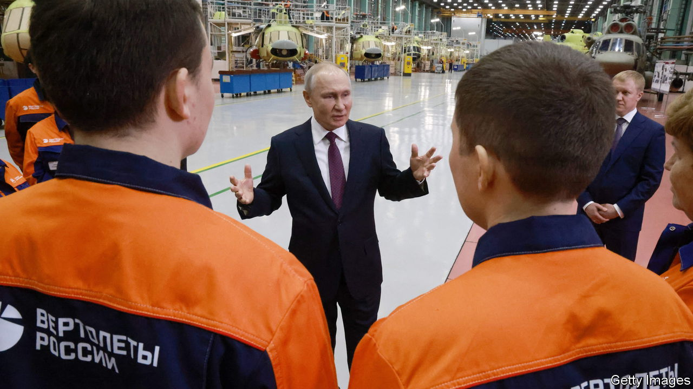
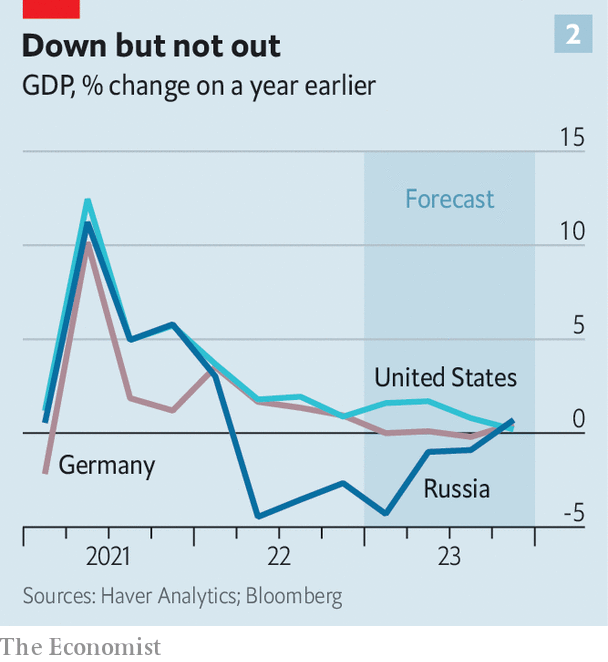

###### Military-industrial complexity

# Russia’s economy can withstand a long war, but not a more intense one 

##### Its defences against Western sanctions can only stretch so far 

 

> Apr 23rd 2023 

A WEEK AFTER Russia invaded Ukraine last year, Antony Blinken, America’s secretary of state, crowed, “The value of the ruble has plummeted; the Russian stockmarket closed as fear of capital flight rose; interest rates more than doubled; Russia’s credit rating has been cut to junk status.” American authorities clearly hoped that the “massive, unprecedented consequences” they and their allies had imposed on Russia, including “severe and lasting economic costs”, would help impede its war machine. Yet over the following year, despite the repeated tightening of Western sanctions, Russia’s economy . The IMF expects it to grow by 0.7% this year—on a par with France, and even as the British and German economies shrink. The hope that the state of Russia’s economy will provide any sort of constraint on the war has faded.

Such despair, however, is as misguided as Mr Blinken’s initial euphoria. By the admission of none other than Vladimir Putin, Russia’s president, “The illegitimate restrictions imposed on the Russian economy in the medium term may indeed have a negative impact on it.” The question is not so much whether Russia can endure an even longer war of attrition (it can), but whether it can support the sort of intensification of the conflict Russia will probably need to transform its prospects on the battlefield. That looks almost impossible.

Russia’s bureaucracy has achieved three feats over the past 14 months. It has found ways to withstand  that Mr Blinken heralded. It has supplied enough men and materiel to . And all this has been done without a sharp decline in living standards, which might prompt popular unrest. But any attempt to escalate the conflict would inevitably undo these successes.

Russia is having to cope with the broadest array of sanctions ever imposed on a big country, including on individuals associated with the war, on financial transactions involving Russian entities, on exports of certain goods to Russia and on imports of most goods from Russia. Yet this economic assault has yielded disappointing results, in part because there were always big holes in the sanctions regime and in part because Russia has found ways around some of the restrictions that did initially hem it in.

Some of the showiest measures have targeted oligarchs and other cronies of Mr Putin’s regime. World-Check, a data firm, reckons that 2,215 individuals with close ties to the government can no longer travel to some or all Western countries, or gain access to their possessions there, or both. Some wealthy Russians have complained about their lost social standing. A few have left Russia and renounced their citizenship. 

Despite the reports of impounded superyachts, however, most oligarchs are still putting caviar on the table. Foreign governments have frozen about $100bn-worth of private Russian assets—only about a quarter of the $400bn that Russian households have abroad. The biggest imposition on many rich Russians relates to their holidays. The French Riviera is off limits; Dubai and Antalya are the main substitutes. Sanctions, perversely, may pave the way for the creation of a new generation of oligarchs. With Western firms leaving the country en masse, there are hundreds of billions of dollars’ worth of assets up for grabs. If the intention behind the measures was to cause discomfort among Mr Putin’s inner circle, there is little sign of it. 

Financial sanctions, too, have had a limited effect. After Russia invaded Ukraine, ten Russian lenders were kicked out of SWIFT, which more than 11,000 banks around the world use for cross-border payments. Close to two-thirds of Russia’s banking system can no longer process transactions in euros or dollars. 

But Western countries have not cut off Russian banks entirely, as they need to pay for the Russian oil and gas they continue to import. Gazprombank, which processes these payments, remains a member of SWIFT. What is more, new financial pipes are being built to replace Western ones. Average daily transactions using CIPS, China’s alternative to SWIFT, have increased by 50% since the invasion began. This past December 16% of Russia’s exports were paid for in yuan, up from almost none before the war. The narrow gap between the price at which Russian banks sell their customers yuan and the price at which they buy yuan suggests a liquid market. Some international transactions are also settled, with difficulty, in Indian rupees and Emirati dirhams. 

Restrictions on exports of certain goods to Russia have also disappointed. America and its allies have banned sales to Russia of thousands of high-tech items, while many Western firms that used to operate in Russia have voluntarily pulled out. Of about 3,000 global firms with a Russian presence tracked by the KSE Institute at the Kyiv School of Economics, roughly half have curtailed operations there in some way. Last year the stock of foreign direct investment in Russia fell by a quarter.

Yet Russia continues to import almost as much as it did before the invasion. New trading partners have sprung up to replace the West. China now sells twice as much to Russia as it did in 2019. “Parallel” imports—unauthorised sales from the West to Russia via a third country of everything from fizzy drinks to computer chips—have soared. In 2022 imports from the EU to Armenia mysteriously doubled, even as Armenian exports to Russia tripled. Serbia’s exports of phones to Russia rose from $8,518 in 2021 to $37m in 2022. Shipments of washing machines from Kazakhstan to Russia rose from zero in 2021 to nearly 100,000 units last year. 

These arrangements have drawbacks. Russia’s economic hubs are nearer to Brussels than to Beijing. Higher transport costs mean higher prices. People also have less choice than before (one Muscovite complains about the difficulty of finding mortadella). According to a recent survey by Romir, a Russian market-research firm, two-thirds of Russians reckon the quality of the products they buy is deteriorating.

What is more, not all goods can be obtained in sufficient quantities through backchannels. Many Russian-made medications, which depend on imported raw materials, are in short supply. The car industry, meanwhile, is struggling with a shortage of imported semiconductors. Production was down 70% in January-February, compared with the same period a year before. 

Yet even if Russia cannot make as many cars any more, it can still import them. After Lada, a Soviet stalwart, the most popular brand in Russia is now Haval, a mid-range Chinese marque. Its monthly sales have increased 331% over the past year.

Russia also seems to be getting hold of the parts it needs to keep its civilian planes airborne, somehow. Hackers have been stealing updates of aircraft software that Russian firms can no longer buy. Crashes, although frequent by Western standards, have not increased. 

The impact of sanctions on Russia’s exports has been bigger–but Western countries always shied away from making them too severe for fear of pushing up energy prices for their own consumers to unbearable levels. The EU’s imports of Russian gas have fallen dramatically. Russia has limited capacity to divert the exports to China, since the pipeline linking the two countries is small. Shipping more by sea requires new liquefaction plants which take time to build and need sophisticated tech. Rystad Energy, a consultancy, forecasts that Russia’s gas sales will dwindle to 136bn cubic metres (bcm) in 2023 from 241bcm in 2021.

Oil, however, is more fungible. In December the EU, which in 2021 bought more than 40% of Russia’s crude exports, imposed an import ban. It also forbade its shipping firms, insurers and financiers from facilitating the sale of Russian crude to buyers in other countries unless the price per barrel was below $60. In February a similar package of sanctions came into force on Russia’s refined oil, a smaller but profitable export, much of which also went to Europe before the war. 


But Asian buyers have been happy to absorb the oil that Europe is spurning. In March nearly 90% of Russia’s total crude exports went to China and India, estimates Reid I’Anson of Kpler, a data firm, up from a quarter before the war. That month Russia shipped 3.7m barrels a day (b/d) on average, more than it did in 2021. March was also a strong month for sales of refined products such as diesel. A new ecosystem of shadow traders and shippers, largely based in Hong Kong and Dubai, has emerged to help ferry the embargoed barrels to their new destinations, often with the help of Russian lenders and insurers. These new buyers, plus high commodity prices brought about in part by the war, helped push Russia’s current-account surplus to a record $227bn—10% of GDP.

 


But it is unlikely to see another bumper year. The price of a barrel of Brent, an oil benchmark, has fallen below $85 from an average of $100 in 2022 (see chart 1). Urals, Russia’s main grade, now sells at a steep discount at Russian ports—below $50 on average in January and February, according to the ministry of finance, compared with $76 on average in 2022. Russia would need a price of well over $100 a barrel to balance its budget, analysts estimate. The International Energy Agency, a watchdog, reckons Russia’s oil revenues were 43% lower in March than a year earlier. Economists expect the country’s current-account surplus to fall to 3-4% of GDP this year, in line with the average of the 2010s. 

Lower hydrocarbon sales mean lower government revenues. In 2022 the Russian government ran a deficit of about 3trn roubles ($37bn), or 2% of GDP. This year it is planning something similar, but actual spending and taxation data so far this year make that look optimistic. A deficit in the range of at least 10trn roubles, as much as 5% of GDP, looks likelier—high by Russian standards.

All the same, the Russian state has plenty of options to fund itself. Russia’s sovereign-wealth fund still has about $150bn (about 10% of GDP), even after being drained of about $30bn last year. The government could also issue more debt. Last year’s bumper exports have left big Russian energy firms with lots of cash they must stash somewhere. Those firms, which are largely state-owned anyway, could also be hit with a windfall tax, as they were last year. And Russian financial institutions hold sufficient assets to cover 10trn-rouble deficits for 25 years–a huge resource the government might seek to tap in some way. Richard Connolly, an expert on the Russian economy at RUSI, a think-tank, says, “The government can always fund itself by taking money from big companies.”

Money, in other words, will not be a severe constraint on the war effort. Demands on the budget for this purpose are in any case modest. Our best guess, based on comparing actual spending figures with what was budgeted before the war, is that Russia’s assault on Ukraine is currently costing it about 5trn roubles a year, or 3% of GDP–less than America spent on the Korean war. 

But replacing damaged weapons and spent munitions is not simply a question of money. Russia has churned through military equipment on a vast scale. Estimates of the number of armoured vehicles destroyed during the war, for example, range between 8,000 and 16,000, according to a recent report by the Centre for Strategic and International Studies (CSIS), a think-tank. Russia has also lost lots of aircraft, drones and artillery systems. 

One solution is to fall back on existing stocks, although many of these are old and in poor repair. Another is to redirect weapons intended for export to the front line. Siemon Wezeman of SIPRI, a Swedish think-tank, reckons Russia’s arms exports plummeted from $50bn in 2021 to $11bn or less last year. He points out that unusual T-90 tanks—perhaps demonstration models, or units originally destined for Algeria—have been spotted on the battlefield in Ukraine.

Russia is also trying to make more weapons. Dmitri Medvedev, deputy chairman of Russia’s security council, recently said the country would produce 1,500 modern tanks in 2023. Officials have also said they want drones to be manufactured en masse in Russia. Some factories are working around the clock. The government is lending lavishly to arms manufacturers, or ordering banks to do so. In January and February production of “finished metal goods” was 20% higher than the year before, according to official statistics. 

The problem is that, to manufacture advanced weapons, it needs access to Western-made, high-end “dual-use” components, from engines to microchips, that are hard to obtain because of Western sanctions. Desperately needed parts can always be diverted to their most urgent use. Thus in February the government temporarily stopped accepting applications for biometric passports to save microchips. High-end washing machines are also being imported in large numbers to be stripped of their chips, presumably for use in guided missiles and other military kit. Ukraine’s military intelligence recently reported that every month Russia manages to make around 30 Kh-101s and 20 Kalibrs, its two main types of guided missile, presumably thanks to such ruses.

But the volumes of advanced weaponry produced is nowhere near what Russia needs to replace its depleting stocks. Ukrainian and Western military officials believe that Russia has used most of its stocks of its most accurate guided missiles. Serial numbers found in the wreckage of spent missiles suggest it is now using new ones, made during the war. Insiders say the army is asking for ten times more tanks than Russia’s factories can produce. A lack of software and technical equipment also seems to be preventing Russia’s production of drones from taking off. 

What Russia lacks in quality, however, it may partly compensate for in quantity—by gussying up Soviet-era weapons. It is modernising perhaps 90 old tanks a month by equipping them with new electronics and communication systems. It is refurbishing old missiles that are less accurate but difficult to intercept and repurposing nuclear delivery systems to launch them. It is cannibalising civilian planes to repair fighter jets.

Russia is also getting military supplies from allies. Some artillery shells appear to be arriving from China, via Belarus. Russia is also buying (ostensibly civilian) drones from its eastern neighbour, as well as artillery shells from North Korea. It reportedly also traded 60 Su-35 aircraft with Iran in exchange for several thousand kamikaze drones. In short, the quality of Russian weapons is declining, but it has found ways to avoid running out. 

 


Finding enough people to keep the war effort going is another challenge. Many have been killed in action; many more have emigrated. In the year to December 2022 the number of employed Russians under the age of 35 fell by 1.3m, according to FinExpertiza, an auditor. Shortages of workers are common. In December the central bank said that half of firms surveyed were struggling to find enough staff. There are 2.5 vacancies for every unemployed person, making the Russian labour market twice as tight as America’s. Wages are growing fast. Specialists, such as IT engineers and lawyers, are especially scarce. At a recent meeting of Russia’s entrepreneurs union, the labour shortage was the main topic of conversation. 

The labour shortage makes life difficult for military recruiters, too. The army is now sending conscription and mobilisation notices by email, in addition to physical copies, to make it harder for people to pretend they have not seen them. Draftees are not allowed to leave the country. With enough coercion, though, Russia should have no trouble filling its ranks. The country is not about to run out of young men: before the war there were about 17m of them. But more people on the frontline means fewer people in offices and factories. And the more widespread conscription becomes in big cities like Moscow and Saint Petersburg, the greater the chance of popular unrest. 

The government’s third economic achievement has been to maintain living standards. Last year it spent an extra 3% of GDP to stimulate the economy. Aside from higher spending on the military, support is coming in the form of economic aid to civilian companies: direct handouts to firms, subsidised loans, joint investments and so on. Spending on the budget category that subsumes many of these items, “national economy”, rose by 20% in 2022, to 4.3trn roubles. Between January and mid-March it increased by another 45% compared with the same period last year. Banks are being asked to give indebted firms breathing room. In 2022 business failures fell to a seven-year low.

Last year “social” spending also rose, from 6trn to 7trn roubles (4.5% of GDP). However, says Vladimir Milov, a former deputy minister of energy, the federal government accounts for only part of overall social spending. The pension fund—a nominally independent agency recently renamed the Social Fund—is also doling out cash to retirees, mothers, the disabled and more, as are regional governments. Allowances towards constituencies important to Mr Putin, such as families with more than one child, the poor and the elderly, are growing, notes Maria Snegovaya of CSIS. Outside Moscow, payments to the families of dead conscripts can be enough to buy a flat. 

All this may explain why the war has not affected Russian living standards all that much. Consumer prices did rise by 12% last year, in large part because of a depreciation of the rouble in the spring. Average pay at medium-sized and large companies, which include many state-owned entities, rose marginally last year even after accounting for inflation. The value of people’s savings has fallen only slightly, central-bank statistics suggest. Inflation fell back to 3.5% in March.

 


Overall, the Russian economy has proved resilient. Real GDP fell by only 2-3% last year—far less than the 10-15% decline that many economists had predicted. A “current activity indicator” compiled by Goldman Sachs, a bank, which correlated closely with official GDP numbers before the war, shows that Russia emerged from recession about a year ago. Most forecasters believe the economy will grow this year (see chart 2). 

All this suggests that Mr Putin should be able to maintain the war effort for some time to come. Expanding it, however, is another matter. Some on the right are calling for Mr Putin to spend more than a few percentage points of GDP on the invasion. After all, Russia has embraced total war before—including in 1942 and 1943, when it spent an astonishing 60% of its GDP on the military, according to “Accounting for War”, a book by Mark Harrison published in 1996. 

But it is hard to see how Mr Putin could do that while maintaining economic stability and preserving living standards. The first problem would be raising money fast. Not all the sovereign-wealth fund’s assets are liquid. Printing money would spur inflation, causing the rouble to lose value and eroding the living standards the government has worked so hard to preserve. Loading up banks with huge amounts of public debt overnight might have a similar effect, stirring doubts about how soundly the economy was being managed. Tax rises or a big shift in public expenditure towards defence would also eat into personal incomes. And any of these measures would undermine the air of calm, control and stability that Mr Putin is at pains to maintain. “Of course, national defence is the top priority,” he said recently, “but in resolving strategic tasks in this area, we should not repeat the mistakes of the past and should not destroy our own economy.”

It’s unclear that spending vastly more money would achieve the desired results anyway. Russia’s economy has become more centralised, but it is not the planned, command-and-control apparatus of the Soviet times. Converting a budgetary bazooka into weapons of a more conventional sort would thus, at best, take time. The effort would exacerbate the bottlenecks that are already constricting Russia’s military output, in machinery subject to sanctions, for example, and in skilled workers. Much would depend on the continued assistance of China, the Gulf states and other countries through which Russian capital and imports flow–and they might be nervous about abetting a big Russian escalation. 

Throwing the kitchen sink at Ukraine therefore looks out of the question. “Considering Russia’s existing capabilities and limitations, it will likely opt for a slower-paced attritional campaign in Ukraine,” asserts the CSIS report. Mr Putin has succeeded in insulating the Russian economy from the worst effects of war and sanctions–but in a way that makes the war hard to win. ■

