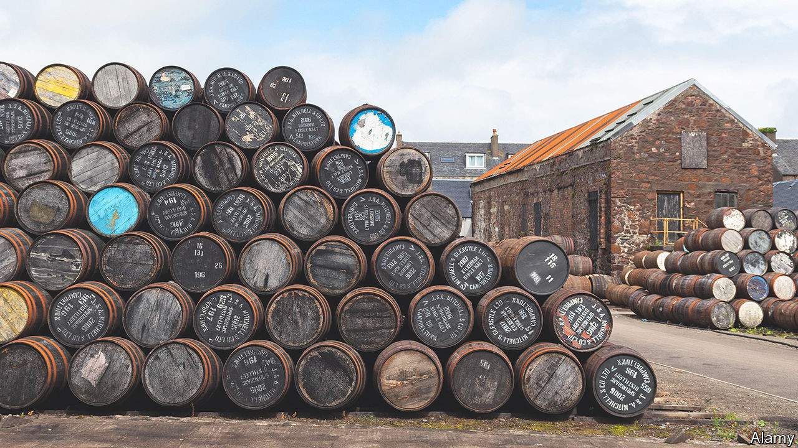
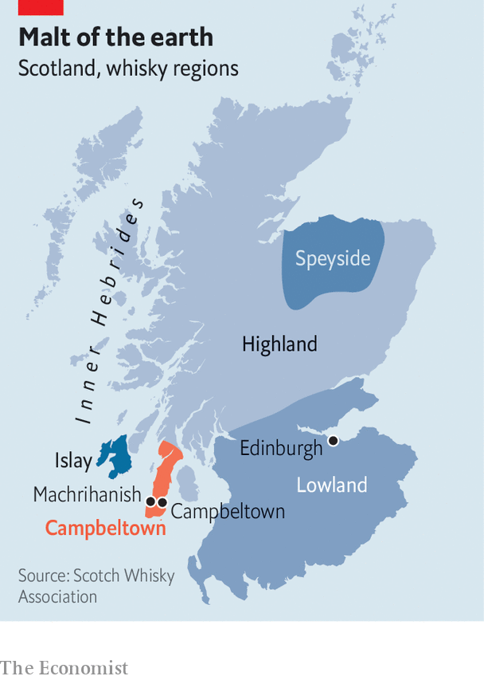

###### Inhabited by spirits

# How Campbeltown has responded to the boom in Scottish whisky 

##### Scarcity and single malts 

 

> Apr 24th 2023 

IN THE 19th century Campbeltown, on the south-eastern shore of the Kintyre peninsula on Scotland’s west coast, was dubbed the “whisky capital of the world”. Its grand sandstone villas attest to a prosperous past, when more than 30 distilleries thickened the air with peat smoke. But then came more than a century of decline—caused by war, the Depression, Prohibition in America and rail-borne competition from places farther north like Speyside (see map). By the dawn of this century, the town had only two distilleries left.

 


Since then Scottish whisky has experienced a boom, which continues still. New markets, especially in Asia, boosted demand; consumers’ enthusiasm for mixing cocktails during the pandemic topped it up. Global exports rose by 37% in 2022, to £6.2bn ($7.7bn), according to the Scotch Whisky Association. 

Investors increasingly covet whisky with a history. Springbank, the eponymous malt produced in Campbeltown by Scotland’s oldest independent family-run distillery, fetches some of the highest prices of all. In 2019 Christie’s sold a bottle of Springbank 1919 (a small first world war-era batch, bottled in 1970) for $355,350.

Springbank’s response to this surging demand might seem a little eccentric. Overseen by the 92-year-old great-great grandson of Archibald Mitchell, who founded the distillery in 1828, Springbank has stuck to traditional production methods, where possible using the original equipment. Touring its Victorian buildings is like going to a museum. Tourists queue early to buy the small quantity of whisky put aside for the shop—Springbank refuses to sell online, believing, probably correctly, that the distillery outlet attracts visitors to the faded town. 

Everything is done on site, from germinating the barley, which is left on a stone floor and turned every four hours by hand, to labelling. This is labour-intensive work: the distillery has a staff of 100, making it an important employer in a region that suffers from high unemployment. 

In 2000 the owner of Springbank, J&amp;A Mitchell, bought and then reopened Glengyle, a distillery next door that had closed down in 1925. But rather than using the purchase to crank up production, it spread it across two sites. Several months a year Springbank’s workers down tools and move to Glengyle to make whisky. The impression this creates—of rare malts that buyers would be lucky to get their hands on—works well. Prices for Springbank’s single malts have surged. It hasn’t bothered with advertising for several years. 

Others want in. There are plans for a new distillery overlooking Campbeltown Loch. But growth may come from outside the town. The Campbeltown whisky region—one of five, along with Highland, Islay, Lowland and Speyside, as codified in the 2009 Scotch Whisky Regulations—extends a little way outside Campeltown itself. R&amp;B Distillers, the owner of Isle of Raasay Distillery, in the Inner Hebrides, plans to turn a farm in nearby Machrihanish into an eco-friendly distillery. 

Barley is already being grown on the farm for use in the new distillery. When production begins, perhaps in 2025, it will produce 480,000 litres a year. Springbank produces 250,000. But the most important thing, says Alasdair Day, co-founder of R&amp;B Distillers, is that the whisky “will taste like it comes from Campbeltown”. ■


