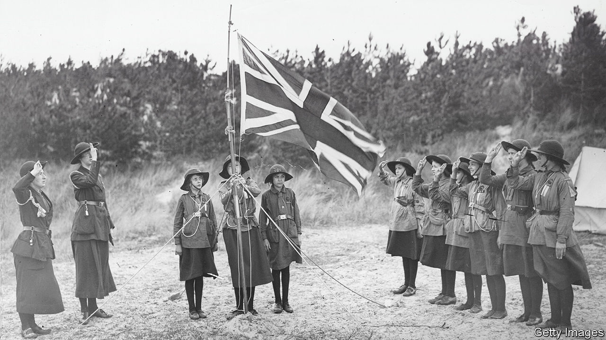

###### Girl power

# How one of Britain’s oldest youth clubs is trying to stay relevant 

##### Girlguiding rebrands itself, again 

 

> Apr 27th 2023 

ROBERT BADEN-POWELL, the founder of the Scouts, had not initially intended the youth movement to be for girls. But a determined group of young women, keen to try their hand at camping and other outdoor activities, had ideas of their own. Some unofficially joined local Boy Scout units. In 1909 a group of them hijacked a Boy Scout rally at Crystal Palace in London, wearing makeshift uniforms. Critics denounced female involvement. “Girls are not boys,” wrote Violet Markham, an author, “and the training which develops manly qualities in one may lead to the negation of womanliness in the other.”

In the same year as that rally, leaders of the Scouts announced the invention of Girlguiding, a “sister organisation” that would prioritise “womanliness”. The first set of girl-only badges, which members earn after completing tasks, included “Florist” and “Needlewoman”. One disgruntled recruit, originally a Scout, complained that becoming a Girl Guide had sucked the fun out of it all, for she had been forced to become “respectable”.

To be appealing the organisation had to change, and it has kept evolving ever since. Its first rebrand came after the first world war, when older Girl Guides served as couriers for MI5, an intelligence agency, and worked in munitions factories (16 members were invited to witness the signing of the Treaty of Versailles in recognition of their work). The latest is a multi-year overhaul: a new brand purpose and logo were launched in March; fresh uniforms are on the way.

The most obvious markers of change are Girlguiding’s proliferating badges—what Professor Sarah Mills of Loughborough University refers to as a “fabric record”. After the first world war, the introduction of badges like “Sportswoman” encouraged girls to try new sports and outdoor activities. The current rebrand has brought the launch of new badges such as “Conscious Consumer” and “Healthy Mind”, which are more focused on introspective development. (Local sections can also create their own, sometimes frivolous badges: one neon-pink addition, “Chippy Hike”, rewards girls in St Albans for collecting food from the local takeaway.)

The pressure to stay relevant continues. Since 2007 the Scouts have officially allowed girls to join all of their groups. Membership of Girlguiding has been dropping: it had 290,500 members in Britain at the end of 2022, down from 730,000 in the 1990s. But “they survive by being flexible enough to adapt,” says Professor Tammy Proctor of Utah State University, an expert in Girlguiding history. A new statue, “Georgina and the Dragon”, installed at the organisation’s HQ in London this year, shows a young girl on a BMX bike slaying outdated stereotypes with a rounders bat. Her rucksack is festooned with badges, including one saying “Girls Can Do Anything”. Markham would have been left reeling. ■


