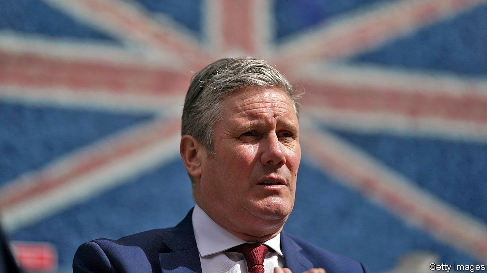
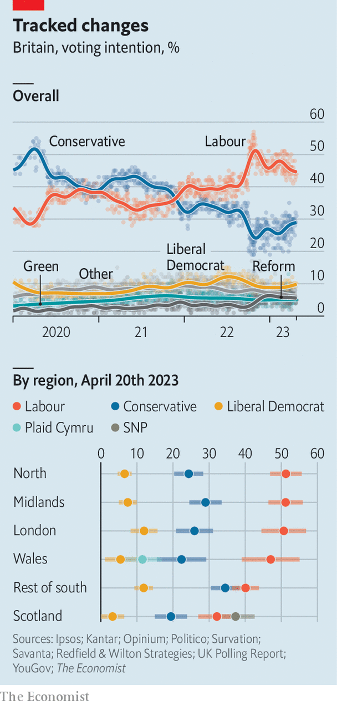

###### Opposition research

# Sir Keir Starmer on “Starmerism” 

##### An interview with the leader of Britain’s Labour Party 

 

> Apr 26th 2023 

Given THAT he has a fair chance of becoming Britain’s next prime minister, Sir Keir Starmer remains curiously undefined. The Labour Party enjoys a 15-percentage-point lead over the Tories, according to our  (see chart). But those same surveys reveal that voters remain unsure what he “stands for”. To critics on the left and right, he is an empty vessel, an opportunist who cycles through slogans and policies.

 


That critique is out of date. Speeches in recent months have sketched an increasingly clear outline of .  during a campaign visit to Middlesbrough ahead of local elections on May 4th, Sir Keir offers his own definition of Starmerism. It brackets him with other centre-left leaders who are seeking to revive the idea of “active” government in response to climate change and the plight of post-industrial towns.

There are two distinguishing elements. The first is an administrative critique: more than being too large or too small, the British state is simply ineffective. The answer is to align all government activity around five “missions”, to be pursued over two terms of a Labour government. “Starmerism is as much about the ‘how’ as the ‘what’,” says Sir Keir. 


The state is ineffective, Sir Keir argues, because it is both over-centralised in Whitehall and siloed between government departments. Worse still is a culture of short-termism and meagre ambition. The “missions”—covering growth, the National Health Service (NHS), decarbonisation, crime and education—will come with single audacious targets, such as halving serious violent crime and achieving the fastest sustained growth in the G7. 

They will serve to triage all other policies. “Are we going to do A or B?” says Sir Keir. “If the answer is it helps with that mission, then the answer is ‘yes’. If the answer is it doesn’t, then the answer’s ‘no’.” Sue Gray, a former Whitehall official hired by the party, has been tasked with putting the missions into practice. But her appointment still requires official approval.


A focus on systems thinking comes naturally to Sir Keir. Barristers normally take to Parliament like a duck to water, but Sir Keir, once the rising star of the human-rights bar, loathes Prime Minister’s Questions, the veneration of oratory over delivery and what he calls the “wedge” politics of “divide, divide, divide, divide”. He is better understood as a bureaucrat who found he could be more influential fixing institutions from the inside. Earlier in his career he served as an adviser to Northern Ireland’s police force and then as the reformist head of the Crown Prosecution Service. The Labour Party, which he took charge of in 2020, was the most chaotic of all.

Colleagues say he regards cultural change as more important than reorganisations, and rarely has a preconceived idea of reform. “He’s not iconoclastic; he doesn’t go around saying I’m going to smash things up,” says one colleague. Others describe a “Merkel-like” tendency to hold back from decisions until the case for a certain course is overwhelming, before implementing it aggressively. “There is very little banter or chit-chat. He will go around the table at the  and go: ‘What are doing to deliver this? What are doing to deliver this?” says another colleague. 

The second strand of Starmerism is an embrace of what Janet Yellen, America’s treasury secretary, has called “modern supply-side economics”. Social democracy cannot be done on a shoestring. Britain’s sluggish economy is undermining the welfare state which Labour prides itself on having built. The Labour leader’s answer is to focus on expanding the productive capacity of the economy—by streamlining the planning regime, by improving labour-market participation, by softening the impact of Brexit and so on. 

One goal predominates. “Economic growth is the absolute foundational stone for everything,” Sir Keir says. Above all, that means offering a stable environment after a decade of political turmoil (which “makes for great political cartoons; for the economy and investment it is a disaster.”) He says he is “absolutely in lockstep” with , the shadow chancellor.


Starmerism has a strong emphasis on stakeholderism: businesses, charities and wonks will be deeply enmeshed in policymaking and delivery. Sir Keir and Ms Reeves have met over 1,000 business leaders in a “smoked-salmon offensive”, according to his office. The point is not just to fix the party’s image “but to model how we would work in government”, he says.

The centrepiece of Labour’s economic agenda is a , comprising £28bn per year in capital expenditure and the creation of a state-owned energy operator. It is inspired by America’s Inflation Reduction Act, which includes a vast package of green subsidies. Does Britain attempting to go toe-to-toe with America not risk a return to the botched industrial strategies of the past? Sir Keir says the programme would aim to release “private investment of many times the amount that we’re putting in” and would, for example, target critical growth stages in a company’s development. He stresses that government must not “suck up” the role of business. 

Labour, says Sir Keir, will change regulations to permit onshore wind farms and accelerate their connection to the national grid. “The role of government is to knock those impediments out of the way,” he says. As for confronting NIMBYism and expanding housing supply, an area where the Tories have conspicuously fallen short: “I think we have to take this on,” he says. “It will require tough decisions.”


The biggest question that dogs Labour is how much it is willing to spend, and by extension to tax, to improve public services. In Middlesbrough Sir Keir met a group of nursing students who, between selfies with the Labour leader, challenged him on low pay; typically, he made no commitments. “There is always the temptation with public services to think that if you put more money in the top, you necessarily get a better outcome,” he says. “You don’t get fundamentally different outcomes if you’re not prepared to do the change-and-reform bit as well.” 

Outsourcing and private provision to fix NHS backlogs are back in favour; that was anathema to Jeremy Corbyn, Sir Keir’s predecessor. The health service must shift to prevention and greater digitalisation to be sustainable. There will be internal opposition to any public-service reform, he admits. “Many people will say ‘no, no, no, leave it as it is.’ Always the wrong answer.”

If Britons want European-style public services, don’t they need to accept taxes to match? (Britain’s tax burden is forecast to hit a post-war high of 37.7% of GDP in 2027, but it will still be below western European averages.) Sir Keir says taxpayers are “really, really feeling the strain” and his model “doesn’t involve huge change to the tax regime”. The tax reforms Labour have announced so far have been both small-fry and crowd-pleasing: among them the closing of exemptions for private schools, private-equity bosses and non-domiciled taxpayers, with the proceeds earmarked for doctors, nurses and teachers. 

Does that herald an assault on the wealthy? “Quite the opposite. They are carefully calibrated decisions on particular tax loopholes. I, and Rachel, intend to resist the pull that so many people urge on us: that the first place a Labour government goes is to tax. The first place the next Labour government will go is to grow.” ■


