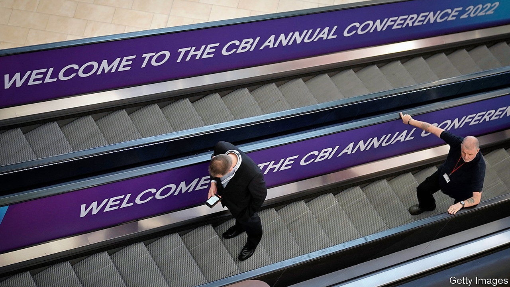

###### An organisation in crisis

# The scandal at the Confederation of British Industry may be terminal 

##### The CBI is spurned by both the lobbied and the lobbied-for 

 

> Apr 27th 2023 

Rain Newton-Smith left the Confederation of British Industry (CBI) in March, after nine years as its chief economist, for Barclays bank. She is already back, as the 13th director-general of Britain’s most prominent business lobby group. And possibly its last. Engulfed by allegations of the worst kind of workplace misconduct and shunned by politicians and its own members, the CBI looks done for.

Ms Newton-Smith’s return was prompted by the dismissal on April 11th of Tony Danker, who had run the CBI since November 2020, for “conduct [that] fell short of that expected of the director-general”. Though sorry for making some staff feel “very uncomfortable”, Mr Danker later told the BBC his sacking was unfair. The grounds he was given, he said, included viewing employees’ Instagram accounts, sending non-work messages on work platforms, inviting junior staff to one-on-one meetings and organising a private karaoke party. The CBI did not go into specifics.

The rot anyway went much further. Far graver complaints, not involving Mr Danker, had already come to light. The  had reported allegations by more than a dozen women of sexual misconduct and the misuse of drugs. This included a rape and an attempted assault at a party on a boat in 2019. The  has since reported that another woman alleges she was raped by two male colleagues. Police are investigating potential offences.

The CBI’s reputation has gone from worthy-but-dull to downright poisonous. Ministers and officials have dropped contact; so have many of the CBI’s 190,000 members. Some have quit altogether, including the John Lewis Partnership and Kingfisher, two retailers; Aviva, an insurer, and the Association of British Insurers (ABI), a trade body; and NatWest, a bank. 

In a contrite letter on April 24th the CBI’s president, Brian McBride, a former head of Amazon’s British arm, told members of his board’s “shame” and “bewilderment”. It had believed the CBI’s corporate culture “was among the very best”—yet “we failed to filter out culturally toxic people” when hiring them, and “victims of harassment or violence” felt “their only option” was to go to the . Mr McBride now promises “zero tolerance” of sexual harassment and bullying, top-to-bottom training, improved recruitment procedures and a whistle-blowing channel outside the organisation. 

All this is to regain members’ lost trust before the CBI presents a reformed version of itself to (remaining) members at an extraordinary general meeting in June. “Whether that is possible”, wrote Mr McBride, “I simply don’t know.”

If the CBI is beyond saving, does it matter? Firms also belong to sectoral bodies like the ABI, and the biggest have their own government contacts. But the CBI provides a single voice on common concerns, such as skills or corporate tax. It claims the “furlough” wage-subsidy scheme during the pandemic and recent expansion of state help with child care among its wins. It also boasts the “largest policy unit outside Whitehall”, with over 100 economists.

Still, four other broad bodies—the British Chambers of Commerce (BCC), the Federation of Small Businesses, the Institute of Directors and Make UK, which represents manufacturers—have also met ministers regularly, alongside the CBI. None duplicates the CBI, but the BCC is closest. Nick Frith of WPI Strategy, a public-relations firm, has pitched a temporary channel, called BizUK, to represent business’s views in the run-up to the next election. 

Companies will find politicians eager to listen—a change from the years of mutual suspicion over Brexit and Corbynism. On April 24th Rishi Sunak, the prime minister, tried to charm corporate bigwigs at a government-sponsored conference. , Labour’s leader, is due to address the BCC’s annual shindig in mid-May. Rejected by both the lobbied and the lobbied-for, the CBI is deservedly shut out. ■


