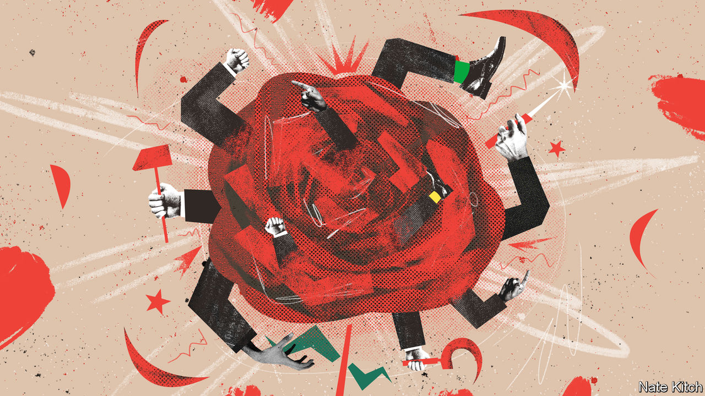

###### Bagehot

# Would Labour turn to the left in office? 

##### The party’s socialist rump will not shift it leftwards, but circumstances might 

 

> Apr 27th 2023 

Absurdly violent imagery has a long tradition in the Labour Party. In 1976 activists attached an ice pick to the front of their bus on their way to vote against Trotskyite rivals in an internal Labour society—a homage to the murder weapon used on the Soviet inspiration of their enemies. Peter Mandelson, the Svengali of New Labour, demanded the left were put in a “sealed tomb”. People are not removed from positions but “purged”; advisers talk of “hand-to-hand combat” rather than office politics. 

Since  became Labour leader in 2020, metaphorical ice picks have been wielded once more. Labour has been transformed in the three years since Jeremy Corbyn, its most left-wing leader in a generation, quit. Mr Corbyn was kicked out of the parliamentary party for saying allegations of anti-Semitism on his watch had been exaggerated. On April 23rd Diane Abbott, a prominent left-wing MP, was suspended after she claimed that Jewish people and travellers did not experience true racism. Behind the scenes, stooges of Mr Corbyn have been replaced with lackeys of the current leadership. Hardly any left-wingers have won selection as candidates in winnable seats at the next election. 

Yet even as blood seeps out from under the door of Labour’s headquarters (remember: this language is how some in Labour talk), not everyone believes that the party has changed. The Conservatives intend to argue that Labour are closet Corbynites who cannot be trusted to run Britain. A rump of socialist mps, combined with an ideologically flexible leader, will see the party revert to its recent leftie stance, runs the logic. But it is wrong. If Labour shift left, it will be for other reasons. 

Some scepticism towards Sir Keir’s Labour is understandable. He served under Mr Corbyn. When Sir Keir ran for leader, he promised to carry on the bulk of the Corbynite economic programme. Utilities would be nationalised; taxes on high earners would shoot up; university tuition fees would be abolished. Once the internal election was won, however, Sir Keir ditched each policy in a feat of political ruthlessness or pure cynicism. 

Those around the Labour leader had never wavered in their contempt for Mr Corbyn. Unlike Sir Keir, most senior members of the current , such as Rachel Reeves, the shadow chancellor, refused to serve under the previous leader. Wes Streeting, the shadow health secretary, slated Mr Corbyn often and enthusiastically. Even the soft left was too much for him. At one dinner party, Mr Streeting found out that someone had supported Ed Miliband—rather than his slightly more right-wing brother, David—in the 2010 party leadership campaign. According to one profile, the shadow frontbencher and friends “got out their knives and started stabbing the table, chanting ‘traitor, traitor, traitor’”. 

If Labour win only a slim majority at the next general election, a socialist rump of two dozen mps could, on paper, hold the balance of power. In practice, they will not. For starters, they are craven. A Labour government is a rare treat. If Labour , it will be the first time they have removed the Tories from office in almost three decades. Bluntly, they will be grateful for what they are given, especially if public services are improving.

A bigger problem condemns the left to impotency should Labour form the next government: it is inept. Under Mr Corbyn, the left controlled the levers of power within the party. It dominated various arcane committees, with pressure groups such as Momentum able to whip members effectively. Yet it still struggled to enforce its will. Left-wing MPs failed to steer the car while they were in the driving seat; they will struggle even more now that they are bound and gagged in the boot. 

Sir Keir and his team have shaped the party for the next decade. Selections for new candidates at the next election have been dominated by those of Sir Keir’s ilk. Awkward local candidates find themselves blocked by central office, while bland 30-somethings with impeccably moderate credentials fly through the vetting process. Anyone left-wing has been “purged”, often for as little as liking an impolitic tweet. Of the 100 or so seats already selected, only one recognisably left-wing candidate has prevailed. 

Far from secretly controlling the party, Labour’s left-wing MPs are struggling to stay in it. When Russia invaded Ukraine in February last year, 11 mps from the Labour left, including John McDonnell, Mr Corbyn’s former shadow chancellor, signed a letter blaming NATO expansionism for the war. Sir Keir let it be known that any MP who did not unsign the letter would be booted out of the parliamentary party. They all duly recanted. Some have gone further. Earlier this year, Mr McDonnell and friends signed an early-day motion calling for Britain to give Ukraine 79 tanks, 60 Chinook helicopters and a handful of fighter jets.

Leftward tow

The left is broken. The shadow cabinet is far from socialist. Yet Labour may still drift left. Residual ideas from the Corbyn era, such as taxing private schools and “non-dom” residents, have been dusted off. Partly this is because they are popular: both measures enjoy the support of big majorities. They are also leftie ploys for a fiscally conservative cause. Each raises some cash for giveaways while keeping Labour within the fiscal straitjacket it has donned under Ms Reeves. The left may be sealed in a tomb. But Labour policymakers sometimes break in to rob its grave. 

Circumstances, rather than a secret ideology or cunning socialist mps, will provide the strongest pull leftward. Sir Keir’s quest to improve the state without increasing its size or adding to the tax burden is worthy. But it is tricky. Just ask , a self-described low-tax Conservative, on whose watch the tax take is heading for a post-war high. British voters have an insatiable desire for public services, whether free child care or subsidised social care. Governments of any stripe have to decide how to provide and pay for them. If the Tories have drifted left, why wouldn’t Labour? ■


