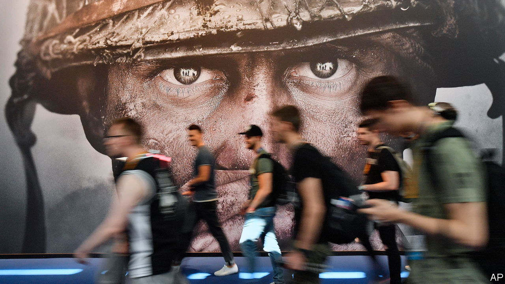

###### Fragged

# Britain shoots down Microsoft’s $69bn Activision deal 

##### The ruling will reverberate worldwide 

 

> Apr 26th 2023 

“How does a uk court block one American company from buying another American company?” asks a gamer in an online forum, where the chat is more often about high scores than competition law. “We had a war about this, and being independent, can do as we damn well please.”

Sadly for gamers—and global tech firms—that is not so. On April 26th Britain’s antitrust regulator, the Competition and Markets Authority (cma), blocked Microsoft’s  of Activision Blizzard, a publisher of games such as “Call of Duty”, arguing that the combined firm could gain too much clout and reduce choice for consumers. The surprise decision may have killed the l worldwide.

The $69bn acquisition, which would have been Microsoft’s largest and one of tech’s biggest ever, had seemed on track. The European Commission was expected to give it the nod next month. America’s Federal Trade Commission (ftc) had objected, but faced a difficult battle in court to stop it. Britain had long been seen as the hardest of the big three regulators to convince. But when in March the cma dismissed concerns from Sony about Microsoft’s advantage in the console market, and after Microsoft signed ten-year deals to make Activision games available on other platforms, it looked like game on.

Instead it seems to be game over. The cma ruled that in cloud gaming, an emerging technology in which games are streamed Netflix-style, Microsoft plus Activision might become excessively dominant. Microsoft is already the biggest player in cloud gaming, with some two-thirds of the worldwide business. Control of Activision’s catalogue of hits might make it unassailable, the cma said, adding that it doubted the effectiveness of ten-year deals in a new and fast-changing market.

The cloud-gaming market is indeed new and fast-changing, which makes it an odd place to wield the regulatory sledgehammer. Cloud-streaming subscriptions accounted for less than 1% of games spending last year, and it is far from certain that the technology will take off. Google shut down its Stadia cloud service in January and Amazon’s similar Luna platform is unpopular. Even if Microsoft bucked the trend, it would be good for consumers. Cloud gaming is “a vector of competition” between Microsoft and rivals like Sony and Nintendo, “not a distinct market”, wrote Clay Griffin of MoffettNathanson, a firm of analysts, who accused the cma of applying “faulty logic”. Weakening the main cloud-gaming service will entrench the console industry—and its leader, Sony.

Microsoft and Activision will appeal. Yet Britain’s appeals tribunal focuses narrowly on process and tends to defer to the cma. Microsoft’s only other options are to break off a smaller chunk of Activision or carve Britain out of the global deal, both things it has previously indicated it will not do. Without a deal Microsoft’s future in gaming is in question, says Ben Thompson of the Stratechery newsletter. “It’s hard to see how the [gaming] division makes sense if Microsoft has the current business model dictated to them, given just how dominant Sony is with said business model.”

Microsoft is not the only big tech firm to have been ambushed by the cma, which last year forced Facebook to undo its acquisition of Giphy, an unassuming generator of internet memes. Another Silicon Valley giant says that, since Brexit, Britain has been the feistiest of the big global regulators. America’s ftc is aggressive but reined in by the courts. The European Commission offers more scope for dialogue, tech lawyers report. The cma, meanwhile, is getting stronger. On April 25th Britain published a bill giving it wide discretion to regulate the biggest tech firms, with the power to dish out fines of up to 10% of global turnover. A separate online-safety bill proposes more rules for tech companies, including restrictions on encryption.

Yet Britain’s new global clout may backfire. WhatsApp and others have threatened to leave the country rather than apply its encryption rules worldwide. Activision, whose share price fell by a tenth on the ruling, says it will reassess British plans, adding: “Global innovators large and small will take note that—despite all its rhetoric—the uk is clearly closed for business.”■


