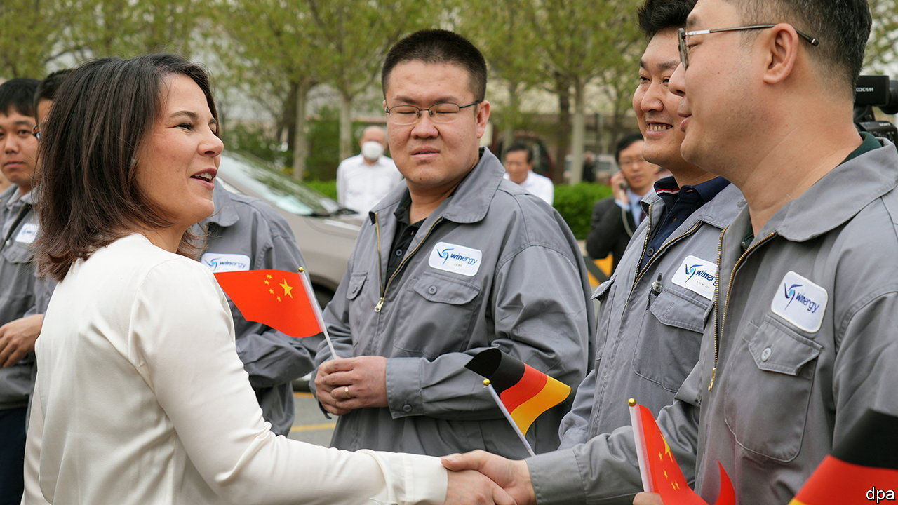
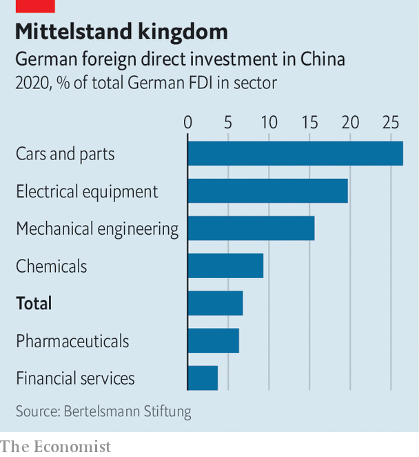

###### A continuing conundrum

# Business links between Germany and China are under review 

##### Less important for some, vital for others 

 

> Apr 27th 2023 

ANNALENA BAERBOCK kicked off her first trip to China as Germany’s foreign minister in April with a visit to a production site of Flender. The  firm makes parts for wind turbines in Tianjin, a coastal city around 130km south-east of Beijing. Ms Baerbock toured the facility for about an hour, all the while bombarding her hosts with questions, such as whether its suppliers are local. 

It is unusual for a foreign minister to tour a factory, but it shows the importance of business ties between Germany and China. The country is Germany’s biggest trade partner and an important destination for foreign investments in several industries that are the backbone of the . Yet as the value of trade increased for the seventh consecutive year in 2022, the bilateral deficit widened. German imports from China rose by a third compared with 2021 to €192bn ($202bn), whereas exports of German wares to China increased by only 3% to around €107bn.

 


Ms Baerbock’s ministry is spearheading efforts to write a new China strategy. Its much-awaited publication has been repeatedly postponed because of the need to strike a balance between boosting German business while at the same time encouraging some firms to diversify and make Germany less dependent on imports of critical raw materials from China. 

As Germany’s government recalibrates its China strategy two trends are emerging. One is that the companies already heavily invested in China are doubling down. Some of the country’s largest companies greatly rely on Chinese customers and suppliers. That includes its three big carmakers (Volkswagen, Mercedes-Benz and BMW); BASF, a chemicals giant; and Bosch, a car-components supplier. BASF is charging ahead with its €10bn investment in a new production site in southern China. In October vw announced a €2.4bn investment in a joint venture with a Chinese firm for self-driving cars and will spend €1bn on a new centre for developing electric cars. The other is that German companies are increasingly producing in China for China. Flender’s factory in Tianjin serves only the Chinese market. 

This reinforces an uncomfortable position for policymakers. Overall Germany may be less dependent on China than generally assumed. A recent study published by the Bertelsmann foundation, the German Economic Institute in Cologne (iw), merics, a think-tank, and the bdi, an association of German industry, scrutinised investment in China. It showed that between 2017 and 2021 China accounted for, on average, 7% of German foreign-direct investment and 12-16% of annual corporate profits, much the same as America, but far less than the eu, which provided, on average, 56% of corporate profits in the same period. And only around 3% of German jobs either directly or indirectly depend on exports to China, says Jürgen Matthes of iw. 

Yet that is not a reason to be less concerned about China, warns Max Zenglein of merics. In the past the assumption was that business in Germany would automatically benefit from investment in China, he says. With German companies increasingly spending on local production and research and development, the bulk of local profits is now often being reinvested there. And in the longer term the “local to local” trend could hurt both German jobs and exports to China. 

Another cause for concern is the cluster of huge German firms and industries that continue to rely heavily on China. The survival of its large carmakers and chemicals firms could hinge on access to the country. And China supplies 95% of the solar cells installed in Germany as well as 80% of laptops, and 58% of the circuit boards that are integral to other electronic goods. Germany also depends on China for the rare-earth metals needed to make semiconductors and lithium-ion batteries as well as antibiotics and other important medicines. 

Mr Matthes warns that companies will continue to pour billions into China unless the new policy provides incentives to do otherwise. If China’s threats to Taiwan turn nastier the consequences could be devastating for firms doing an ever-bigger slice of their business there. The latest tentative date for the publication of the new strategy is just after a meeting on June 20th between Olaf Scholz, the German chancellor, and Li Qiang, China’s prime minister. It is high time for a rethink. ■


