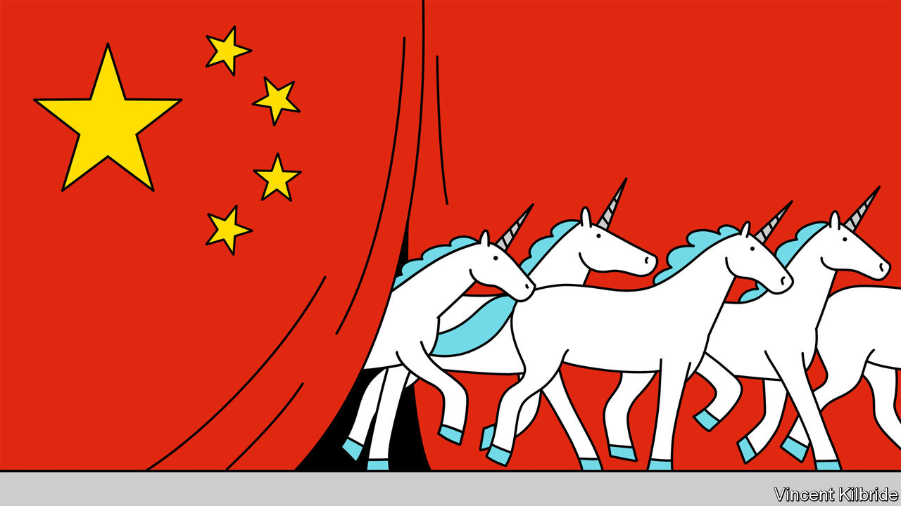
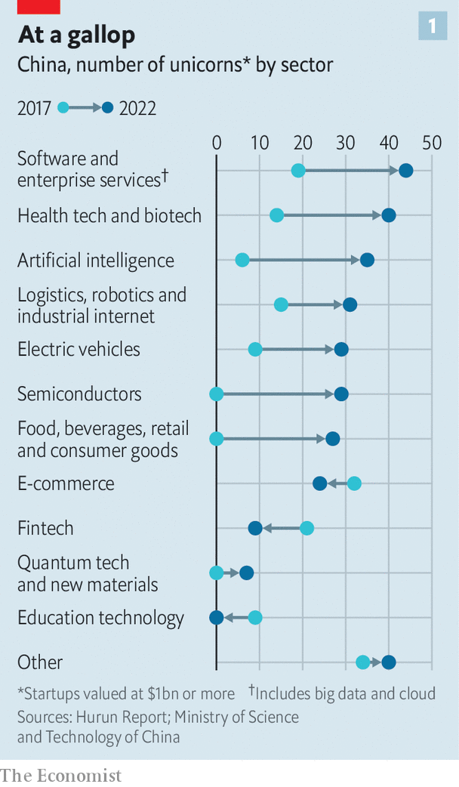
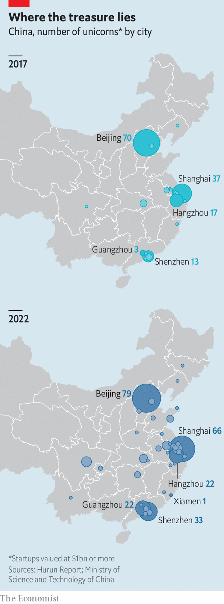
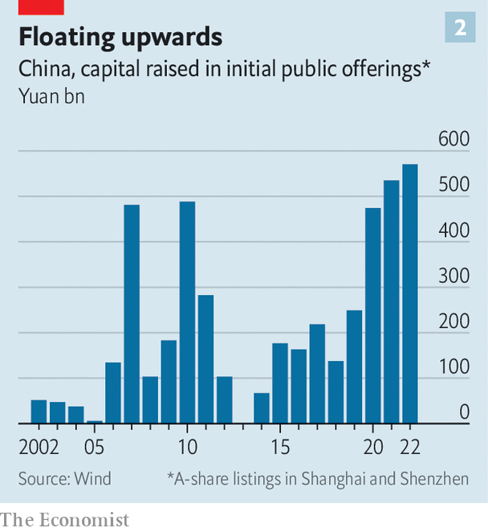

###### A new breed of unicorn

# How to make it big in Xi Jinping’s China 

##### We crunch the numbers on the country’s most valuable startups 

 

> Apr 24th 2023 

Greater bay technology’s transformation into a mythical beast has been speedy. The startup, which specialises in super-fast  charging, was launched in late 2020. Only 19 months later it had reached a valuation of $1bn, making it a unicorn (ie, an unlisted firm valued at or above that amount). Such creatures are becoming far more . Greater Bay joined a field of more than 300 of them in 2022, double the number five years ago. These new unicorns offer an intriguing snapshot of the country’s shifting industrial priorities.

The list, for that reason, is ever-mutating. Firms fall off because they go public or tumble in value. Some of the most promising ones get stuck as they encounter regulatory problems. The initial public offering (ipo) of Ant Group, a fintech powerhouse, for instance, was ditched at the last moment under pressure from regulators in 2020. Its valuation has reportedly tumbled from more than $300bn before the failed flotation to around $64bn. Others have gone from strength to strength. Beijing-based , which owns TikTok, a short-video app, was most recently valued at $220bn, making it the world’s most valuable unlisted firm.

To understand which sectors are being prioritised, and which ones are being neglected or crushed,  has analysed the changing mix of China’s most highly valued startups over the past five years. The results reveal a country teeming with unicorns that are intensely focused on making wares favoured by the Chinese government. They are cropping up outside the established tech hubs of Beijing, Hangzhou and Shenzhen. And whereas privately controlled tech giants, such as Alibaba and Tencent, used to dominate the startup scene, much of the recent growth is being underwritten by state firms. 

Consider first what the current crop of unicorns does. Many are in tune with the government’s long-term goals for technology, which involve engineering a shift away from consumer-internet firms and towards areas that the government thinks will drive the future of the economy. These include green energy as well as semiconductors, smart manufacturing, software and artificial intelligence, and biotech. 

The shift is also central to President Xi Jinping’s efforts to make China less dependent on foreign tech at a time when America is attempting to starve Chinese companies of advanced semiconductors. At a meeting with senior officials on April 21st Mr Xi said the government must help companies break through technological barriers in order to achieve “self-reliance” in the most important fields. 

 


As a consequence, much has changed since 2017, as illustrated by data from China’s Ministry of Science and Technology and Hurun, a research group. Back then, e-commerce dominated the landscape and about 20% of unicorns operated in online sales and related industries (see chart). Another 13% were engaged in fintech and 9% in culture and entertainment. These industries have since fizzled. By the end of 2022 software and enterprise services represented the largest group, or more than 40 of the country’s 315 unicorns, followed by health and biotech. The number of artificial-intelligence (ai) unicorns rose from six to 35. Dozens of green-energy and robotics unicorns have sprung up where there were few or none before. In 2017 China did not have a single unlisted semiconductor company valued at more than $1bn. By some counts, it had around 30 by the end of 2022. According to state media, the number was higher still, at 50. 

Entire industries have vanished from the list of unicorns. By 2017 China was home to nine education-technology firms each worth at least $1bn. But in 2021 a sweeping government campaign against companies offering online courses to students obliterated the industry. One of the nine managed to list in New York but was later forced to delist after the crackdown. The others have gone either through mass layoffs or, for a few, bankruptcies. By the end of last year, no such unicorns existed. A severe crackdown on online finance in recent years, meanwhile, has cut the number of highly valued fintech firms in half.

 


As unicorns’ sectors have changed, so too has the geography of innovation. The boom in consumer-internet tech naturally took place in China’s biggest cities, where wealthy consumers are concentrated. Just a few hubs, such as Beijing, Hangzhou and Shenzhen, became home to the most successful firms. Part of Mr Xi’s grand transformation of the Chinese economy, though, has involved divvying up development more evenly across the country. This has meant bankrolling more innovation in new places. Some large cities known mainly as hubs of manufacturing, not innovation, are becoming startup havens. Greater Bay, for example, is based in Guangzhou, part of China’s southern factory-belt (see map). So too are 21 other unicorns, up from three a half-decade ago.

Smaller cities, too, are part of the unicorn boom. Hithium, a lithium-battery-maker founded in 2019 and most recently valued at 25bn yuan ($3.6bn), is based in the southern city of Xiamen. Sagebot, a robot-assisted surgery company, was founded in Harbin in the rust-belt of China’s north-east. It is planning an ipo after recently achieving a valuation of 8bn yuan. According to a list from , a business publication, unicorns have even cropped up in China’s far-western regions of Qinghai and Tibet.

Sources of funding, too, have changed dramatically over the past five years. Privately owned giants are no longer the centre of gravity in China’s tech world. Not long ago startup founders joked that the only business model in China which mattered was “b-to-bat”, or selling their companies to one of China’s biggest tech groups—Baidu, Alibaba or Tencent (collectively known as bat). Alibaba and Tencent emerged as two of the biggest forces in China’s venture-capital industry, eventually displacing dedicated private-equity firms. In 2017 five of the country’s top tech groups—Alibaba, Tencent, Xiaomi, Baidu and jd.com—were investors in about half of China’s unicorns.

Today they are far less influential. In 2022 the same top-five tech groups had invested in only 21% of unicorns, according to our analysis of company disclosures and press reports. This in part reflects the  on monopolistic behaviour at the tech giants, which has caused them to invest less now than they did in the past. But it also reflects the emergence of new sources of funding, often backed by the state. 

Cash from government-backed funds, for instance, has rushed into “hard tech”. Of the 50 semiconductor unicorns identified by state media at the end of 2022, a state entity had either invested in or controlled outright 48 of them. Many large state firms are taking on the role of startup incubators. Greater Bay, for example, is the youngest of four unicorns launched with capital from Guangzhou Automobile (gac), a state-owned carmaker. By handing out funds to a number of startups, gac is becoming a nexus for transportation tech. Aion, an electric-vehicle unicorn funded by gac, uses Greater Bay’s battery technology. Ruqi Mobility, a ride-hailing startup, is expanding nationally using gear from Greater Bay and Aion, and cash from gac. The carmaker is also backing a semiconductor-maker, called CanSemi, that recently secured funding at a $1bn valuation.

Qiyuan Green Power, a Shanghai-based startup that provides battery charging and replacing services for large trucks, tells a similar tale. The group was launched by State Power Investment Corporation (spic), a centrally controlled firm which holds a controlling stake in Qiyuan. Launching subsidiary businesses is nothing new for state entities. But Qiyuan looks much more like a startup than a typical government-run company. It has instigated funding rounds to bring in private investment, and competed for cash and talented engineers alongside other private firms. In April last year Greater Bay, too, raised capital from a number of privately controlled investors, including Tencent.

At a recent fundraising roadshow for Qiyuan 80 investors attended with an interest in getting a stake, says Guo Peng, an executive at the company. As a “hybrid” firm with both state and private interests, Qiyuan enjoys some of the efficiencies of a private-sector startup but has the backing of a powerful state group. The state pedigree has, without a doubt, increased investors’ confidence in the company’s future, says Mr Guo.

It is not only state firms that are rushing in. Huawei, a privately owned telecoms-equipment maker, only began making venture-capital-style investments in 2019. Since then it has sealed at least 91 individual investments in startups, an increase from two in the previous seven years, according to data compiled by Itjuzi, a Chinese investment-intelligence firm. One of those companies, Welion, a lithium-battery company, attained a 15bn yuan valuation last year. If just a few of the investments made over the past four years succeed, the company should become a hub of valuable startup activity.

 


For Mr Xi, this latest tech boom is both a source of pride and a potential problem. The state has set out to tame speculative bubbles in some areas while also releasing market forces in others. It has referred to the flood of funding that once poured into internet businesses as a “disorderly expansion of capital”. But at the same time it is also trying to ease the way for some companies to go public. In February China’s market regulator announced that its bourses would adopt a registration system for ipos that does away with an onerous official screening process. The result has been a barrage of new tech-sector listings hitting the stockmarket in March and April. Stock prices have soared on the first day of trading, often more than doubling.

New bubbles are without question being created in emerging industries, says one investor who specialises in green energy. This has been deemed acceptable, for now, because it is in line with government policy. State-backed startups face few hurdles. State influence over capital markets—from seed funding to ipos—means it has become easy for companies with the right connections to catapult through the fundraising process. Whether those companies have the best technological chops, however, is unclear, says the investor.

Foreign investors remain sceptical. One banker who works with foreign private-equity groups says that some investors fear regulators can easily turn on an industry if speculation appears to be getting out of hand. Peer-to-peer lending once received strong support from the government before it was crushed in 2018. Another, more recent example relates to Chatgpt. The Chinese state has shown heavy support for China’s domestic ai industry. But the latest global craze for ai-powered chatbots has led regulators to crack down on the area. On April 11th the country’s cyber regulator said it would require security reviews for these businesses. As long as there are bubbles—even state-backed ones—there will be crackdowns. ■


