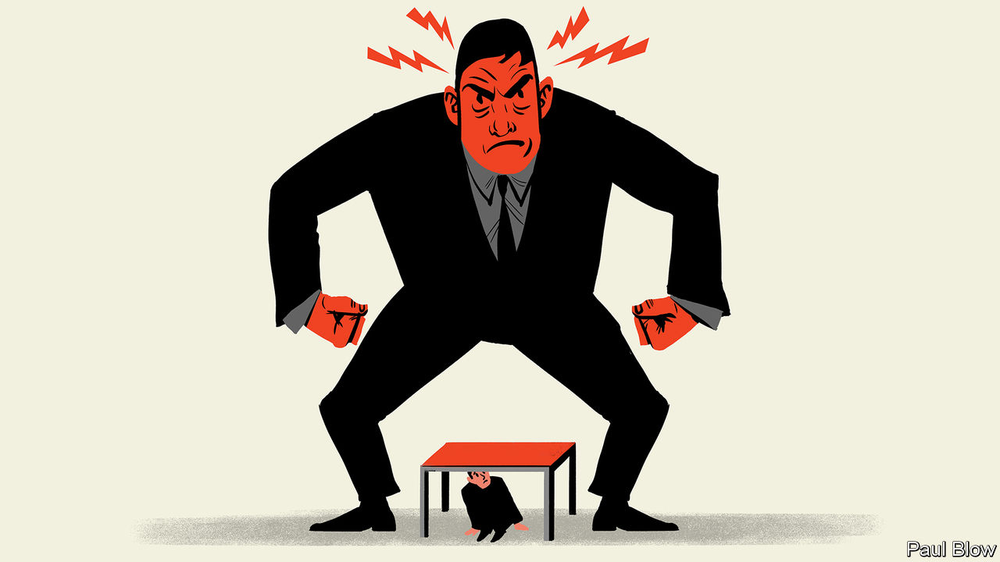

###### Bartleby

# If enough people think you’re a bad boss, then you are 

##### Dominic Raab’s exit from Britain’s government, and the role of fear in the workplace 

 

> Apr 23rd 2023 

A fascinating case study on the exercise of power within an organisation has just reached a conclusion in Britain. Dominic Raab resigned as the country’s deputy prime minister and justice secretary on April 21st, after an independent investigation into whether he is a workplace bully found that he had crossed a line. The civil servants who lodged complaints against him will feel justified. His supporters, and the man himself, contend that his departure sets an unhealthily low bar for being found guilty of bullying. 

Adam Tolley, the barrister who conducted the probe, found that Mr Raab had displayed “unreasonably and persistently aggressive conduct” while he held the job of foreign secretary. Mr Tolley also concluded that Mr Raab’s style at the justice ministry was sometimes “intimidating” and “insulting”. Mr Raab may not have intended to upset but that is not enough to get him off the hook: the British government’s own website says that bullying is “behaviour that makes someone feel intimidated or offended”. 

The context of the Raab affair is unusual. Media interest is high, and the relationship between  and British government ministers is a very particular one. But the question of what distinguishes someone who merely sets high standards, which is Mr Raab’s version of events, from someone who is a bully is of interest in workplaces everywhere. In a survey published in 2021 around 30% of American workers, for example, said they had direct experience of abusive conduct at work; in two-thirds of cases, the bully was someone above them in the food chain. 

It is hard to read the report and not feel an unexpected twinge of sympathy for Mr Raab. Unfashionable though it is to admit it, fear is a part of organisational life. Hierarchies hand managers the power and remit to weed out poor performers. Driven,  are often the people who make it up the ladder. 

Mr Raab is definitely that. Mr Tolley describes an exacting boss: hard-working, impatient and direct. He interrupts when he is not getting a straight answer. He does not want to spend time rehearsing arguments that have already been aired. If he thinks work falls short of the required standard, he says so. 

Mr Raab shares many of the attributes of a desk light: he is bright, glares a lot and is not known for empathy. But he appears to be motivated principally by achieving better outcomes. The investigation found no evidence that Mr Raab shouted or swore at people, or that he targeted individual civil servants. Mr Tolley was unpersuaded by allegations from officials that he made threatening physical gestures, whether banging the table loudly or putting his hand out towards someone’s face to stop them talking. The “hand out” gesture was not as emphatic as alleged, writes the lawyer; the banging was unlikely “to cause alarm”. If Mr Raab is a bully, he is not nearly as aggressive as some media reporting had implied.

Yet that twinge of sympathy passes, as twinges are wont to do. The number and consistency of complaints about Mr Raab is itself evidence that something was genuinely amiss. The civil servants who spoke out about him had worked for other ministers before; they were not greenhorns. Mr Tolley is persuaded that the complainants acted in good faith, despite protests from Mr Raab that he is the victim of “activist civil servants”. 

Mr Tolley’s most acute observation is to recognise that working life is not a series of discrete incidents, each bearing no relation to the other. Some of the complaints people had about Mr Raab might seem innocuous in isolation. A propensity to bang the table or interrupt people is discourteous but plenty of bosses do the same. Cutting people off in meetings would have mattered less if he was not also the sort of person to describe work he received as “utterly useless” and “woeful”. Bullying can be a one-off, but more often it is incremental: stresses accumulate, anxiety builds, atmospheres form. 

And even if you think Mr Raab has been unfairly labelled as a bully, it is hard to overlook another problem—his effectiveness as a manager. If enough people think you are a bad boss, you are a bad boss. If employees try to avoid you, the pool of talent available to you shrinks. Mr Tolley himself, who has done a scrupulously fair job, clearly found the deputy prime minister trying. He describes Mr Raab’s approach to the investigation as “somewhat absolutist”. That sounds suspiciously like British-lawyer-speak for “he is a complete nightmare”.■


