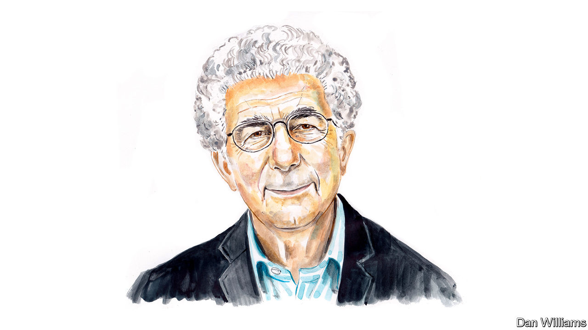

###### Israel at 75

# Avi Shlaim calls for critical reflection 

##### Like Zionism itself, the state has become a settler-colonial movement, argues the academic and author 

 

> Apr 25th 2023 

ISRAELIS APPROACH the  of the establishment of their state in a subdued and sombre mood. Israeli society is , the country is in the throes of , and there is no consensus on how to mark the milestone. On the one hand, Israel can boast some remarkable successes in the economic, technological, scientific and cultural spheres. And in its central aim of providing the scattered Jews with a haven, instilling in them a sense of nationhood and forging a modern nation-state, Zionism has been a brilliant success.

Success, however, came at a price, a price that  were forced to pay. Nineteen forty-eight was a year of triumph and tragedy, an Israeli triumph and a Palestinian tragedy. What Israelis call “The War of Independence” is known in Arabic as the  (catastrophe): about 750,000 Palestinians, more than half the Arab population of the country, became refugees and the name Palestine was wiped off the map. Seventy-five years on, there is still no solution in sight to the refugee problem and the Palestinian people are still denied freedom, independence and statehood. 

Before Israel’s foundation, Zionism was an avowedly settler-colonial movement. Its ultimate aim was to build an independent Jewish state on as much of the territory of Palestine as possible, with as few Arabs as possible within its borders. Zionist leaders spoke about developing the country for the benefit of the two peoples who lived there but this was largely empty rhetoric. The reality was a relentless drive to acquire more and more land, and a systematic effort to take over the country. As Zionism is essentially a settler-colonial movement, so is its political progeny, the state of Israel.

The controlling logic of settler-colonialism is to subdue and drive out the natives. Noam Chomsky, an eminent Jewish-American intellectual, has argued that settler-colonialism is the most sadistic form of imperialism. In Palestine, the Zionist leaders were not sadistic, but they were ruthless in pursuit of their goal.

In 1948, following the Arab rejection of the UN partition plan, they exploited the opportunity offered by an Arab military attack to extend the territory of their emerging state beyond the borders drawn by the UN cartographers, and to carry out large-scale ethnic cleansing of Palestine. After the war, all the emphasis was on , or immigration, “the ingathering of the exiles”, nation-building and promoting the welfare of the Jewish population. The Arab minority inside Israel was kept under military government until 1966. During this period the settler-colonial character of the new state became obscured, but it did not fundamentally change.

It took the war of June 1967 to reopen the question of the territorial aims and claims of Zionism and to bring back to full view the colonial essence of the project. The trebling of the territory under Israel’s military control also revived the dilemma that the Zionist movement had faced since its earliest days: the land of its aspirations was already inhabited by another people. As the then prime minister Levi Eshkol never tired of reminding his Labour Party colleagues: “You like the dowry, but you don’t like the bride.”

It is often forgotten that it was not the right-wing Likud but a Labour-led government that started the colonisation of the West Bank, East Jerusalem and the Gaza Strip after 1967. No sooner had the guns fallen silent than it started to build civilian settlements on occupied Palestinian territory—in contravention of the Fourth Geneva Convention. The convergence of secular nationalism and religious messianism in the aftermath of victory fed the growth of the settlement movement. Ten years later it also helped to bring to power Likud under the leadership of Menachem Begin.

Likud views Judea and Samaria, the biblical names for the West Bank, as an integral part of Eretz Yisrael, the Land of Israel. Likud rule saw a massive increase in the resources devoted to settlements. Labour governments authorised settlements mainly in areas they intended to keep permanently following a negotiated settlement of the conflict. Likud governments encouraged the building of settlements all across the West Bank to ensure that no part of it could be relinquished in the event of Labour’s return to power.

The occupation inflicted terrible suffering on the occupied people: land confiscation, restrictions of movement, detention without trial, torture, “targeted assassinations” of leaders, indiscriminate killing of civilians and house demolitions. But the occupation has also had far-reaching consequences for the occupier, most notably by eroding the foundations of Israeli democracy. 

It is no exaggeration to say that the occupation turned Israel into a repressive police state. This had repercussions at every level of Israeli society. The number of settlers kept increasing (it now stands at an estimated 700,000, or nearly 10% of Israel’s Jewish population). The political power of the settler lobby increased exponentially. The political culture of the settlers infected the rest of the Israeli body politic with intolerance, religious fanaticism, xenophobia and Islamophobia.

The current Likud-led coalition government, headed by Binyamin Netanyahu, reflects the slow but steady shift to the right of Israeli society over the past half-century. It is the most right-wing, authoritarian and overtly racist government in Israel’s history. It represents the ugly face of settler colonialism. Netanyahu, who is standing trial on serious charges of corruption (which he denies), personifies some of the most negative aspects of Zionism without any of its saving graces. Among his ministers are settlers and avowed Jewish-supremacist politicians like Itamar Ben-Gvir and Bezalel Smotrich, who have been given extensive powers by Mr Netanyahu to oversee the occupation forces on the West Bank.

Israel used to boast of being an island of democracy in a sea of authoritarianism. Today, it increasingly displays some of the negative features of the region into which it never wanted to be integrated.

Whether pre-1967 Israel was a proper democracy is debatable. It defined itself as a Jewish democracy, which is an oxymoron: a Jewish state is inherently racist; a democracy is for all its citizens. Yet the Arabs had the vote and the country had the rules and procedures that fulfilled the basic requirements of a democracy.

The same cannot be said of the Zionist colonial project beyond the 1967 borders, known as the Green Line. The relationship here is between occupier and occupied, colonial overlord and a subjugated people. This situation is best described as an ethnocracy, a political system in which one ethnic group dominates another. However, there is a more ominous word for it: apartheid.

B’Tselem, a respected Israeli human-rights organisation, issued a position paper in January 2021 entitled “A regime of Jewish supremacy from the Jordan River to the Mediterranean Sea: This is apartheid”. In the past, B’Tselem had reported only on human-rights violations in the occupied territories. Its paper in 2021 concluded that “The entire area Israel controls between the Jordan River and the Mediterranean Sea is governed by a single regime working to advance and perpetuate the supremacy of one group over another. By geographically, demographically and physically engineering space, the regime enables Jews to live in a contiguous area with full rights, including self-determination, while Palestinians live in separate units and enjoy fewer rights.” The chickens of Zionist settler-colonialism have come home to roost.

I experienced the transformation of Israeli society over the past half-century at the personal level. In the mid-1960s I served loyally and proudly in the Israeli army because I felt at that time that the IDF was true to its name: it was the Israeli Defence Forces. After the 1967 war, its character gradually changed. It became the repressive police force of a brutal colonial power. I for one, therefore, do not regard Israel’s 75th birthday as a cause for celebration but rather as an occasion for critical reflection and soul-searching.■


