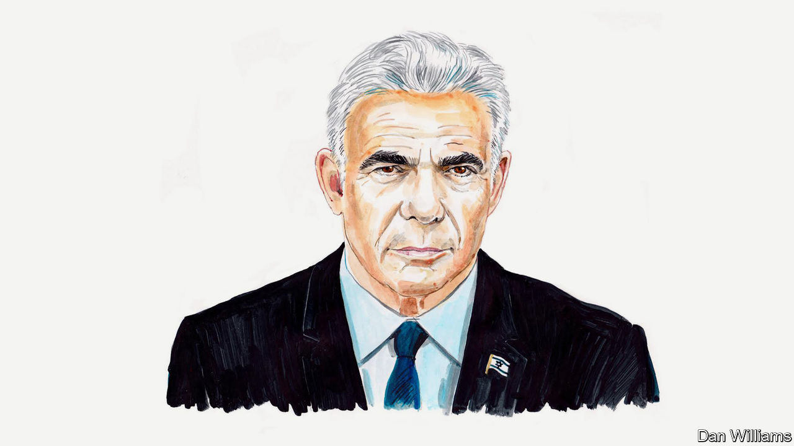

###### Israel at 75

# There is much to celebrate—and worry about—says Yair Lapid 

##### The leader of the opposition on the fight for the nation’s future 

 

> Apr 23rd 2023 

THIS COLUMN could start in one of two ways.

Option one: on its 75th birthday Israel is an incredible success story. From the horrific destruction of the Holocaust, the Jewish people rose and built a country to be proud of. Israel is a military and technological power with more Nobel laureates than China or Australia, with a modern economy and a vibrant democracy. It is one of the United States’ closest allies, and Israel is a synonym for innovation and entrepreneurship. Not for nothing is it known as the “Start-Up Nation”. 

Option two: on its 75th birthday Israel is facing the gravest crisis in its history. Its government is controlled by the extreme right, which is trying to alter the democratic character of the country. Wild conspiracy theories are destroying the concept of truth. Religion is far too prominent in the political arena. The control over millions of Palestinians is hurting the country from within. Israel’s international legitimacy is quickly wearing away and its closest allies are distancing themselves in embarrassment.

Which of these descriptions is more accurate? I believe it’s the first, but I don’t ignore the second. Israel is a country facing complicated and existential questions, but it remains one of the most breathtaking projects of the modern era. In the seemingly endless string of events, it is sometimes hard to remember what we’ve achieved and the conditions in which we’ve done so.

In the summer of 1948, my father arrived at the port of Haifa in a boat that had left his homeland of Yugoslavia. He was 17 years old, a skeleton-thin Holocaust survivor who by some miracle had survived the ghetto. His father had been murdered in a concentration camp together with many of his relatives. His friends and neighbours couldn’t understand the madness that had taken hold of him. Why was he leaving the communist heaven and emigrating to a failing country which had been created only months earlier and would almost certainly be rapidly wiped out. Only 650,000 Jews lived in Israel at that time, surrounded by Arab countries which openly declared their intention to destroy Israel.

Seventy-five years later we know that my father—who died fat and happy—was right. Yugoslavia doesn’t exist anymore but more than 9m people live in Israel, and they are sending satellites into space, leading breakthrough AI projects and exporting water- and food-conservation technologies across the Arab world. Show me another people that can claim both the Bible and Wonder Woman. Show me another country that gave the world both the Waze navigation app and the immortal characters created by Shai Agnon, a Nobel laureate in literature.

These incredible achievements shouldn’t cause us to ignore the problems. In our 75th year we face enormous challenges, both internal and external. Our military strength should enable us to separate from the Palestinians on the basis of the two-state solution. We need to create regional alliances which will allow us to deal with the existential threat posed by Iran’s nuclear programme. Above all, we must ensure that Israel remains a vibrant democracy which, in the words of our declaration of independence, “will ensure complete equality of social and political rights to all its inhabitants irrespective of religion, race or sex; it will guarantee freedom of religion, conscience, language, education and culture.”

To protect those sacred words, hundreds of thousands of Israelis have taken to the streets in an inspiring series of protests. We march wrapped in our national flag in order to stop the government’s attempt to turn Israel into another “illiberal democracy” like Hungary or Poland. We know there is no such thing. A democracy which doesn’t protect the rights of women, the LGBT community, national minorities, the independence of the court and freedom of expression isn’t a democracy. We want to live in a Jewish state but not in a state where religion is forced upon citizens. The attack on democratic values under the current government has given rise to an enormous and determined liberal camp.

As populist regimes so often do, the government attacks us for not being patriotic enough. Our answer is that real patriots do not claim their country is perfect; they fight to make it so. The protest movement is the real face of the liberal Israel whose democratic instinct is deep and uncompromising. Our decision is to make our voice heard, not to give up, and to fight for the values on which our country was founded. Life in the Middle East has made us incredibly aware of the painful weakness of tribal and theocratic societies. We will not let the government turn Israel into another one of those countries.

I have always been slightly uncomfortable with the rather immodest concept of the “Chosen People”. I prefer to think that the Jewish people are the “choosing people”. We choose our life story. Seventy-five years ago we chose to channel the horror and anger of the Holocaust into the positive energy of building an independent home for ourselves. Today we choose to fight for the character of that home. You cannot disconnect Israel’s extraordinary success from the fact that it is a modern democracy with checks and balances and a separation of powers. That is the Israel we chose; now we will ensure it stays that way. ■


