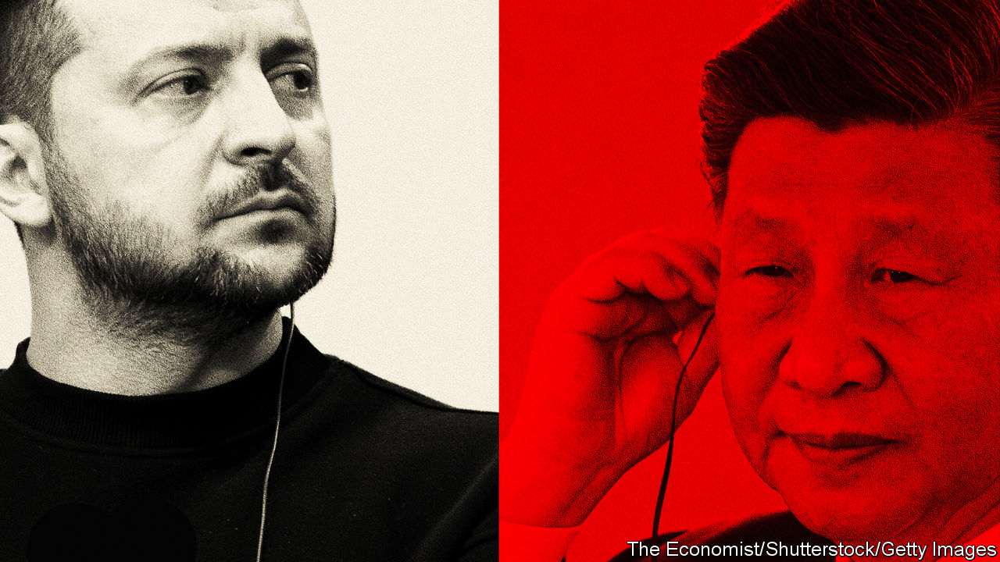

###### First contact

# At last, Xi Jinping calls Volodymyr Zelensky 

##### China’s leader promises to push peace in Ukraine 

 

> Apr 26th 2023 


For weeks, Chinese officials have told foreign counterparts that the time is not right to push for peace talks between Russia and Ukraine. Neither is interested, the officials argued, as each hopes to gain ground in the coming months. Likewise, the officials suggested it was too early for China’s leader, Xi Jinping, to speak to Ukraine’s president, Volodymyr Zelensky. 

Many were thus surprised by the news that Mr Xi and Mr Zelensky spoke by phone on April 26th, their first exchange since the Russian invasion. What is more, the Chinese government announced that it would soon send a special representative to Ukraine and other countries to discuss “a political settlement of the Ukrainian crisis”.

Neither side provided much detail. China’s foreign ministry quoted Mr Xi as saying that dialogue was the only way forward. “There are no winners in a nuclear war,” he said. Mr Zelensky described their talk as “long and meaningful”. He said the call, and the appointment of a new Ukrainian ambassador to China, would give “powerful impetus” to bilateral ties. Russia, meanwhile, noted China’s readiness to try to start negotiations. But it added that Ukraine and its backers had “shown their ability to mess up any peace initiatives”. 

So what explains China’s change of heart? Russia and Ukraine are no closer to peace talks. Nor has the battlefield shifted much. But the call follows a period of intense diplomacy focused on China’s approach to Ukraine. And it comes just a few days after China’s ambassador to France caused a diplomatic furore when he questioned the sovereignty of ex-Soviet states.

China’s foreign ministry quickly disavowed those comments. For many in Europe and in former Soviet countries, however, the outburst provided further evidence that China is too close to Russia to act as a peacemaker in Ukraine. They were already sceptical of the peace plan that China proposed in February, as it echoes many of the Kremlin’s demands and does not seek a Russian withdrawal. 

Such doubts intensified following Mr Xi’s visit to Moscow in March, when he pledged to expand co-operation just a few days after the International Criminal Court indicted Mr Putin for war crimes. America also alleged that China has been considering selling weapons to Russia, which European leaders say would cross a red line. 

China denies any such plans and rejects all criticism of its relations with Russia. But Chinese officials are increasingly conscious that Mr Xi’s position on Ukraine is undermining his efforts to persuade European governments to resist American pressure to “decouple” from China economically and to confront China more directly on security issues, including Taiwan. 

European leaders have been pressing Mr Xi to do more to end the war in Ukraine (even as they debate their longer-term China strategy). Emmanuel Macron, France’s president, and Ursula von der Leyen, president of the European Commission, were among those who on recent visits to China urged Mr Xi to speak to Mr Zelensky.

None of that will have altered Mr Xi’s strategic calculus. His priority is China’s rivalry with America and he still sees Russia as a valuable source of energy, weapons and diplomatic support. He is determined to prevent Mr Putin from suffering a humiliating defeat that might lead to his being replaced by a pro-Western leader. 

“The fundamentals are the same,” says Alexander Gabuev of the Carnegie Russia Eurasia Centre in Berlin. He suggests that China delayed the Zelensky call over concerns about what Ukraine’s leader might say publicly, but then accelerated plans to help walk back the Chinese ambassador’s remarks and to “show that Macron and others who are enthusiastic about China’s diplomatic role are not mistaken”.

That China has no intention to abandon or exert real pressure on Russia was made clear again in April when General Li Shangfu, China’s new defence minister, visited Moscow on his first trip abroad in that position. He told Mr Putin that Russia-China relations “go beyond the military-political alliances of the cold-war era”.

Yet Mr Xi is determined to portray himself, especially in the global south, as the responsible leader of a great world power. And he still hopes to drive a wedge between America and Europe, a critical source of the investment and trade that China needs to revive its economy. 

Defusing the row surrounding its ambassador is unlikely to have been China’s main goal. But the timing helps, says Yun Sun of the Stimson Centre, a think-tank. “China doesn’t have realistic expectations that the war will end soon,” she says. “But it doesn’t mean China cannot exploit the opportunity to boost its influence and the goodwill it creates with Europe.” ■


