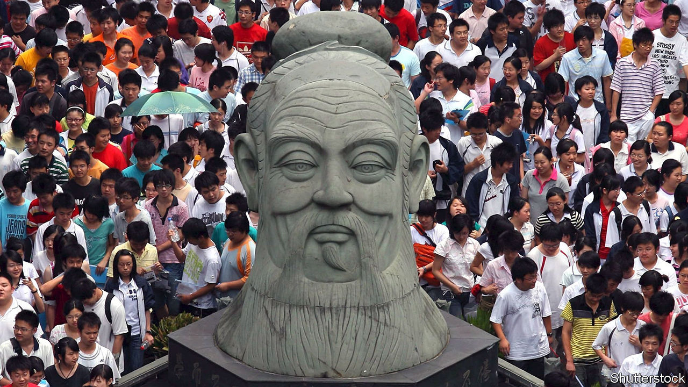

###### Xivilisation

# China’s latest attempt to rally the world against Western values 

##### Xi Jinping faults America for any clash of civilisations 

 

> Apr 27th 2023 

Thirty years ago, in the wake of the Soviet Union’s collapse, Samuel Huntington, an American scholar, offered a bleak view of how the world would change. He suggested that a “clash of civilisations” would replace the erstwhile cold-war conflict between West and East. As China’s struggle with America intensifies, President Xi Jinping has recently proposed a different view—that civilisations can live in harmony. It may sound tritely upbeat, but its underlying message is less so. The West must stop promoting its values, or Huntington will be proven right. 

Since Mr Xi unveiled his Global Civilisation Initiative (GCI) on March 15th, state media have brimmed with fawning coverage. The English edition of , a nationalist tabloid, has dubbed the president’s idea “Xivilisation”, calling it “all important” and “full of Chinese wisdom”. Writing in the , a Hong Kong newspaper, a Chinese diplomat alluded to Huntington: “At a time when the antiquated thesis of a ‘clash of civilisations’ is resurfacing, China’s emphasis on the equality of civilisations is needed more than ever for a peaceful world.” In other words, the West should learn to live with Chinese communism. It may be based on Marxism, a Western theory, but it is also the fruit of China’s ancient culture. 

The GCI is the latest in a series of suggestions by Mr Xi for how the world should be run. First came the Global Development Initiative (GDI), which he presented to the UN in 2021. It has been touted as a “twin engine” alongside the Belt and Road Initiative, a worldwide infrastructure-building scheme that was launched by Mr Xi close to the start of his more than decade-long reign. Under the GDI, China has pledged at least $4bn towards helping poorer countries with everything from public health to cutting carbon emissions. The initiative is described as a “Chinese formula” for development. That means putting economic benefits ahead of civil and political rights.

In 2022 Mr Xi produced another, called the Global Security Initiative (GSI). This came just two months after his “old friend” in Moscow, Vladimir Putin, launched an invasion of Ukraine. The GSI echoed Russia’s worldview, calling for a “common, comprehensive, co-operative and sustainable” approach to building international security. That is shorthand for giving big powers, such as China and Russia, a veto over security arrangements in their neighbourhoods. Chinese officials describe a rapprochement in March between Iran and Saudi Arabia, in which China played a modest role, as a victory for the GSI. They will doubtless hail Mr Xi’s  with Ukraine’s president, Volodymyr Zelensky, their first contact since the war began, as another GSI milestone. 

The GCI was announced at a virtual dialogue, organised by China’s Communist Party, of leaders of about 500 political organisations from more than 150 countries. The timing may have been deliberate: days later President Joe Biden was to co-host his second Summit for Democracy, also by video link (85 world leaders took part—China’s was not invited). “The practice of stoking division and confrontation in the name of democracy is in itself a violation of the spirit of democracy,” Mr Xi told his audience. “It will not receive any support.”

In many non-Western countries, his own initiative may win backing, even though it consists of just a few bromides. “Countries need to keep an open mind in appreciating the perceptions of values by different civilisations,” he said, “and refrain from imposing their own values or models on others and from stoking ideological confrontation.” 

China’s leaders have often made similar points. But the initiative formally elevates China’s concerns about Western “interference” to a matter involving not just countries, but civilisations. It implies that any attack on China’s political system is an attack on its culture. Mr Biden describes America as being engaged in a “battle between democracy and autocracy”. Mr Xi is clearly trying to portray it as waging a broader, Huntingtonian-type struggle.

Chinese civilisation has long been one of Mr Xi’s preoccupations. He has convened Politburo meetings to discuss it. One of his mantras is that Chinese must display “four self-confidences”. Unsurprisingly, three of them are about strengthening belief in various aspects of Chinese communism. But the fourth relates to Chinese culture: Mr Xi wants no doubting of its greatness either. His views on this are strikingly different from those of the party’s founders, who played up the darker aspects of China’s pre-communist history. Mr Xi prefers to highlight a cultural continuum, with a past full of glories that are now embodied in the party. Mao Zedong tried to suppress Confucianism, a philosophy that guided state and personal behaviour for centuries. Mr Xi has been promoting it. 

Music to Xi’s ears

In recent years, some Chinese scholars have embraced the idea of China as a “civilisational state”—a country whose borders also encompass a distinct civilisation. A book by a British author, Martin Jacques, published in 2009, helped to popularise the notion. Titled “When China Rules the World”, it became a bestseller in China, where its prediction that China would displace Western power without adopting Western values chimed with the party’s view. In 2011 a book on the theme by Zhang Weiwei, a Chinese academic, also became a hit. Mr Zhang describes China as exceptional: the only modern country that is also an ancient civilisation. He clearly has Mr Xi’s blessing. In 2021 he was invited to brief the Politburo on how to project China’s views globally. 

Developing Mr Xi’s new initiative will involve a tricky balancing act. As Chinese officials explain the idea, all civilisations are equal and should be tolerant of each other. So what to make of Western civilisation? Official Chinese commentary often portrays it as in decay, a victim of ingrained flaws. On April 21st at a government-sponsored forum in Shanghai, Mr Zhang contrasted the “harmony” of Chinese culture with the conflict of politics in the West (Mr Jacques was also among the speakers). Even Mr Xi, in his efforts to promote “cultural self-confidence”, plays up the exceptionalism of Chinese civilisation. He has spoken of its “unique ideas and wisdom”. 

Like his other initiatives, this one will appeal to many poorer countries that want China’s largesse and share its disdain for Western values. Early last year China formed a group in the UN called the “Friends of the Global Development Initiative”, with 53 member-states. Now it has nearly 70. At last month’s democracy summit, Mr Biden spoke of “real indications that we’re turning the tide here” in the contest with authoritarianism. If so, there is much ground to make up. A report in March by the V-Dem Institute, a think-tank based at the University of Gothenburg in Sweden, said the share of the world’s population living in autocracies had risen from 46% in 2012 to 72% last year. 

In the West, however, Mr Xi’s civilisation initiative will do little to boost his or his party’s image. Among Western elites, many reject any notion that calling for democracy in China involves a challenge to its civilisation. In 2019, when Donald Trump was America’s president, an official at the State Department described the rivalry with China in Huntingtonian language. It is “a fight with a really different civilisation and a different ideology”, said Kiron Skinner, adding that America faced a “great power competitor that is not Caucasian.” But she faced a backlash in America for her remarks.

In recent years several American universities have closed their campuses’ Confucius Institutes. But this has not been aimed at a 2,500-year-old philosophy. The centres, which promote Chinese language and culture, have been targeted because of their suspected political influence. There are many such institutes in the West, sponsored by the Chinese government.

Far from having a positive impact, Western officials worry that the GCI, like China’s previous proposals, will be used to draw lines between the country’s supporters and critics. Chinese diplomats lean on foreign counterparts to express public support for Mr Xi’s ideas, keeping careful tally of who does. His triad of global initiatives will deepen the world’s divides. ■


