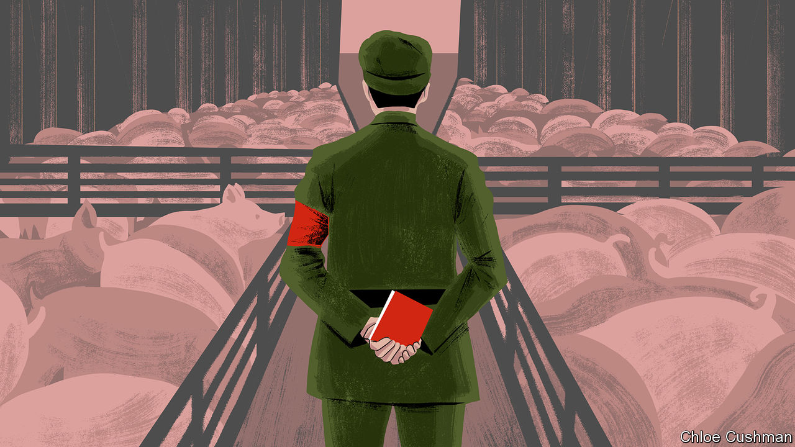

###### Chaguan

# China’s rulers play the law-and-order card, and lose 

##### A revealing backlash to a new brigade of rural law-enforcement officers 

 

> Apr 27th 2023 

Mr Tang, a farmer from central China, bears the marks of hard luck and forces beyond his control. A wiry, shaven-headed man of 57, with red scars on his face and neck, he returned home to the province of Henan two years ago, after growing too old to find migrant work in big cities. Pouring his savings and borrowed money into a smallholding in the village of Niezhang, Mr Tang (not his real name) watched 200 pigs die last year of “the disease”. He means African swine fever, which is rampant in China. “They all had to go,” he recalls, pulling a thin jacket around him against a cold, damp day. “Every night we shipped them out in a three-wheeled truck to be buried.” His homecoming at the height of China’s “zero-covid” policy exposed him to rural life at its most controlling, as pandemic guards and volunteers in red armbands wielded coercive powers not seen since the Mao era. 

Yet for all the bossing about that Mr Tang has endured, places like Niezhang need a stronger rule of law, not a weaker one. Swine-fever outbreaks that have brought ruin to farmers across this muddy corner of Henan are, in part, a glimpse of a secretive, unaccountable bureaucracy failing its own citizens. While channelling state support to industrial pork producers with modern safety systems, officials seem to be quietly writing off backyard farms and hiding the results. China has not declared a single mainland case of swine fever to the World Organisation of Animal Health in over a year, though the disease is endemic in the country. 

Floods are growing more common and severe in these vast, flat plains around the Yellow River. When waters rise in Niezhang, they carry pollution from a creek beside Mr Tang’s farm, which is slick and black with waste. Both animals and people are sickened, he says. A state-owned water-treatment plant, visible through stands of poplar trees, was fined in 2020 for allowing polluted waste into a local river. Promises to cover the creek with concrete have not been kept. With powerful local backers, the plant remains open. Asked about asserting his legal rights, Mr Tang sounds weary. “We farmers, we don’t know about the law.” Some neighbours sent petitions to higher authorities. He is not good with words, he says. “If I appealed it wouldn’t amount to much.”

Such unhappy fatalism about the limitations of legal appeals, multiplied enough times across China, should worry the Communist Party and its leader, Xi Jinping. For under Mr Xi, the party and state have dramatically increased their reach into every corner of society and the economy: a process greatly accelerated by zero-covid policies, but which continues after the pandemic. Mr Xi has made “governing the country according to law” a pillar of his first decade in power. That does not involve allowing the rule of law to act as a check or balance on the party’s authority. Mr Xi has explicitly condemned the idea of an independent judiciary as a dangerous Western notion. Instead, in directives and amendments to administrative laws, officials have sought to increase support for the party by delivering strict but effective government. New law-enforcement agencies have been created that are answerable to central-government ministries. These, it is promised, will sweep away a patchwork of local bodies and send well-trained, professional officers to interact with farmers, traders and other folk. 

To hear the authorities tell it, such reforms should bring cheer to forlorn spots like Niezhang. The Ministry of Agriculture and Rural Affairs in Beijing recently spelled out advances to be expected from its Agricultural Comprehensive Administrative Law Enforcement Department. Its officers, all wearing the same uniforms and sporting identification numbers, will be constrained by clear legal bounds on their power, it said. Their work will be “strict, standardised, fair and civilised”, and will focus on such useful tasks as catching sellers of counterfeit or substandard seeds, pesticides and veterinary medicines, or inspecting animals and plants for disease. Minor violations by small farmers will be dealt with flexibly, perhaps with cautions, the ministry added.

Revealingly, the public reaction has been loud and mostly hostile. Online forums have filled with anecdotes about thuggish rural officials. The new agents have been nicknamed , or agricultural-management officers. That is a play on urban-management officers, or , who are among China’s most despised functionaries, derided for their nit-picking ways and record of violence against market traders, food-cart owners and the like. Reports of a squad of agricultural-enforcement agents in Tibet trying to buy electric-shock batons and other police gear have gone viral. If leaders in Beijing hoped to hear applause for new, central-government oversight of rural law enforcement, they have been disappointed. In the past, Chinese have expressed confidence in national leaders, while blaming abuses on local officials. But citizens, exhausted by years of zero-covid bossiness, seem ready to assume that new powers will be abused, whether national leaders are watching or not.

The smack of firm government, village-style

Back in Henan, an agricultural-law-enforcement official declines a formal interview, but admits to dismay about the loud public backlash. Worried bosses have ordered him to post explanatory videos and statements from the agriculture ministry on his social-media accounts, he confides. He calls the nickname  unhelpful and misleading, and denies that he and colleagues will wield any new police powers or seek to manage farmers’ lives.

Perhaps the bleakest verdict on the reform comes from Niezhang. Detailing years of local corruption and favouritism, farmers scoff at the idea that good policies can survive the journey to their village. “All crows under heaven are equally black” and all village cadres dishonest, declares a farmer in his 70s. The party is betting that professionalised law enforcement can offer a new source of legitimacy, amid worries about a slowing economy. Alas, grassroots cynicism is a force beyond even Mr Xi’s control. ■


