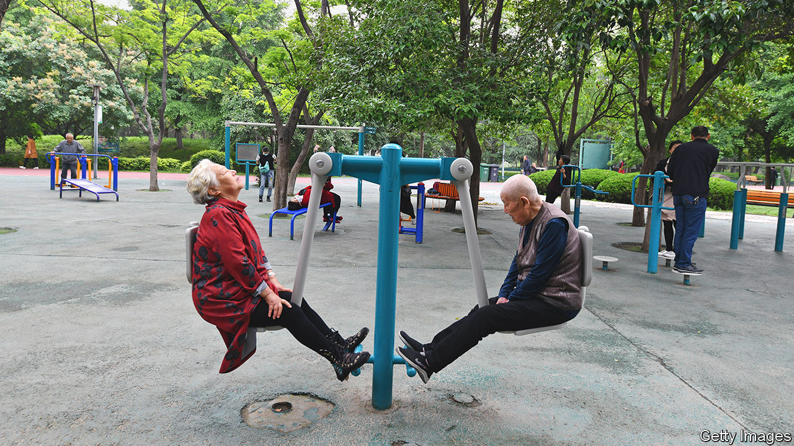

###### Love elderly

# The novel ways old people try to find love in China 

##### Some join a matchmaking live-stream watched by half a million people 

 

> Apr 27th 2023 

The man, who must be in his 70s, says he has money, even a pension and a house. The similarly-aged woman looks unimpressed. Across a phone connection they are sizing each other up. But the host senses a lack of interest and, with the tap of a button, the connection is cut. 

This is a typical scene from the popular live-streams featuring old people looking for love. The set-up is generally the same: elderly singles can flick through different “rooms” on their phones, checking out other prospects. If one catches their eye, they can request to join the room. A host plays the role of doorman, matchmaker and bouncer. When two people hit it off, contact details are exchanged and the host receives a fee. The spectacle draws a crowd. One host has upwards of 500,000 followers.

Live-streams are one of many new ways old people are trying to find love. Data from Baidu, an online-search giant, suggests that more than half of the 100m registered users of Pair, a dating app, are 50 or older. Another app, called Middle-Aged and Elderly Life, was launched in 2019 and has grown in popularity. That same year the founder of Baihe, China’s largest dating service, left the company to start Leisure Island, a social network for the elderly that has dating features.

Demand for such products is being driven by an increase in the elderly population. Nearly 210m Chinese people are 65 or over, up from around 160m five years ago. The average life expectancy in China is up, too, rising from just under 73 in 2005 to almost 78 today. There isn’t much recent data on how many of the country’s oldies are single. But a survey published in 2015 by the China Research Centre on Ageing showed that over a quarter of people 60 and over were either single, separated or widowed. According to a survey from 2014 by Renmin University, nearly 10% of old people live alone. Traditional attitudes towards old people remarrying and potential opposition from children do not help. 

The live-streams have evolved from dating shows, which are still quite popular and provide insight into the pragmatic approach taken by old singles. On “Not Too Late After All”, one such show, contestants ask pointed questions of potential partners, such as whether they have a pension, a house or any children. Some want to know more about a match’s health or previous relationships. In a clip that went viral, a 78-year-old man said he was looking for a servant.

“Not Too Late After All” receives, on average, 80 applications a day, according to a producer. For those who do not make the cut or are not as tech savvy as Deng, there are still other ways to find a mate. Some urban green spaces are known for their matchmaking corners, where parents try to set up their children and old people put up posters introducing themselves. But finding love in old age is no walk in the park.■


