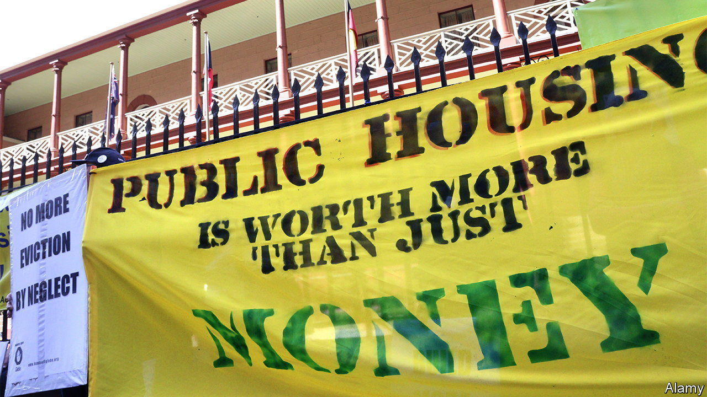

###### Finance and society

# Asset managers control a growing share of society’s essentials 

##### “Our Lives in Their Portfolio” is a lively account of the trend, but a muddled critique of its costs 

 

> Apr 27th 2023 

By Brett Christophers. 

Which bits of a country should the state control, and which can be privatised? In the last decades of the 20th century, the answer to one of the thorniest questions in political economy shifted decisively. Starting in Britain and America, in the 1980s governments sold off some $185bn-worth of assets (roughly equivalent to Australia’s GDP in 1985). The Soviet Union’s fall, and the transformation of eastern Europe from a communist bloc into a series of market economies, supercharged the trend. In big swathes of the world not only state-owned companies but housing, railways, sewage pipes, power grids and much else became .

Now, argues Brett Christophers of Uppsala University in Sweden, the building blocks of everyday life are changing hands again. Assets such as  and  are being bought not just by private operators, but by asset managers—financiers who invest the money of pension schemes, insurance firms, university endowments, sovereign-wealth funds and the rich. As a result, growing numbers of people live in what Professor Christophers terms an “asset-manager society”, in which “asset managers increasingly own and control our most essential physical systems and frameworks.”

As the title of his new book, “Our Lives in Their Portfolios”, suggests, Professor Christophers finds this deeply troubling. Professional money managers, he says, are “relentless in squeezing maximum profits” from their assets. They cut costs, skimp on investment and raise rents wherever they can get away with it—and are now doing so for services like housing and water that people cannot do without. They promise long-term stewardship when buying vital infrastructure, then sell with “unseemly haste” to reap quick profits. 

And their influence is largely invisible, Professor Christophers writes, due to lax disclosure requirements, which makes analysis too much like “detective work”. Ultimately, despite the “terrific and tenacious” front men who convince governments to trust them with society’s essentials, asset managers’ “product is snake-oil, and their utopia a pure moonshine”.

The book’s argument is lively and studded with anecdotes. But it is undone by its flaws and inconsistencies. Investment firms’ increasing fondness for such assets is indeed striking. So far, though, they own a minuscule proportion of them. Professor Christophers estimates that, globally, around $1trn-worth of housing and $3trn-worth of infrastructure are in asset managers’ hands. These numbers sound big. But Savills, an estate agent, reckons that in 2020 the total value of global residential property stood at some $260trn. To talk of an “asset-manager society” is a stretch.

Given the author’s aversion to asset managers owning social infrastructure, his account of the costs of the phenomenon is surprisingly limp. Accusing such investors of “profit-maximising” is a “vanilla critique”, he concedes, as the pursuit of profit is hardly unique to them. But elsewhere in the book, their “relentless” cost-cutting and rent-hiking are key planks of his case. Concessions extracted from governments to “de-risk” investment in needed infrastructure, at huge expense to the taxpayer, are presented as a decisive argument against such private investors. In reality these are examples of poor negotiation by governments, a weakness that can also nobble their use of public money.

The irony is that asset managers such as Blackstone,  and Macquarie—the three villains of the author’s story—have indeed reshaped the world of investment. Over the past decade their stellar returns from private assets, as opposed to stocks and bonds, have led big institutional investors to entrust them with ever more cash. Pension schemes and university endowments depend on them sustaining a winning streak that probably won’t last. That is a serious risk. A takeover of society by shadowy money men is not. ■


