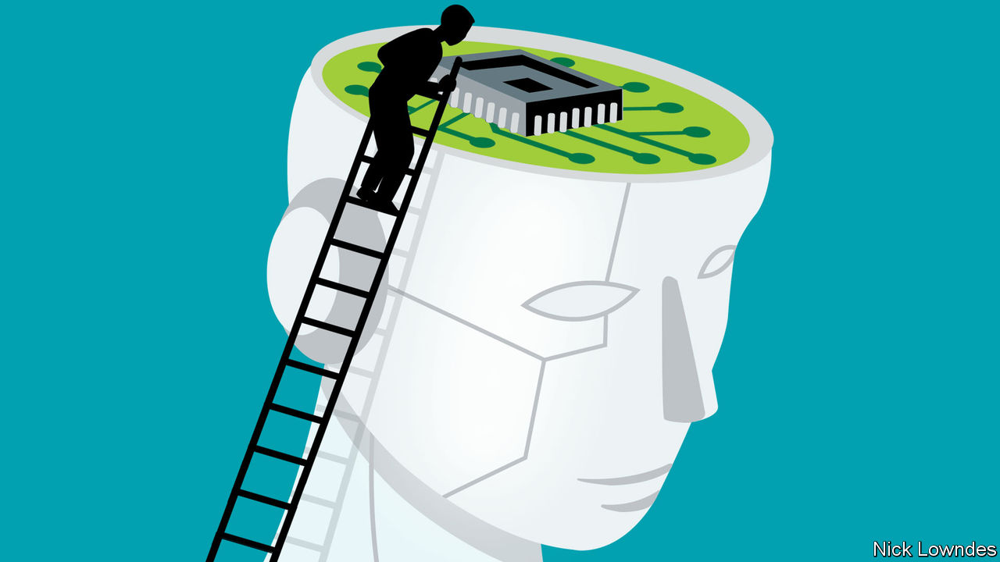

###### Johnson

# ChatGPT raises questions about how humans acquire language 

##### It has reignited a debate over the ideas of Noam Chomsky, the world’s most famous linguist 

 

> Apr 26th 2023 

WHEN DEEP BLUE, a chess computer, defeated Garry Kasparov, a world champion, in 1997 many gasped in fear of machines triumphing over mankind. In the intervening years, artificial intelligence has done some astonishing things, but none has managed to capture the public imagination in quite the same way. Now, though, the astonishment of the Deep Blue moment is back, because computers are employing something that humans consider their defining ability: language.

Or are they? Certainly, (LLMs), of which the most famous is ChatGPT, produce what looks like impeccable human writing. But a debate has ensued about what the machines are actually doing internally, what it is that humans, in turn, do when they speak—and, inside the academy, about the theories of the world’s , Noam Chomsky.

Although Professor Chomsky’s ideas have changed considerably since he rose to prominence in the 1950s, several elements have remained fairly constant. He and his followers argue that human language is different in kind (not just degree of expressiveness) from all other kinds of communication. All human languages are more similar to each other than they are to, say, whale song or computer code. Professor Chomsky has frequently said a Martian visitor would conclude that all humans speak the same language, with surface variation.

Perhaps most notably, Chomskyan theories hold that children learn their native languages with astonishing speed and ease despite “the poverty of the stimulus”: the sloppy and occasional language they hear in childhood. The only explanation for this can be that some kind of predisposition for language is built into the human brain.

Chomskyan ideas have dominated the linguistic field of syntax since their birth. But many linguists are strident anti-Chomskyans. And some are now seizing on the capacities of LLMs to attack Chomskyan theories anew.

Grammar has a hierarchical, nested structure involving units within other units. Words form phrases, which form clauses, which form sentences and so on. Chomskyan theory posits a mental operation, “Merge”, which glues smaller units together to form larger ones that can then be operated on further (and so on). In a recent op-ed, the man himself (now 94) and two co-authors said “we know” that computers do not think or use language as humans do, referring implicitly to this kind of cognition. LLMs, in effect, merely predict the next word in a string of words.

Yet it is hard, for several reasons, to fathom what LLMs “think”. Details of the programming and  of commercial ones like ChatGPT are proprietary. And not even the programmers know exactly what is going on inside. 

Linguists have, however, found clever ways to test LLMs’ underlying knowledge, in effect tricking them with probing tests. And indeed, LLMs seem to learn nested, hierarchical grammatical structures, even though they are exposed to only linear input, ie, strings of text. They can handle novel words and grasp parts of speech. Tell ChatGPT that “dax” is a verb meaning to eat a slice of pizza by folding it, and the system deploys it easily: “After a long day at work, I like to relax and dax on a slice of pizza while watching my favourite TV show.” (The imitative element can be seen in “dax ”, which ChatGPT probably patterned on the likes of “chew on” or “munch on”.)

What about the “poverty of the stimulus”? After all,  (the LLM underlying ChatGPT until the recent release of GPT-4) is estimated to be trained on about 1,000 times the data a human ten-year-old is exposed to. That leaves open the possibility that children have an inborn tendency to grammar, making them far more proficient than any LLM. In a forthcoming paper in , researchers claim to have trained an LLM on no more text than a human child is exposed to, finding that it can use even rare bits of grammar. But other researchers have tried to train an LLM on a database of only child-directed language (that is, of transcripts of carers speaking to children). Here LLMs fare far worse. Perhaps the brain really is built for language, as Professor Chomsky says.

It is difficult to judge. Both sides of the argument are marshalling LLMs to make their case. The eponymous founder of his school of linguistics has offered only a brusque riposte. For his theories to survive , his camp will have to put up a stronger defence. ■


