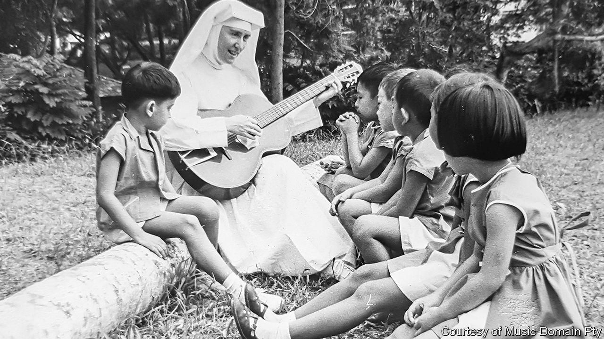

###### Home Entertainment

# Psychedelic music by an Australian nun is an uncanny pleasure 

##### First recorded 50 years ago, Sister Irene O’Connor’s album has now been reissued 

 

> Apr 27th 2023 

It starts with an incantatory, haunting voice: “Fire, fire, burning, warming cold hearts…” The words are distant and echoing, as if they are coming from inside a dark cave or a cathedral. The vocalist is soon joined by a gently pulsing rhythm. The song, called “Fire”, is an enchanting piece of music. It sounds vaguely like some electronic pop that was made in the 1980s, yet it is actually the work of Sister Irene O’Connor, an Australian nun.

You may have heard “Fire”, or at least a fragment of it, before. Last year it featured in “”, a hit television series, providing the soundtrack to a scene in which the show’s psychopathic anti-hero, Villanelle, is baptised. James Blake, a British pop star, sampled the song on “Where’s The Catch?”, a track of 2019. “Fire” has been remixed in a  style by an artist in Brazil; a Swedish metal band used to play it at the start of their concerts. In February the album on which it originally appeared, “Fire of God’s Love”, was released digitally for the first time, half a century after it came out on vinyl. 

Sister Irene’s involvement in the recording industry dates back to the 1960s. She was teaching in Singapore at a kindergarten for children with learning difficulties when, one day, she picked up a guitar and sang to the youngsters. They loved her performance, and word got around about the musical nun. She recorded several albums.

It was in Singapore that Sister Irene befriended Sister Marimil Lobregat, a fellow teacher and music enthusiast. Years later the two nuns both moved to Sydney and entered the same Franciscan convent. Sister Marimil became a collaborator on “Fire of God’s Love”, handling the production and lending the music its eerie, psychedelic-folk mood. Sister Irene wrote the songs, sang the vocals and played all the instruments. 

The album was first released by Philips Records, a Dutch conglomerate, in 1973. Though it didn’t sell in big quantities at the time, in the decades since it has earned a cult following. In 2008 Darren Seltmann of the Avalanches, an electronic-music group, named “Fire of God’s Love” one of the best Australian albums of all time. The LP has long been a holy grail for discerning crate-diggers, who pay high prices for original  copies.

Sister Irene recently celebrated her 90th birthday. She now lives in an old-people’s home in Sydney; some proceeds from the reissue will go towards paying for her care. For now it is only available digitally, through Sister Irene’s website—vinyl collectors will have to wait a little longer for the 21st-century edition. Listen to the music closely, and it becomes clear that, for all its impressive sonic ingenuity, at the heart of the album is a sincere religious devotion. As “Fire” comes to a close, Sister Irene sings: “We’ll pass from death to life one day to share/God’s endless life of love beyond compare.” 

Speaking to from a sunlit park bench, Sister Irene was surprised and happy that her distinctive music was being appreciated anew. The flame of her startling creativity burns on. ■


