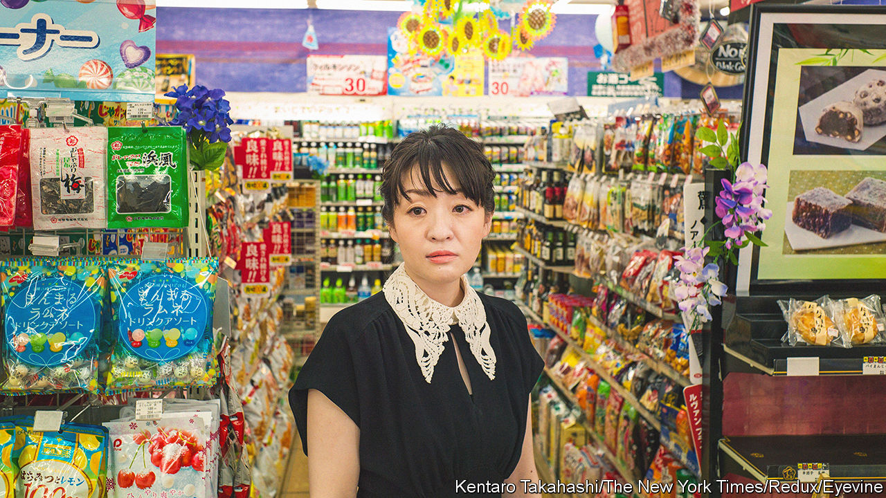

###### Fiction from Japan

# Readers in the West are embracing Japan’s bold women authors 

##### Writers such as Murata Sayaka and Oyamada Hiroko have drawn fresh attention to Japanese literature 

 

> Apr 27th 2023 

MURATA SAYAKA has long kept company with imaginary friends. She first conjured them up as a child, while enduring bullying at school and hectoring at home. Her parents forced her to practise cooking and encouraged “girlie” behaviour, thinking that would one day help attract a rich husband. “I didn’t feel like my body, my life, belonged to me,” Ms Murata (pictured) says. She dreamed of flying away, on a spaceship with her fantastical companions, to a planet where she would belong.

Throughout , Ms Murata questions what it means to be “normal” and writes sceptically about family life. Her work has struck a chord in Japan, her conservative home country. Her semi-autobiographical novel, “Convenience Store Woman”, won the prestigious Akutagawa literary prize in 2016. It has since been translated into more than 30 languages and sold over 1.5m copies. 

Ms Murata’s work has helped usher in a new era of Japanese literature in translation. “Convenience Store Woman” came out in English in 2018 and its feminist undertones may have resonated amid the #MeToo movement, thinks Ginny Tapley Takemori, its translator. In 2020 “Breasts and Eggs”, a novel about pregnancy and beauty standards by , another female Japanese author, also became an international bestseller. “Publishers used to ask for the next Haruki Murakami,” says David Boyd, a translator who has worked on Ms Kawakami’s books. “Now they ask: What’s going to be the next ‘Convenience Store Woman’?” 

Though the settings may be unfamiliar to Western readers, these books examine universal themes, such as the . In “Weasels in the Attic” (2022), a novella made up of interlinking stories, Oyamada Hiroko portrays an unhappily married couple who seek fulfilment by having a baby. “In Japan, it seems as if women are seen as incomplete unless they have a child,” says Ms Oyamada. Her short story “Spider Lilies” explores the related obsession with breastfeeding. “When I had a baby, I felt like my breasts were a public asset,” the author says. “Strangers kept asking me: ‘Is the milk coming?’”

Ms Murata’s view of motherhood is even more caustic. The women in her fiction are often “monstrous”. In “Nothingness”, a short story, the female protagonist is incapable of maternal affection. Ms Murata once hoped her own mother would shower her with unconditional love. She now says the mother-daughter relationship usually involves “beautified abuse”.

Today’s literary stars belong to a long lineage of . In the 1970s, amid anti-war and anti-capitalist feminist movements, the child-killing mother became a popular trope in fiction by Japanese women, says Iida Yuko of Nagoya University. Novelists including Oba Minako and Kono Taeko used disturbing imagery to rebel against a view of women as baby-making machines. Bookish types hope the new overseas interest in Japanese writers will extend to this period, too.

Yet the likes of Ms Murata are breaking new ground in their bold depictions of sexuality. “Growing up and dating men, I never thought women could be sexual agents,” she says, noting that Japanese popular culture idealises subservient women. Her characters are aroused by things such as stuffed toys and curtains: whereas heterosexual love often turns into a “manual”, intimacy with objects is more “creative”, she writes in “Vanishing World”, a sci-fi tale of a world where people breed through artificial insemination. “There’s always a hierarchy between man and woman,” echoes Ms Oyamada. In “Lost in the Zoo”, a short story, she likens unhappy families to caged animals, trapped by convention. A lesbian couple, by contrast, exude an air of liberty. 

These books may be by and about women, but a man’s perspective can be useful, Ms Oyamada suggests. “When I depict men’s behaviour through the eyes of a woman, many people see it as an attack,” she says. “I can avoid that by speaking as a man.” She stages chauvinistic discussions between male characters in “Weasels in the Attic”, demonstrating their obliviousness to the demands of child-rearing. “Most men aren’t even aware of the pain they inflict on women,” she says. “It’s good that such pain is becoming more visible.” ■


