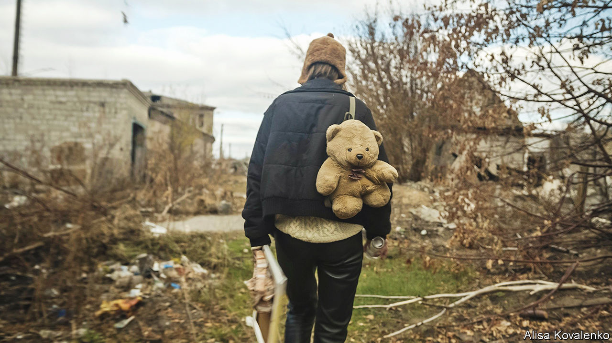

###### Film on the front line

# Ukrainian film-makers are capturing the realities of war 

##### But, for many, it is too soon to fictionalise its horrors 

 

> Apr 24th 2023 


When Russia  on February 24th last year, Alisa Kovalenko was on an overnight train from Kyiv, heading east. She was on her way to film footage of teenagers in a village in Donbas, on the front line of the conflict that had rumbled there since 2014. She soon realised that her mission was impossible. 

“What can you do with your camera,” Ms Kovalenko asks, “when there are bombs falling on your head?” She helped several of the figures in the documentary she was making, “We Will Not Fade Away” (see picture), reach safety; it had its premiere at the Berlin International Film Festival this February Then she said goodbye to her French husband and young son and joined a volunteer unit, fighting first near the capital, then, last April and May, near Kharkiv, when Ukrainian troops pushed Russian forces back towards the border. 

Ms Kovalenko is part of a new generation of Ukrainian film-makers who came of age during the  of 2013-14 and have increasingly won audiences and prizes abroad. Documentarians developed a personal and domestic style. For instance, “The Earth Is Blue as an Orange”, which won many awards in 2020-21, depicted a family in a war zone filming a documentary about themselves. Feature films blossomed, too. Set in a boarding school for deaf teenagers, “The Tribe” won several prizes at Cannes in 2014. “Falling” (2017) was a sparse, dislocated love story exploring themes of violence, corruption and identity.  was a dystopian fantasy set in a post-war Donbas.

As Daria Badior, a critic and co-curator of a film festival in Kyiv, puts it, the first response of Ukrainian film-makers to political upheaval was “to make something that reflected their lives”. Beneath these intimate stories, the conflict in Donbas shuddered through Ukrainian films of the past decade. Yet for many film-makers, as for Ms Kovalenko, last year’s all-out Russian onslaught seemed to render their craft almost irrelevant. 

“I had a very strong feeling that cinema didn’t matter any more,” says Marina Stepanska, director of “Falling”. “I considered quitting.” In the weeks after the invasion, film-making ceased. Government funding dried up. “Many film-makers went into the army,” says Ms Badior, “along with actors, screenwriters, cinematographers and sound engineers.” Some were wounded; others, such as Viktor Onysko, a friend of hers and a talented editor, have perished. 

After the initial shock, directors turned to documentaries to capture the reality of war. Ms Stepanska is making one that follows several people in the film community who have joined the war effort, observers turned participants. She hopes to avoid clichéd images of conflict and instead “to build a story of daily experiences”: the boredom and solitude of a foxhole;  recurring conversations about fear and death. “These ordinary things interest me more than ruins and action.”

For her part, Ms Kovalenko found herself filming a kind of video diary at the front: “I wanted to save some memories for my son, in case I died.” She filmed simple things, “trees and grass and the trenches, routine life.” War, she says, is “not only about action and bombing; it is also about waiting and looking at the same lines of horizons for hours and hours.” Ms Stepanska persuaded her to turn this footage into another film. Having left her unit, Ms Kovalenko plans to overlay a narration drawing on letters she wrote to her son to read when he was older. The text is “experimental and poetic”, she says. “On the front line you’re in an extreme situation, and you have lots of reflections about your life.” 

As for feature films, the obstacles are now ethical rather than creative or practical. Foreign cultural institutions and production firms have set up funds to support Ukrainian film-makers. Directors are already scouting for re-enactments of  committed by Russian troops in Bucha last year. For many others, though, it is too soon to turn the ghastly facts of the war into fiction. “I think we need more time,” says Ms Kovalenko.

Camera, action

“For me personally, it’s a dilemma,” says Denis Ivanov, a prominent producer. “You can’t be silent about what has happened,” he says, “but I don’t think it seems right to make these films now.” They risk coming across as “war porn”. He is developing a script for a feature film about the siege of the  in Mariupol, in collaboration with Oleh Sentsov—a well-known director from Crimea who spent more than five years in prison in Russia and is now serving on the front line. But they have decided not to discuss it publicly, and won’t release it before the war ends. 

“Rhino”, Ms Sentsov’s movie about the rise of a Ukrainian gangster in the 1990s, was released in February 2022. “We joke that the Russian invasion killed our second box-office weekend,” says Mr Ivanov, who produced it. Now, despite the ongoing bombardment, Ukrainian cinemas are open. “Avatar 2” has been popular, as have Ukrainian films made shortly before the war, among them “Klondike”, a family drama set against the shooting down of  over Ukraine in 2014, and “Mavka. The Forest Song” an animated fairy-tale. Almost all Ukraine’s regular film festivals are persevering, notes Ms Badior, if with some relocations and delays. An impresario even put on a festival of old Ukrainian war films in a bomb shelter in Mykolaiv.

Kyiv Critics’ Week, the festival that Ms Badior runs, opened in October, just as Russia launched strikes against Ukraine’s electrical infrastructure. Her team bought extra generators; screenings were packed. “It was very reassuring,” she says, “that after all the tragedy and the heartbreak, the deaths and the funerals, you can still come to the cinema and watch a film, like it or dislike it, discuss it afterwards…It was a beautiful thing.” ■


