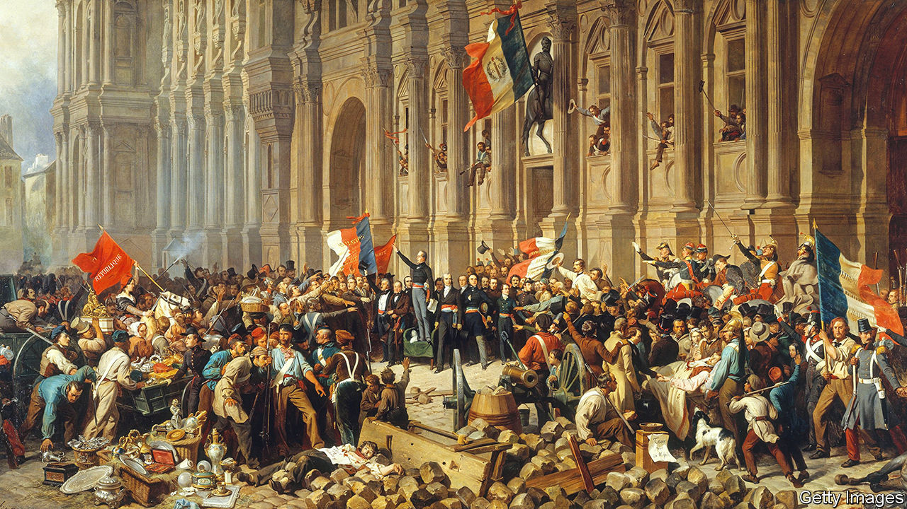

###### European history

# “Revolutionary Spring” brings to life the drama and daring of 1848 

##### Christopher Clark thinks the sacrifices of revolutionaries across Europe were not wholly in vain 

 

> Apr 27th 2023 

By Christopher Clark. 

At the outset of this magnificent chronicle of the events leading up to and beyond 1848—the year revolutions spread to almost every country in Europe—Christopher Clark confesses that when he first learnt about them at school, he was not enthused. Thanks to squabbling within the loose-knit coalitions of revolutionaries, and the delayed but brutally effective response of the reactionary establishment, the story of the upheavals lacked “a moment of redemptive closure”. Picturing what happened clearly is hard, both because of the continental scale of the turmoil and because the discontents that triggered the revolutions varied. “Complexity and failure are an unattractive combination,” Professor Clark, a historian at Cambridge, wryly admits.

He tackles the complexity by giving sufficient space to the often thrilling stories of every uprising, and by basing his tale on a compelling cast of idealists, thinkers, propagandists, cynics, adventurers, opportunists and (often doomed) heroes. As for failure, Professor Clark is adamant that in many countries the revolutions were the precursor of “swift and lasting constitutional change”. The tumult, he writes, was “the particle-collision chamber at the centre of the European 19th century. People, groups and ideas flew into it, crashed together, fused or fragmented.”

The movements and ideas tested in this chamber included , democratic radicalism, , nationalism, conservative monarchism and even corporatism. After 1848 Europe rapidly became a very different place. Even conservative regimes (such as Prussia’s) or authoritarian ones (such as Napoleon III’s in France) embraced technological and administrative methods to improve living standards for workers and the bourgeoisie.

One of the challenges of 1848 is identifying what caused the conflagration that leapt from city to city in February and March. Professor Clark opens with a harrowing chapter on the immiseration of the poor over the previous decade or so. Rising populations and a devastating potato blight drove hungry peasants into towns, where itinerant labourers and their families lived in squalor. Children were put to work in dangerous factories. Artisans who had been relatively comfortable, such as weavers, found their wages driven down by trade and industrialisation.

Writers and analysts documented and publicised this “social question”, among them Ange Guépin and Eugène Bonamy, two French doctors; Bettina von Arnim, a German author and activist; and. Penury was not, in the end, the spark that ignited the revolution. But it provided the fuel, in the form of a desperate urban working class.

The first revolt, in Palermo, Sicily, was inspired by the island’s history of “romantic nationalism”. But it was Paris which, as ever, inspired revolutionary fervour across Europe. And in Paris it was the banning on February 14th by the prime minister, François Guizot, of a large banquet on the 22nd—organised by republicans and liberal reformers—that brought the previously moderate opposition out onto the streets. A ruse to get around a prohibition on public assemblies, the banquets were a forum for demands to extend the franchise.

As the riots spread, the inevitable happened. A shot was fired; soldiers defending the Ministry of Foreign Affairs from a surging crowd panicked and killed 52 people. Events then moved with astonishing speed. It was, writes Professor Clark, “a  moment”. Hundreds of barricades went up. Soldiers of the National Guard refused to shoot, embracing their fellow citizens instead. On February 23rd Guizot and his ministry resigned. Louis-Philippe, the king, abdicated. On the 25th the poet-politician Alphonse de Lamartine announced the forming of a provisional government and the founding of the Second Republic.

In nearly all Europe’s capitals, the author observes, authorities had prepared for the wrong sort of revolution—a tightly organised uprising of the kind that had broken out before. “What happened was something more inchoate,” he says; “something anchored not in seditious conspiracy, but in the waning of respect and trust and in the emergence, unexpectedly, of a cause—the right to assemble—capable of bringing together heterogeneous disaffected elements, at least temporarily.” Within weeks the arch-conservative chancellor of Austria, Prince Klemens von Metternich, had fled from Vienna. King Frederick William of Prussia had pulled his army off the streets of Berlin after hundreds of demonstrators were killed. The kings of Piedmont-Sardinia, Denmark and Naples had all issued constitutions.

But “temporarily” was the key word. The alliances of radicals, liberals, workers and students were fractious. The liberals feared excessive upheaval but wanted to extend the franchise, freedom of assembly, the end of press censorship, equality under the law and a modest amelioration of the plight of the poor. Radical democrats and workers, on the other hand, were ready to tear down the pillars of an irredeemably unjust society.

As the revolutionaries divided, the forces of conservatism recovered their self-confidence—and with it a willingness to use both unrestrained military might and executions on a draconian scale. Following further upheavals and the spilling of much blood, the revolutions were essentially over by late 1849. The short-lived Roman Republic was crushed by French troops. The Hungarian Revolutionary Army was destroyed by forces loyal to the  Empire and a 300,000-strong Russian army of occupation.

“Towers prevailed over squares,” Professor Clark concludes. “Hierarchies beat networks. Power prevailed over ideas and arguments.” The lament of the poet Robert Browning of a few years earlier—“Never glad confident morning again!”—seemed to apply to the revolutionaries. Yet as this scintillating book shows, their sacrifices were not wholly in vain. ■


