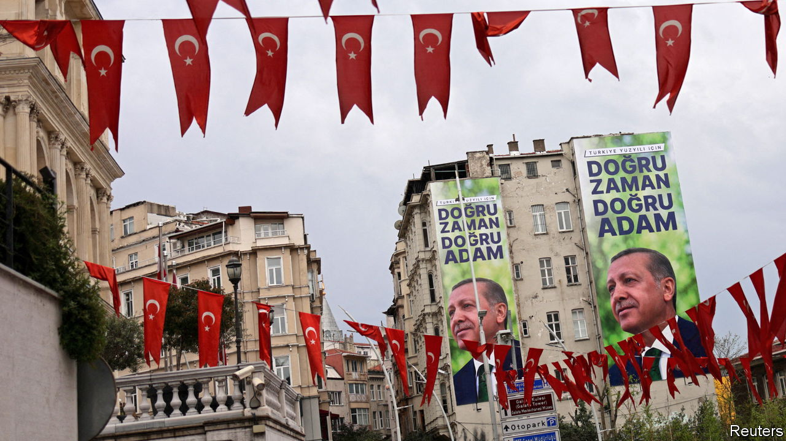

###### No sharp tacks

# A post-Erdogan Turkey would only partly change its foreign policy 

##### On Russia, Syria and the Kurds, the country’s interests would remain much the same 

 

> Apr 27th 2023 

Recep Tayyip Erdogan’s magic is not working. With less than three weeks until the elections, Turkey’s populist leader has made up little ground against Kemal Kilicdaroglu, the candidate of the main opposition alliance, in the presidential race. (Parliament will also be up for grabs.) Most polls give Mr Kilicdaroglu an edge in the first round on May 14th and see him winning a run-off two weeks later. Mr Erdogan is trying to regain popularity by dipping into the public purse. But he is also looking for help abroad, balancing, as he has done over the past decade, between NATO allies, Russia and other autocracies, all while flexing his muscles at home. 

In the past couple of months, his government has waved through Finland’s accession to NATO, which it had been blocking since last summer; banned companies from shipping sanctioned goods through Turkey to Russia; and courted Western investors whom it once spurned. But Mr Erdogan has also assured his supporters that Turkey no longer cares what Western countries think of its foreign policy, and accused the West of backing his rivals. “Their hostile stance toward Erdogan is a hostile stance toward my nation,” he said on April 13th. “My nation will foil this plot.”

Turkey’s relations with the EU and America are arguably at their worst in decades. Flashpoints include the country’s purchase of an S-400 air defence system from Russia, armed offensives against American-backed Kurdish insurgents in Syria, accusations of American support for a coup against Mr Erdogan in 2016 and spats over maritime borders with Cyprus and Greece. Tensions would certainly subside under an opposition government. But analysts, diplomats and opposition figures dismiss the idea that Mr Erdogan’s ouster would mean a foreign-policy overhaul.

A new Turkish government committed to fixing the economy, releasing some political prisoners and dismantling Mr Erdogan’s autocracy would enjoy plenty of goodwill in the West. This could pay immediate dividends, such as reviving long-stalled talks on upgrading Turkey’s customs union with the EU. A change in tone from Mr Erdogan’s “Ankara First” approach would also go down well with NATO allies. The opposition promises a foreign policy run by seasoned diplomats, and suggests it would drop Mr Erdogan’s objection to letting Sweden into NATO.

But with regard to Turkey’s relations with Russia, its attitude to Kurdish insurgents in Syria, and other sources of friction, big changes are unlikely. A Kilicdaroglu government would be unlikely to join sanctions against Russia or play a more active role in Ukraine, preferring to position itself as a mediator. There is a sense in Turkey, shared by the ruling AK party and the opposition, that America will not remain in the region forever, says Nigar Goksel of the Crisis Group, a think-tank. That weakens the appetite for confrontation with Russia. “They do not want to stick out their necks,” says Ms Goksel, because that would “risk having to face Russia alone”. 

One irritant might go away: the S-400 air-defence system that Mr Erdogan procured from Russia, triggering American sanctions. Sending the system to another country (perhaps Ukraine, as some American officials have reportedly suggested) is not on the table. But a new government could put it in storage and throw away the key, say opposition politicians. It could also reject a proposal, favoured by Mr Erdogan, for Russia to build Turkey a second nuclear plant besides one that is already under construction.

A new government may have to rely on the country’s main Kurdish party in parliament. But it would be in no hurry to make peace with Kurdish insurgents in northern Syria or to withdraw troops from the region. It would probably stop removing elected Kurdish mayors from power, as Mr Erdogan has done since 2017, and allow the release of imprisoned Kurdish politicians such as Selahattin Demirtas, a former presidential contender. But it would continue to battle the Kurdistan Workers’ Party (PKK), an armed Kurdish group in Turkey, and its Syrian franchise the YPG, says Oytun Orhan, an analyst. Mr Kilicdaroglu and company would seek to restore relations with Bashar al-Assad, something Mr Erdogan, who backed the Syrian dictator’s overthrow for the past decade, has also begun to explore. But that alone would not turn Turkey’s Syria policy on its head.

The swathes of land Turkey wrested from the YPG in armed offensives in Syria are important bargaining chips with Mr Assad’s regime. A new government would not give them up easily, says Mr Orhan. Like Mr Erdogan, the opposition plans to lean on Mr Assad to take back many of the 3.6m Syrian refugees now in Turkey and to police Kurdish insurgents. “Once we have that kind of an understanding, there may be a time we can consider withdrawing troops from Syria,” says a senior opposition lawmaker. “But this will not happen overnight.” For the West, a government headed by Mr Kilicdaroglu would be a much easier partner to deal with. But well-wishers in Brussels or Washington should curb their enthusiasm.■

