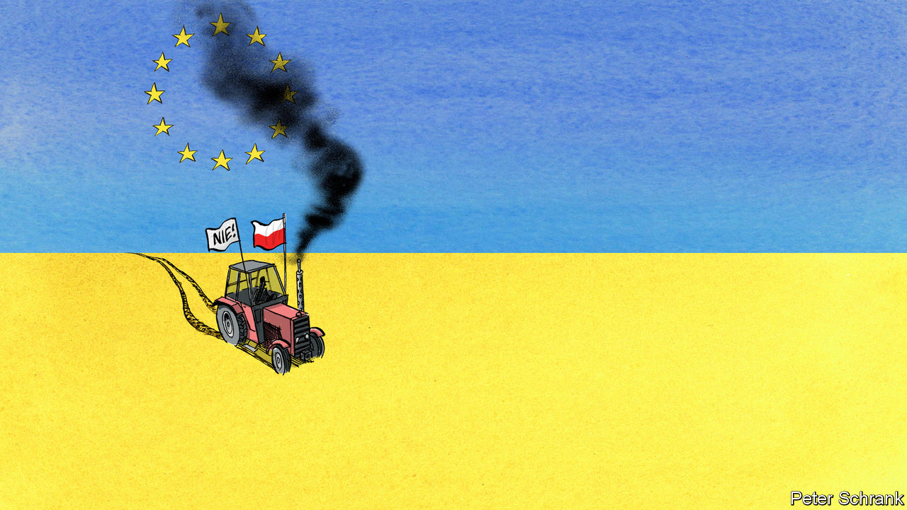

###### Charlemagne

# A spat over farming bodes ill for Ukraine’s future European prospects 

##### Have the limits of the EU’s support for its neighbour been reached? 

 

> Apr 27th 2023 


If the phrase wasn’t already taken, Ukraine and the EU could be said to enjoy a “no-limits friendship”. The bloc’s 27 countries, four of which border Ukraine, have provided money and weapons to their neighbour, taken in its refugees and trained its troops. Ukrainian flags in Brussels dangle from balconies and official buildings. To bolster morale while fighting endures, and help reconstruction once it ends, the club has raised the prospect of Ukraine soon joining its ranks. In many ways it already has. President Volodymyr Zelensky now routinely addresses summits of EU leaders, including once in person. More tangibly, after Russia launched its full-scale invasion last year Ukraine was given tariff-free access to the club’s single market, beyond trade deals already in place. 

But it seems the friendship may have limits after all. European politicians have found a constituency even dearer to them than Ukrainians: their own farmers. On April 15th Poland announced it was shutting off imports of most types of Ukrainian foods; many in central Europe all but followed suit, despite protests from Kyiv. The move undoes much of the trade largesse extended to the EU’s embattled neighbour last spring. Given that agricultural produce makes up two-fifths of Ukraine’s total goods exports—there is a reason half the national flag depicts a golden wheat field—the shortfall will be keenly felt by an economy at war. Worse, being thrown under the tractor by the likes of Poland will raise questions over Ukraine’s prospects as it seeks one day to join the EU.

Poland and its neighbours claim they still stand shoulder-to-shoulder with Ukraine—but that they are bearing a disproportionate burden for its plight. Scrapping tariffs for Ukrainian grub was meant to facilitate its export to poor countries beyond Europe, in particular after seaborne routes used to ship cheap Ukrainian wheat were originally throttled by Russia. In fact much of that grain has ended up stuck in transit. In central Europe silos full of Ukrainian harvest mean lower prices for local farmers, who have both political heft and access to manure to help make their point at protests. Poland has elections coming up this autumn; the ruling Law and Justice party needs rural votes to stay in power. 

The extent of the strain in Euro-Ukrainian solidarity is still unclear. A few days after the original blockade was imposed, a deal was struck that allowed produce to cross into Poland as long as it was merely transiting there (the plan involves sealed containers and guards). The European Commission in Brussels has tried to defuse the situation by offering money to compensate affected farmers, and finding ways to expedite Ukrainian exports away from markets apparently reserved for local growers. But Europe is in effect rowing back from the untrammelled Ukrainian access to its own consumers, never mind its original promise. An extension of the tariff-free deal for another year, starting in June, was once taken as given. Now it may be laden with caveats.

The prospect of no longer being able to sell staples to its immediate neighbours is bad for Ukraine. Worse still, the other export avenue—a UN-backed scheme to allow ships to transit through the Black Sea—depends on Russian acquiescence which may no longer be forthcoming from next month. Most worrying of all is the mood shift the spat has revealed. Ukraine still enjoys broad support in just about every part of the EU. But it is no longer unconditional and across all areas, as was once the case. A senior EU official familiar with the thinking in national capitals speaks of “à la carte” backing for Ukraine going forward, not the all-you-can-eat succour of 2022. 

Weapons and money will continue to flow, refugees will still be hosted, and more sanctions against Russia are being mulled. Less clear are Ukraine’s prospects for closer ties with the EU—including, one day, accession. The countries that blockaded Ukrainian grain have been among Kyiv’s most strident allies, notably Poland. Ukraine’s bid to join the club largely depends on the continued support of central Europe, to overcome the muted scepticism of “old” Europeans in France and the Netherlands, among others. 

The central Europeans’ pitch has been an emotional one: Ukrainians are fighting for the entire continent’s freedom, and so should not have to go through the years-long box-ticking exercise that applicants to the EU usually endure. Western Europeans have made the point that Ukrainian accession will come at a cost. Much of the EU’s budget is spent on farm subsidies or structural funds that go largely to poorer countries. If it were to join, Ukraine would have a fifth of all the farmland in the EU. Its population of over 40m had less than one-third the incomes of their EU neighbours (before the war). Bringing Ukraine’s farms in will mean less money for current recipients. Currently 18 out of the club’s 27 countries get more cash from Brussels than they pay in, including all of central Europe. The figure could drop to just four or five once Ukraine joins, according to estimates doing the rounds in EU circles. 

Reaping what you sow

Poland and its neighbours used to pooh-pooh these sorts of pragmatic concerns: how could support for an ally at war be subjected to such tight-fistedness? The farm spat shows there are limits to how much even central Europeans will give up to support Ukraine. Western Europeans, repeatedly browbeaten by the likes of Poland for insufficiently aiding Kyiv with arms and money, feel like the penny has dropped. The moral authority that has given central Europe a larger say in EU affairs (though not as much as was sometimes made out) has receded.

Ukraine is still widely expected to reach the next step of rapprochement to the EU: starting formal accession talks to join the bloc. The commission will present a report on its progress next month, and another by year-end. Not long ago everyone expected the sense of momentum to continue through the talks, which may take years. But now a large Polish tractor stands between Ukraine and its dreams of EU accession.■


