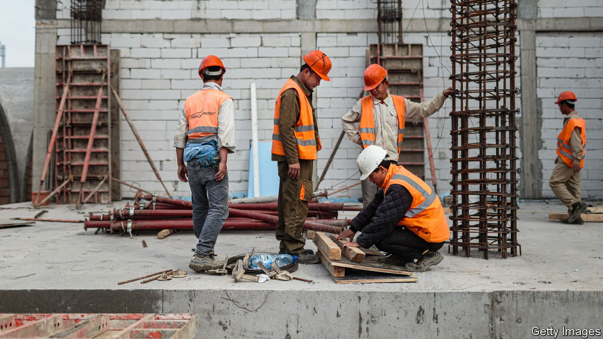
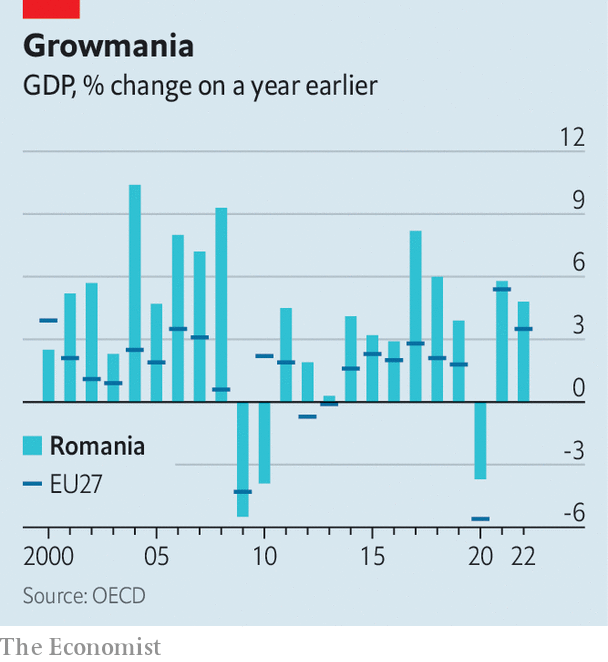

###### Pulling them in

# Romania’s hot economy is attracting foreign workers 

##### Changing from a country of emigrants to one of immigrants 

 

> Apr 27th 2023 

A generation ago Romanians queued for food. Today in Bucharest the queues are back, but those standing in them are not Romanian. In one street Ukrainian refugees line up in front of an aid-distribution centre. In another Nepalis, Bangladeshis and others wait outside an immigration office to renew work and residence permits. Like Italy in the 1970s, Romania is on the cusp of switching from a country of emigrants to one of immigrants. 

Romania’s economy has been growing steadily for a decade, last year by 4.7%. In 2010 GDP per person, adjusted for prices, was 53% of the EU average; by 2021 it was 74%. Meanwhile the population shrank from 23.2m in 1990 to 19m today. Birth rates collapsed after the revolution of 1989, and millions have emigrated. The country now faces severe labour shortages. 

 


The afternoon queue outside Bucharest’s immigration office is long. Nikky, a Nigerian nanny, says she would ideally like to work in Britain, but would rather live legally here than illegally there. Atharv, a software engineer from India, and Nico, a barman from Sri Lanka, speak no Romanian, but this has proved no obstacle for them so far. So hard is it to get into the office that Nico slept on the pavement overnight; the other two arrived at dawn. Suddenly there is an uproar: someone they have not seen before is attempting to queue-jump past them. 

Hotels, bars and restaurants are desperate for workers, but the biggest gap is in construction. Alexandru Baiculescu, deputy general manager of Hidro Salt, a construction firm, has 350 employees. Of these 200 are foreigners, mostly Sri Lankans and Vietnamese. They are recruited via agencies, but Romania’s bureaucracy is so overwhelmed by the exploding demand that many of those invited never arrive: they are filched by other countries, such as the United Arab Emirates, in the months before their Romanian visas come through. 

Mr Baiculescu pays $1,000 a month plus accommodation and food, but up to 40% of his new recruits leave within months to try their luck illegally in better-paid countries. “I cannot expand because of these problems,” he says. Romania’s bureaucracy “is so complicated that many companies simply give up” on importing new workers, says Monica Roman, an academic studying immigration. Instead they try to lure those that bigger companies have succeeded in getting in. Many of the workers, who come to escape desperate poverty, are happy to accept “any kind of job abroad”. 

Adriana Iftime, director-general of the Federation of Construction Company Employers, says the sector needs a minimum of 100,000 new workers by the end of 2024. Builders want to meet the demand for work on infrastructure that is being stimulated by the EU’s post-pandemic reconstruction funds. Romania will get €27bn ($29.8bn), of which up to €17bn will go towards construction, says Ms Iftime. Include other EU funding streams and Romania could receive more than €80bn by 2027. Foreign workers, she says, “are the solution when there is no other solution”. 

In 2017 Romania had a quota of 3,000 permits a year for non-EU workers. That had soared to 100,000 by last year, but many were taken up with renewals by workers already in the country. Oana Toiu, an MP who serves on parliament’s labour committee, says that while Romania does require foreign workers as a “quick fix” for its labour shortages, many of the people the country needs are already in it. The problem is that the social-security system and punitive tax rules make it pointless for many people to work part-time, especially mothers with small children. “There is a huge space for having proactive measures for Romanians to step into these roles.”

Many Romanians are still emigrating for better pay elsewhere, but others are returning home. Meanwhile Romania’s foreign-born population is growing. By the end of 2022 there were 113,520 non-EU nationals in the country, an increase of 110% in five years. There were also 54,765 EU citizens, 113,000 Ukrainian refugees and an estimated 200,000 immigrants from neighbouring Moldova (although most of these have Romanian citizenship). Mircea Mocanu, who heads the UN’s International Organisation for Migration’s office in Bucharest, says her outfit calculates that excluding Moldovans, by the end of the decade there will be 600,000 foreigners in Romania. That is a big and very rapid change. ■

