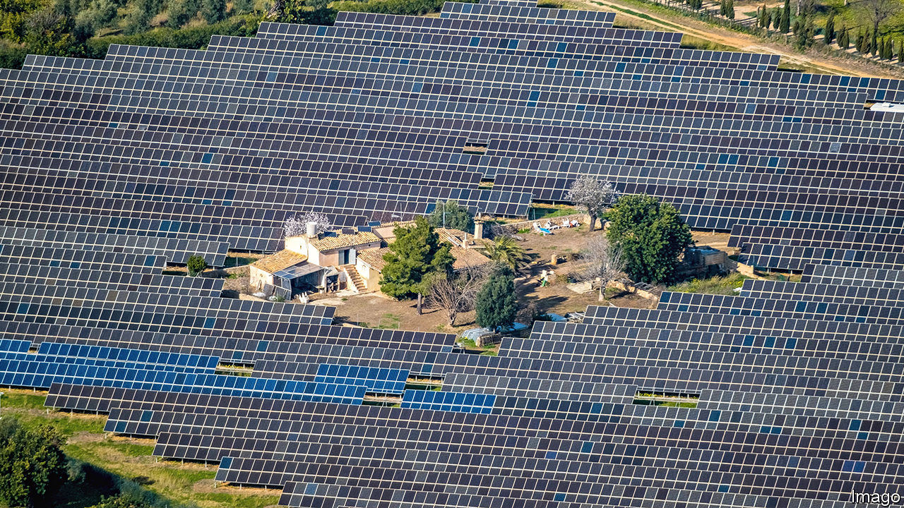

###### Late sun

# Spanish renewable-energy development is waking from its siesta 

##### Green projects in Europe’s land of the sun struggle with NIMBYs and France 

 

> Apr 26th 2023 

Renewable-energy promoters are not typical movie villains. But “Alcarràs”, which won best film at Berlin’s festival last year, follows a peach farm in Catalonia forced to make way for a solar farm. In “As Bestas”, a thriller that won Spain’s own top prize, a French couple in Spain fight their neighbours’ desire for windmills. Spain sometimes seems to want renewables without having to build or see them.

Spain has sun, rivers, wind and sparsely populated landscapes. But it has lagged behind its renewable potential. Much of that has to do with a solar-energy bust over a decade ago, when solar panels were expensive. The government offered developers subsidised returns, which became unaffordable during the financial crisis. The state reneged on its promises in 2013, and a gaggle of investors is suing for compensation. As a result, one of Europe’s sunniest places generated less than 8% of its electricity from solar panels in 2021, around one-third the amount it got from wind. 

Now a surge of big solar and wind projects is under way. Just 25 current installations have over 50MW of power, but more than 180 new ones have been approved since January 2022. The government has slimmed down the process of environmental review, and investors have piled back in. But this has led to other problems. 

One is that the land where they aim to put panels and windmills is not quite empty. Many residents resent the spoiling of their landscapes to power homes and industry elsewhere. One localist platform,  (“Teruel Exists”), is now represented in parliament and urging a slowdown. And many Spaniards are suspicious of the big companies backing the projects, which once built generate few jobs. “,” goes a campaign slogan: renewables yes, but not like this. (Cynics say this really means —yes, but not here.) 

Such NIMBYs sometimes argue for rooftop panels generating power for local consumption. But here Spain faces barriers too. First, there is not enough rooftop real-estate. Permissions for putting up panels are bureaucratic. Some homeowners do not want to ruin the look of their old houses. And the savings from panels may not materialise for a year. Production for local consumption has risen by 26 times over the past four years, but from a low base.

Furthermore, electricity (green or otherwise) accounted for just a quarter of Spain’s energy consumption as of 2020; the rest was still mostly fossil fuels. The economy may not be ready for a huge wave of renewable generation, says Mario Sánchez-Herrero of Ecooo, a non-profit that helps set up solar projects. On sunny and windy days this March, wholesale power prices touched zero. Electric cars have not yet taken off in a big country of long drives.

The final hurdle is that not enough electricity can be exported. Interconnection with France is just 2.8% of installed generating capacity; the EU’s target is 15% by 2030. (Spaniards criticise the French for protectionism.) Plans to turn electricity into hydrogen and pipe it to Marseille or to lay a high-capacity cable across the Bay of Biscay will take years to realise. For Spain to become a green power-plant for Europe commensurate with its capacity, the barriers are as formidable as the Pyrenees.■


