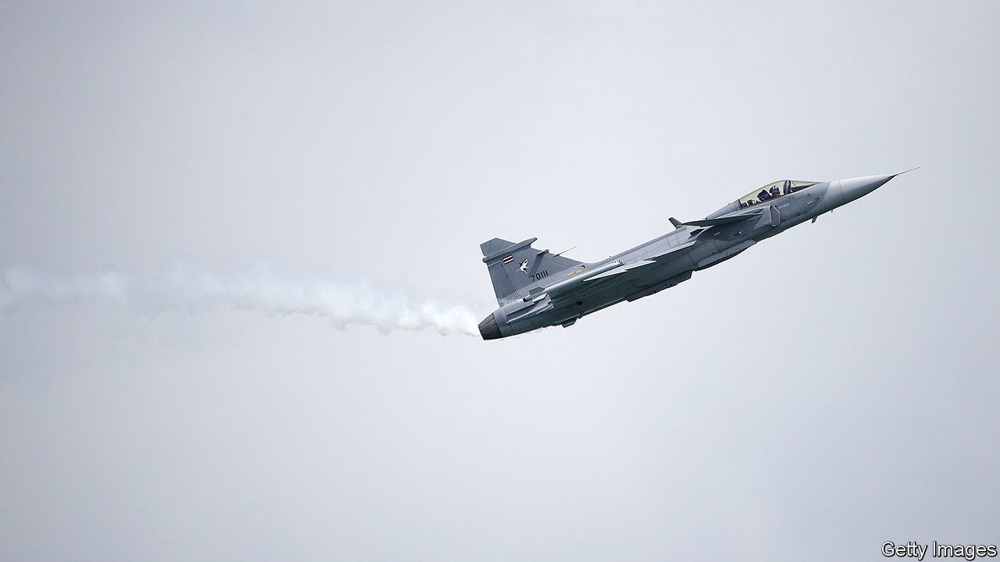
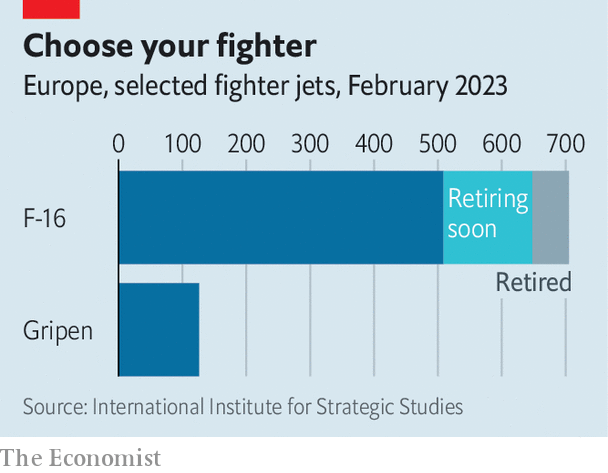

###### War in the skies

# Ukraine’s top guns need new jets to win the war 

##### There is a dogfight between Swedish Gripens and American F-16s 

 

> Apr 23rd 2023 


YOUR CORRESPONDENT often travels by air for work. But rarely does this involve skimming at low altitude over the summer homes that dot Sweden’s Baltic coastline, breaking the sound barrier and taking the controls of a Gripen fighter jet for several rolls and loops. In the cockpit, next to the pilot, wisely out of your correspondent’s reach, is a small switch that allows the Swedish plane to be pushed to its limits. It is set to “peace”. The flick of a finger would toggle it to “war”. It feels particularly resonant. 

Since Russia invaded Ukraine last year, Ukraine’s air force has lost 60 fighter jets, 40% of its pre-war fleet, according to a recently leaked American document. It has just 80 or so left. Russia has almost 500 planes allocated to the war. And they largely , with better radar and longer-range munitions. The good news is that Russia has been unable to use that advantage to dominate the skies. Having failed to wipe out Ukraine’s air defences, its planes are forced to fire missiles or lob bombs, often ineffectually, from a considerable distance. The bad news is that the air balance is looking shaky.

A regular drumbeat of Russian  since October has forced Ukraine to expend huge numbers of its surface-to-air missiles (SAMs). The situation has stabilised in recent weeks, says a Western official, with new supplies coming in. But if SAMs run short, Ukraine would have to choose between protecting cities, critical infrastructure, bases or front line troops. “Our number one task is to stop Russian planes from coming into our skies,” says Colonel Yurii Ihnat, a spokesman for the Ukrainian air force. “We don’t want a situation like the one above Mariupol, where they…flattened an entire city.”

In theory, fighter jets can substitute for ground-based air defences by shooting down enemy planes, drones and cruise missiles. But Ukraine’s current fleet rarely sees these early enough, says Colonel Ihnat, because of “ancient radar technology”. Poland and Slovakia have delivered around eight MiG-29 jets in recent weeks, but these are similarly limited. Many of the jets are not in flyable condition and are being used for spare parts. Ukraine needs a fresh fleet.

The Gripen, built by Saab, a Swedish company, is one candidate. In many ways, it is ideally suited to Ukraine’s needs. It was designed specifically to defend Swedish airspace from Russian jets, rather than fancier tasks like penetrating deep behind enemy lines for strike missions. It was also built to land on short runways and even roads, in circumstances where traditional air bases have been struck by missiles. Saab says the plane can be refuelled and re-armed in ten minutes by a single technician and five conscripts. 

The main problem with the Gripen is that there are so few of them around. Sweden has sold or leased around 66 to other countries. It has fewer than 100 itself. And because Sweden’s bid for NATO membership is being blocked by Turkey and Hungary, the country is hesitant to deplete its defences. Nothing is off the table, says Tobias Billstrom, Sweden’s foreign minister, but “we don’t have that many Gripens.” Sweden could only provide one squadron’s worth, about 14 or so, with a 10-year wait for any more, says Colonel Ihnat.

 


He is not coy about what he would rather have: “Ukraine needs F-16s.” Over 4,600 F-16s have been built since production began in the 1970s. Some are still being built in South Carolina and the US Air Force plans to keep its newest models flying until the 2040s. It is the “Toyota Hilux of the combat air world”, says Edward Stringer, a retired air marshal in Britain’s Royal Air Force, nodding to the ubiquitous and hardy pick-up truck. In 2020 the F-16 made up around 30% of fleets among European NATO members, a higher share than any other plane.

Ukraine is eying the second-hand market: last year Norway retired all of its F-16s in favour of the stealthy F-35, and Denmark, Belgium and the Netherlands all plan to do so too. In February, Ukraine issued a formal request for the Dutch ones. Spare parts and maintenance facilities would be available in next-door Poland and Romania, says Mr Stringer, as well as in Greece and Turkey. On April 21st Ukraine’s defence ministry published a tongue-in-cheek video praising the jet’s qualities (“30-degree recliner seats, baby”).

It also has some drawbacks. One problem is cost. The Gripen is much cheaper to fly and maintain. The other issue, says Justin Bronk of the Royal United Services Institute, a think-tank in London, is the state of Ukraine’s airfields. Soviet runways were built like floor tiling: panels of concrete blocks with sealant in between. That allows them to withstand the expansion and contraction from extreme heat and cold. It also means that moss, stones and other debris accumulates in between. The Gripen, with smaller air intakes that sit higher up on the fuselage, would cope with this far better than the F-16, says Mr Bronk.

Ukraine could resurface some airfields, but that would only invite Russian missiles. And while the F-16 can land on roads in a pinch, its lighter undercarriage is not as well suited to the stresses of short runways—a point hammered home to your correspondent when his Gripen is slammed down for a short landing. Colonel Ihnat bristles at such objections. “We feel it’s an attempt to pull the wool over our eyes,” he retorts. “Any plane can land in Ukraine.” In private, some experienced Ukrainian military pilots are more sceptical of the government’s quest for F-16s.

Either way, what matters as much as the plane is its armament. Mr Bronk says that even a tiny fleet of Gripens, just eight to 12, could keep Russia’s risk-averse air force at bay if they were armed with Meteor, the world’s most advanced air-to-air missile. Because Meteor was jointly developed by Britain, France, Germany, Italy, Spain and Sweden, and would therefore require a consensus to export, it would also give Sweden multinational political cover for any decision to send jets. The snag is that Europeans may not want to risk having the cutting-edge Meteor fall into Russian hands. America may be similarly hesitant about sending the latest variants of its equivalent, the AIM-120, which Mr Bronk says would be needed to give the F-16 comparable range to Russia’s best missiles.

Ukraine will need other supporting capabilities, too. Mr Stringer points to the importance of electronic warfare (EW) to blind Russian warplanes; Ukraine could deploy simpler ground-based systems, he suggests, rather than the dedicated EW planes used by America and its allies. Anders Persson, deputy commander of the Swedish air force until last August, points to the importance of a data link that connects fighter jets to air-defence radars on land. Gripens or F-16s without such links, he warns, would serve as little more than souped-up MiGs.

For now, many Western officials insist that the debate over fighter jets is a distraction from resupplying Ukrainian SAMs. That seems complacent. Russia’s air force is easy to mock: on April 20th it even bombed the Russian city of Belgorod by accident. But air power could yet play a role in Ukraine’s forthcoming offensive, particularly if the Russian air force takes greater risks.

It need not have been this way. “If we had begun this effort last year, modern combat aircraft would already be in Ukrainian hands,” laments David Deptula, dean of the Mitchell Institute for Aerospace Studies in Arlington, Virginia, and a former lieutenant-general in the US Air Force. If the West acted now, he says, there could be up to 30 F-16s in Ukrainian hands by the end of the year. “Where there is will, there is a way,” he adds. “Where there is no will, there is no way.” ■

