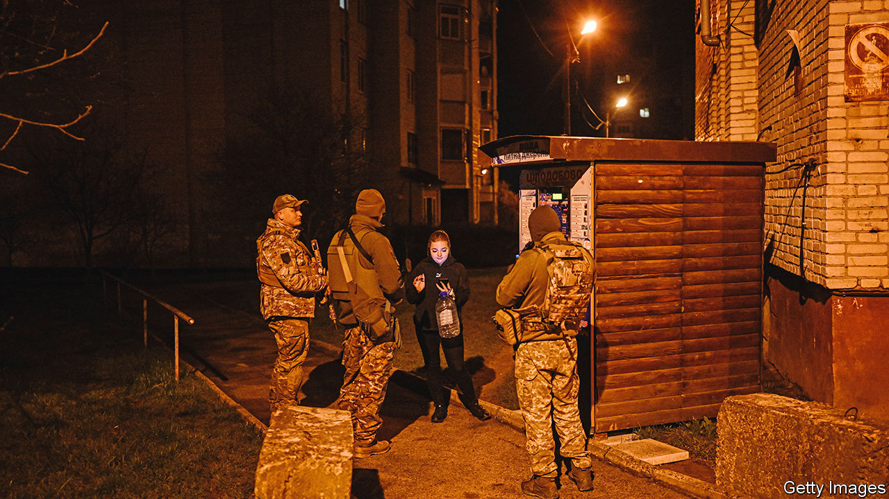

###### After-hours war

# Ukrainians have grown used to living with curfews 

##### Sometimes they break them, but police are often understanding 

 

> Apr 26th 2023 


One evening last summer Mykola Zhupaniuk, a trauma surgeon, was jogging near his home in the Kyiv suburbs, his usual way to shake off the stress of hospital work in wartime, when he heard someone call out “Stop, I’ll shoot!” His first thought was that it was lucky that only one of his ear pods was working, so that he could hear the order. His second was alarm; he had lost track of time and it was now past curfew. He halted, raised his hands and turned to see three Territorial Defence soldiers pointing their guns at him.

Curfews were put in place throughout Ukraine’s cities when  was introduced at the beginning of . A year on, they are still a fact of life. The number of checkpoints has been reduced in cities like Kyiv and Odessa which are no longer on the front lines, and the curfew has been pushed back. It now starts at 11pm rather than 8pm in most areas; recently Kyiv’s was relaxed to midnight. But streets are still patrolled at night by police and Territorial Defence units who have the power to stop people, check documents and search phones. Violators can be prosecuted and punished with fines (proportional to income) and a prison sentence of up to 15 days. Some young men caught out at night have been sent to the military registration centre. 

How many cases have been prosecuted is unclear. Oleksiy Biloshytskiy, deputy head of the patrol police, says that if people have good reason to be out “the police are willing to meet them halfway.” Dr Zhupaniuk used a different argument: recognising one soldier as a man who had done construction work for him, he asked, “If you shoot me now, who will employ you to build a fence?” The man smiled, confirmed his identity and accompanied him home. 

Curfew-breakers agree enforcement is flexible. One woman was stopped at a checkpoint after losing track of time while canoodling with a fellow NGO volunteer. The guards laughed at the car’s steamed-up windows and let her go (after a mortified call to a policeman acquaintance who vouched for her). When Dmytro Zinoviev was asked where he was going at a motorway checkpoint at 4am, he answered “Antarctica!” Police took him for drunk, until he displayed documents showing that he needed to catch a plane in Hungary to join Ukrainian researchers at the Vernadsky Research Base. They gave him a badge from their unit; he later sent them a photo of the badge beside a penguin colony.

The scant exemptions to the curfew include accredited journalists, humanitarian volunteers, military personnel, a few designated taxi drivers and those with tickets for early trains. People have got used to going home early. Shift workers such as doctors and nurses often stay over at their workplaces. Dr Zhupaniuk says some colleagues stopped going home late after unsympathetic police forced them to sleep in their cars at checkpoints. 

When Russian forces were close to Kyiv, days-long curfews were imposed to flush out saboteurs. That threat is diminished, but Mr Biloshytskiy says nightly curfews deter sabotage too. They also seem to help with law and order. According to Mr Biloshytskiy, over the past year Ukraine’s crime rate has dropped by 25%.■

